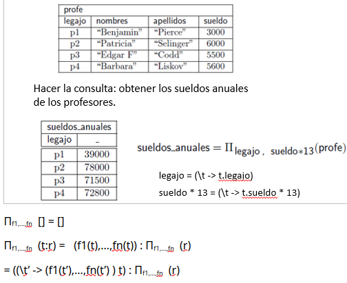
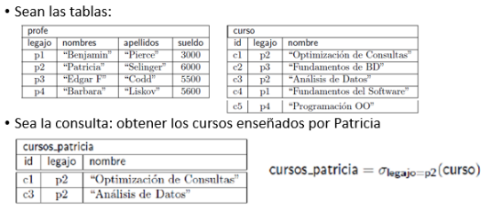

**Tabla**: Lista de tuplas.

**Álgebra de tablas**: Variación más expresiva del lenguaje de consulta de álgebra relacional

**Operador de álgebra de tabla**: función que recibe tablas (que cumplen ciertas condiciones) y devuelve una tabla.
Pueden ser Unarios o Ternarios
Son llamados:
- **Operadores lógicos**: definición (usando recursión) lógica.
- **Operadores físicos**: Algoritmo específico usado para implementar un operador lógico.
	- Hacen uso de informaciones, como índices, tamaños de búfer en memoria, técnicas avanzadas de algorítmica, etc.
	- La **evaluación** de una expresión del álgebra de tablas va a ser en términos de operadores físicos.
	- Se puede **estimar el costo** de ejecutar el operador físico y del tamaño de almacenamiento del resultado de evaluarlo.
		Los costos de todos los algoritmos físicos dependen de:
		- Numero de **transferencias de bloques** de disco (Tienen diferentes costos a su vez (p.ej. lectura$\neq$escritura), pero asumiremos que no)
		- Numero de de **accesos a bloques**
			El tiempo de acceso a un bloque es el tiempo que le lleva a la cabeza lectora del disco en posicionarse en el bloque deseado. Son mucho mas costosos que las transferencias de bloques.
			Los archivos secuenciales son eficientes en accesos a bloques.
		- **Tamaño del búfer** en memoria principal (Osea, cuentos bloques caben en el).
			Asumimos generalmente el peor caso: el búfer puede sostener solo unos pocos bloques de datos– aproximadamente un bloque por tabla.
		- Vamos a ignorar los costos de CPU por simplicidad.

Al procesar consultas SQL se las traduce a álgebra de tablas. Luego se transforma esa expresión en álgebra de tabas a una equivalente mas optima con operadores logicos (esto es posible ya que podemos medir su costo). Y se evalua como un operador fisico (implementacion de un operador logico)(su resultado tiene un tamaño en memoria que se puede optimizar a su vez)

**Notación**:
- **Esquemas**: $R = (A_{1}::T_{1}, …, A_{n}:: T_{n})$ donde $T_{i}$ es tipo para atributos de $A_{i}$ y el dominio de $R$ es el producto cartesiano de sus tipos ($\text{Dom}(R) = T_1 \times \dots \times T_n$). Todo atributo debe tener tipo pero no necesariamente nombre (podemos tener $R = (A_{1}::T_{1}, \text{ \_}::T_{1})$).
- **Tablas**: $r(A_{1}::T_{1}, …, A_{n}:: T_{n})$ significa que la tabla $r$ tiene esquema $R = (A_{1}::T_{1}, …, A_{n}:: T_{n})$. Se puede indicar, habiendo definido $R$, de forma resumida como $r(A_{1},…,A_{n})$.

**Operador lógico de proyección**:
Ejemplo:

Definición recursiva del ejemplo:
$\Pi_{A,C}[] = []$  //(Tabla vacía)
$\Pi_{A,C} (t:r) = (t.A, t.C) : (\Pi_{A,C} \ r) = ((\lambda t' \to (t'.A, t'.C)) \ t) : (\Pi_{A,C} \ r)$ 
$\Pi_{A,C} = \text{map} \ (\lambda t' \to (t'.A, t'.C))$
PD:
- $\lambda$ se usa para representar funciones lambda.
	- $\lambda p' \to f(p')$ es una función lambda que recibe parámetros $p'$ y devuelve $f(p')$
	- $(\lambda p' \to f(p')) p$ aplica la función lambda al parámetro $p$ 
- $t$ es una tupla, $r$ una tabla
-  $t.A, t.C$ son atributos de $t$

Otro ejemplo:

**Operador físico de proyección**
Requiere recorrer todos los registros y realizar una proyección en cada uno.
El bufer tiene un bloque para $r$ y otro bloque para el resultado.
El algoritmo recorre todos los bloques de la tabla en orden.

Para cada bloque de $r$ lo transfiere a memoria, recorre ese bloque proyectando y guardando las tuplas resultantes en el bloque para el resultado. Cuando el bloque de resultado está lleno lo guarda en disco y luego lo vacía.

Tabla $r$ con $b_{r}$ bloques
Para estimar el costo: por ejemplo, suponemos que $r$ está organizado secuencialmente sin bloques de overflow y que no se borraron tuplas. O sea, $r$ está en bloques consecutivos de disco.
Costo = 1 acceso a bloque + $b_{r}$ transferencias de bloques
Este algoritmo vale también para proyección generalizada.
$b_{r}$ denota el número de bloques conteniendo registros de la tabla r

## Operador de selección

$Legajo = p2 = \lambda t \to (t.legajo == p2)$

### Aplicar la selección a predicados.
Un predicado es una función booleana.

**Predicados que usan operadores de comparación**:
Predicados básicos o atómicos
Sea un predicado de comparación $rel$, osea, $rel \in \{<, >, ==, >=, <=, \neq\}$
Sea $A$ un atributo y $v$ un valor.
$A \ rel \ v = (\lambda t \to t.A \ rel \ v)$
$A \ rel \ A' = (\lambda t \to t.A \ rel \ t.A')$

**Predicados que usan conectivos proposicionales**:
Los predicados básicos se pueden combinar usando conectivos booleanos.
$A > v \ \&\& \ A1 == A2 = \lambda t \to (t.A > v \ \&\& \ t.A1 == t.A2)$

Si $con \in \{\&\&, ||, !\}$ y $p1, p2$ son predicados:
$p1 \ con \ p2 = \lambda t \to (p1(t) \ con \ p2(t))$

**Definición del operador de selección**:
$\sigma_P [ ] = [ ]$
$\sigma_P (t : r) =  \begin{cases}  t : \sigma_P(r) & \text{si } p(t) \\ \sigma_P(r) & \text{si no}  \end{cases}$

### Operadores físicos para selección

Conceptos:
Si es indice primario, la tabla estará ordenada según el.
Si los bloques no son consecutivos, tendremos tantos accesos como bloques en el peor caso.

**Algoritmo de búsqueda lineal**
Recorre todos los bloques del archivo y va testeando todas las tuplas que cumplan el predicado. Como antes tenemos en búfer: un bloque para leer y un bloque para el resultado. 
Si hay $b_{r}$ bloques en la tabla y los bloques de $r$ son contiguos
Estimación del costo =  $b_{r}$ transferencias de bloques +  1 accesos de bloques
Es independiente al predicado

**Algoritmo para índice primario usando árbol $B^+$ con igualdad en clave candidata**
Supongamos que $A$ es clave candidata,  $A == v$  es el predicado.
Buscar $v$ en el árbol $B^+$; para esto voy a recorrer la altura del árbol.  Al llegar a $v$ uso el puntero del índice para recoger el registro. (Recorrer la altura del árbol más una E/S para recoger el registro.)
Cada una de estas operaciones requiere un acceso a bloque y una transferencia de bloque.
No transfiere todos los bloques del archivo, solo los buscados.

Supongamos que el árbol $B^+$ tiene altura $h$.
Costo del algoritmo en el peor caso:  $h + 1$ transferencias de bloques +  $(h + 1)$ accesos a bloques.
PD: Los bloques no están necesariamente contiguos. 

**Algoritmo para índice primario usando árbol $B^+$ con igualdad en clave no candidata**
$A$ atributo que no es clave candidata, $A == v$ es el predicado.
Recorro la altura del árbol para buscar $v$.  Para $v$ vamos a tener un puntero a un bloque de la tabla.  El puntero indica el primer registro con valor $v$.  Luego recorro la tabla secuencialmente retornando las tuplas con valor $v$.  Asumimos las tuplas con valor $v$ van a estar en bloques consecutivos.
Suponemos altura del árbol $h$ y hay $b$ bloques en la tabla con registros de valor $v$.
Costo del algoritmo = $(h + b)$ transferencias de bloque +  $h$ accesos a bloque + 1 acceso de bloque en la tabla = $(h + b)$ transferencias + ($h+1$) accesos

**Algoritmo para índice secundario usando árbol $B^+$ con igualdad en clave candidata**
Igual a con indice primario

**Algoritmo para índice secundario usando árbol $B^+$ con igualdad en no clave candidata.**
$A$ atributo que no es clave candidata, $A == v$ es el predicado.
Recorremos la altura del índice. Al llegar a la clave de búsqueda $v$, el puntero apunta a un bucket. Cada entrada del bucket apunta a un bloque de la tabla.
Si $n$ es número de registros que tienen en $A$ el valor $v$ y $h$ es la altura del índice:
Costo del algoritmo:  ($h + 1 + n$) transferencias de bloques + ($h + 1 + n$) accesos a bloque.

**Algoritmo para selección involucrando comparación de atributo con un valor para índice primario**
El predicado va a tener la forma $A \leq v$ o $A \geq v$ por ejemplo.

Supongamos que el predicado es $A \geq v$:
Recorremos la altura del índice para encontrar el primer valor $\geq v$. 
Luego hay que escanear la tabla secuencialmente desde allí.
Si la altura del árbol es $h$  y hay $b$ bloques con registros con $A \geq v$
El costo del algoritmo: (h + b) transferencias de bloques + (h + 1) accesos a bloque

Supongamos que el predicado $A \leq v$:
No hace falta usar el índice. Usamos una búsqueda lineal en la tabla hasta encontrar la primera tupla con $A > v$.

**Algoritmo para selección involucrando comparación de atributo con un valor para índice secundario**

Supongamos que el predicado es $A \geq v$:
En el árbol $B^+$ cada puntero de hoja apunta a un bucket pero supongamos que no hay para hacer mas facil el calculo.
Va a recorrer la altura del índice hasta el primer valor $\geq v$.  Por medio de los punteros del índice accedemos a los bloques de la tabla de ese valor. Pasamos al siguiente valor del índice y hacemos lo mismo. Así seguimos hasta llegar al final del índice.
Supongamos que la altura del índice es $h$ y la cantidad de registros con $A \geq v$ es $n$.
El costo del algoritmo:   ($h + n$)   transferencias de bloques  +  ($h + n$)  accesos a bloques.

==Está faltando: Estimar el tamaño en cantidad de bloques del resultado del operador selección. Lo veremos en la clase próxima.==