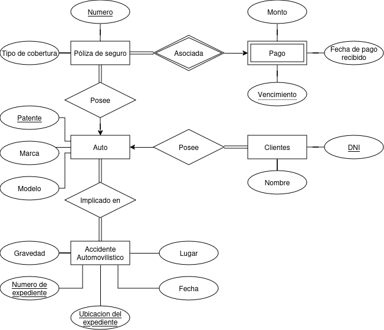
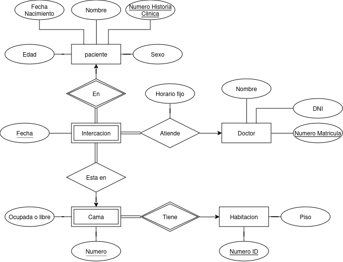

# Practico Bases de Datos

## 1 - Práctica de modelos relacionales y de modelado de entidad-relación

> ### Ejercicio A
>
> Considerar la siguiente base de datos relacional:
>
> - empleado(nombre-empleado, calle, ciudad)
> - trabaja(nombre-empleado, nombre-empresa, sueldo)
> - empresa(nombre-empresa, ciudad)

#### a)

- El atributo nombre-empleado, ¿incluirá también el apellido?.
  Puede que no, pero seria lo mejor. De esa forma se podria identificar mejor a los empleados. Es comun que tengan el mismo nombre y puede pasar que ademas tengan el mismo nombre y vivan en la misma calle en la misma ciudad.

#### b)

- ¿previó la posibilidad de que haya dos empleados de igual nombre en una misma ciudad?
  Si solo se pone el nombre, entonces no. No se los puede identificar bien, mas aun donde trabaja cada uno.
- ¿Y en distintas ciudades?
  Si un empleado o empresa esta en mas de una ciudad, habra duplicacion de sus datos.
- ¿Y en una misma empresa?
  Si tiene el mismo nombre y trabajan en la misma empresa, no se sabria cuanto cobra cada uno.
- ¿Y que una misma persona sea empleada de varias empresas?
  Se repetiria el nombre del empleado y a diferencia del DNI, el nombre se puede cambiar.

#### c)

> ¿Cuáles serían las claves primarias apropiadas?

  _Sin agregar nada:_
  
  - empleado(<u>nombre-empleado</u>, <u>calle</u>, ciudad)
  - trabaja(<u>nombre-empleado</u>, <u>nombre-empresa</u>, sueldo)
  - empresa(<u>nombre-empresa</u>, <u>ciudad</u>)
  
  Tiene muchos defectos, hace falta agregar:
  
  _Agregando campos:_
  
  - empleado(<u>DNI</u>, nombre-empleado, calle, ciudad)
  - trabaja(<u>DNI</u>, <u>Codigo-local</u>, sueldo)
  - empresa(<u>Codigo-local</u>, nombre-empresa, altura, ciudad)
  
  Donde en empresa nombre-empresa, altura, ciudad son clave candidata.

### d)

- ¿Cuáles son las falencias de este diseño? ¿Cómo subsanarlas?
  
  Falencias del diseño:
  Si una empresa esta en mas de una ciudad/altura, entonces habra redundancia de datos en el nombre de la empresa.
  
  _Diseño mejorado:_

  - empleado(<u>DNI</u>, nombre-empleado, ID-dirreccion)
  - trabaja(<u>DNI</u>, <u>ID-dirreccion(del local)</u>, sueldo)
  - empresa(<u>ID-empresa</u>, nombre)
  - local(<u>ID-dirreccion</u>, ID-empresa)
  - direccion(<u>ID-dirreccion</u>, altura,  calle, ciudad, pais)

> ### Ejercicio B
>
> Dada la base de datos universitaria donde ya se han subrayado las claves primarias:
>
> - aula(edificio, aulaNro, capacidad)
> - facultad(nombreFacultad, edificio, presupuesto)
> - curso(idCurso, título, nombreFacultad, créditos)
> - profe(ID, nombre, nombreFacultad, salario)
> - actividad(idCurso, idAct, semestre, año, edificio, aulaNro, idDurClase)

#### a)

- ¿Qué información contiene la relación aula?
  - La facultad
  - La actividad
- ¿Es posible que haya aulas con el mismo número en edificios diferentes?
  Si
- ¿Es posible que tengan capacidad para diferente cantidad de alumnos?
  Si

#### b)

- ¿Qué información contiene la relación facultad?
  - Profesores
  - Aulas
  - Cursos
  - Actividades
- ¿Cuántos edificios puede tener una facultad?
  Uno

#### c)

- ¿Puede una misma facultad tener varios cursos con el mismo título?
  Si
- ¿Puede un mismo profesor trabajar en varias facultades?
  No
- ¿Puede una misma actividad dictarse varias veces al año?
  No
- ¿Y en un mismo semestre?
  No
- ¿Puede una misma actividad ser parte de varios cursos?
  No

### d)

- ¿Puede una misma actividad que se dicta como parte de un curso dado durante un año y un semestre dado dictarse los martes en un aula y los viernes en otra?
  No

> ### Ejercicio C
> 
> Se agrega a la base de datos universitaria del ejercicio anterior las siguientes
> relaciones.
> enseña(ID, idCurso, idAct, semestre, año)
> estudiante(ID, nombre, nombreFacultad, total de créditos)
> toma(ID, idCurso, idAct, semestre, año, nota)
> supervisor(IDe, IDp)
> horarios(idDurClase, día, horaInicio, horaFin)
> correlativa(idCurso, idPre-requisito)

#### a) 

- ¿Qué información contiene cada una de las relaciones enseña, toma, horarios y correlativa?
  - enseña: lo que toma y la correlativa
  - toma: lo que enseña y la correlativa
  - horarios: _
  - correlativa: lo que enseña y toma

#### b) 

- ¿En cuántas facultades puede estar inscripto un estudiante?
  una
- ¿Puede tener varios supervisores?
  si

### Ejercicio 1 

> La Secretaría Académica de una universidad mantiene datos acerca de las siguientes entidades:
> - a) Materias: incluyendo el número, título, programa y correlatividades.
> - b) Ofertas de materias: incluyendo el número de la materia, año, semestre, código de oferta, profesor(es), horarios y aulas.
> - c) Estudiantes: incluyendo número de matrícula, nombre y carrera,
> - d) Profesores: incluyendo número de legajo, nombre, departamento y cargo.
> Además, la inscripción de los estudiantes en materias y las notas concedidas a estudiantes en cada materia en la que están inscriptos se deben modelar adecuadamente. Construir un diagrama E/R para la oficina de registro. Documentar todas las decisiones que se hagan acerca de restricciones de correspondencia.

    

### Ejercicio 2

> Construir un diagrama de E/R para una compañía de seguros de autos cuyos clientes (con DNI y nombre) poseen uno o más autos (cada uno con número de patente, marca y modelo).
> Cada auto tiene asociado un número de cero a cualquier valor de accidentes almacenados.
> Además, hay pólizas de seguro con número de póliza y tipo de cobertura (p.ej. robo, incendio, etc.) Cada póliza de seguro cubre uno o más autos y tiene uno o más pagos asociados con ella.
> Cada pago tiene un monto, es por un período particular de tiempo y tiene asociado una fecha de vencimiento y la fecha cuando el pago fue recibido.

    

### Ejercicio 3
> En el ejercicio anterior:

- ¿Es razonable considerar accidentes como atributo de auto?
- 
Si solo importa saber cuantos tuvo si, pero no es realista. Los accidentes pueden tener un expediente mas completo asociado a un auto o a mas de uno para saber si hubieron otros implicados,...

- ¿Qué información se le ocurre que sería relevante sobre los accidentes?

Lugar, fecha, dueño, otros implicados, daños al auto, causas_judiciales,... otra lista de daños totales no arreglados.

- ¿De qué manera se debería adecuar el diseño?

    

### Ejercicio 4

> Se quiere mantener una base de datos para el área de obstetricia de un hospital. Un bebé es identificado por una hora y fecha de nacimiento. Cada bebé es el resultado de un nacimiento único; cada nacimiento es de un bebé (los gemelos serán representados por 2 nacimientos); cada bebé tiene una única madre (con nombre y DNI); para cada nacimiento hay un único doctor (con nombre, número de matrícula y DNI); además, existen algunes enfermeres (cada une con nombre y DNI) que asisten al doctor.

- ¿Es razonable suponer que un mismo doctor es acompañado siempre por les mismes enfermeres?

Nada en esa pregunta es razonable.

- ¿De qué manera impacta la respuesta a esa pregunta en el modelo?

Ninguna.

    

### Ejercicio 5

> Asumimos que se hace una base de datos para una universidad. En una facultad que dicta cursos se quiere modelar una base de datos. Cada facultad está identificada por su nombre. Un curso es dado por un único departamento, pero su único atributo es su número. Diferentes departamentos pueden ofrecer cursos con el mismo número. Cada departamento tiene un único nombre. Identificar las claves de las entidades fuertes y débiles involucradas.
> __Entidades fuertes__: tienen una clave única propia que identifica cada instancia de manera independiente.
> __Entidades débiles__: no pueden ser identificadas de manera única solo por sus propios atributos y dependen de una entidad fuerte para su identificación.

Facultad: Nombre (fuerte)
Departamento: Nombre (fuerte)
Curso: ID propio y Departamento (debil)

### Ejercicio 6
> Diseñar el diagrama E/R e identificar las claves primarias y candidatas para la siguiente base de datos. Se debe construir una base de datos para un hospital. De une paciente se tiene que saber el nombre y sexo, la fecha de nacimiento, y su edad. Une paciente se diferencia unívocamente de otre por su número de historia clínica. Une doctore se identifica por su número de matrícula, y también se quiere almacenar su DNI y nombre. Una habitación tiene un número de identificación, un piso correspondiente y una o más camas numeradas. Se podría tener por ejemplo una cama 3 en la habitación 666 y una cama 3 en la habitación 911. Se necesita saber que camas están ocupadas o libres. Una internación tiene asociada una fecha y la cama del paciente. A cada paciente internade se le asigna une únique doctore que lo atiende en un horario fijo; cada doctore puede atender varies pacientes.

    

### Ejercicio 7
> El siguiente diagrama E-R tiene algunos errores. Se pide identificarlos y corregirlos; además seleccionar las claves primarias y discriminadores adecuados para cada uno de los conjuntos de entidades. Luego pasar a tablas el modelo resultante, prestando especial atención a que modele adecuadamente lo esperado.
> __Discriminador__: es un atributo utilizado para diferenciar entre varios subtipos de una entidad generalizada. Indica a qué subtipo específico pertenece una instancia de la entidad.

    

Suposicion de lo que se pide:
Cada cliente tiene una cuenta, se pide guardar la fecha en la que la usa y relacionar las transacciones que realiza.
Si un cliente no puede identificarse directamente, un cliente podria abrir mas de una cuenta y no se podria relacionar esas dos cuentas de ningun modo. Se puede lograr lo mismo y mejor haciendo que cada cliente pueda tener mas de una cuenta.
Un cliente es importante, debe ser fuerte. Luego, una cuenta se puede sacar de un cliente por lo que no hace falta que sea fuerte. Ademas seria importante identificar las transacciones por lo que deben ser importantes.
Si se usa una cuenta, es para hacer una transaccion en este diagrama, por lo tanto la fecha se guardara en la relacion de la cuenta con la transaccion.
Mejor la fecha como atributo de la transaccion, mejor que una tabla solo para eso.

>__PREGUNTA:__
>La verdad que este ejercicio es muy confuso. Se pueden agregar atributos?, Se quiere guardar los accesos de un cliente a su cuenta aunque no haga transacciones? muchos clientes pueden usar muchas cuentas y viceversa? se pueden tener dos relaciones entre dos entidades?... que se debe poder identificar fuertemente? que se pide?...

    

### Ejercicio 8
> Construir tablas apropiadas para cada uno de los diagramas E-R de los ejercicios 1 y 3.

_Ejercicio 1_:

    

_Ejercicio 3_:

    

### Ejercicio 9
> Considerar el diagrama en la figura 2 que modela una librería en línea.
> __a)__ La librería está expandiendo su colección con discos DVD, Blu-ray y videos descargables. Estos nuevos ítems son provistos por une proveedore, que tiene la misma información que la editorial. Igual que los libros, estos productos tienen autores, año, y titulo. Los DVD y los Blu-ray se distinguen por código de barras, y los videos por URL. El mismo ítem puede estar presente en uno o en ambos formatos, con diferentes precios. Extienda el modelo E-R para modelar esta adición. Notar que los DVD y los Blu-ray también se guardan en el depósito.
>__b)__ Traducir a tablas el diagrama E/R obtenido.

    

    

Cosas que preguntaria:
El codigo de barras entre DVD y Blue-ray se puede repetir?
Puedo marcar a la editorial como proveedor?

    

### Ejercicio 10
> Diseñar una jerarquía de especialización-generalización para las ventas de una compañía de vehículos a motor. Un vehículo a motor tiene un número de patente, marca, modelo, antigüedad, cantidad de cilindros, kilometraje y precio. La compañía vende motocicletas, autos, furgonetas y ómnibus (con tamaño y cantidad de asientos). Los autos y las furgonetas tienen accesorios (p.ej. gps, apoya cabeza, aire acondicionado, etc.). Diseñe y justifique la colocación de los atributos en cada nivel de la jerarquía. Explicar por qué se deberían colocar en un nivel más alto o más bajo.

    

>__PREGUNTA:__
> Esta bien que Motocicleta no tenga atributos, como puse los accesorios, y como dividi los vehiculos medianos??