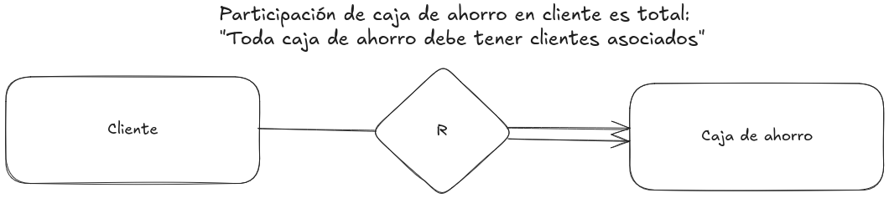

# Base de Datos

**Base de datos (BD)**: contiene datos generalmente interrelacionados.
**Esquema**: La estructura de entidades y relaciones de la BD.
**Instancia**: contenido actual de la BD en un momento del tiempo.
**Restricción de integridad**: es una propiedad que las instancias de la BD deben satisfacer. Al modificar una instancia se debe chequear que las restricciones de
integridad de la BD siguen siendo válidas.

**Procesos de diseño de esquemas relacionales que veremos**:

1. [Proceso de modelado Entidad Relacion y traduccion](#Proceso-de-Entidad-Relacion-y-traduccion): Proceso que hace un diseño de entidad-relación primero y luego traduce ese diseño de entidad-relación a un conjunto de esquemas de relación.
2. [Proceso de Normalizacion](#Proceso-de-Normalizacion): Proceso que comienza con esquema relacional con todos los atributos atómicos del problema y un conjunto de restricciones de integridad y calcula un esquema de la base de datos. A esto se le llama normalización.

## Esquema relacional

Es una forma para estructurar una base de datos, utilizando relaciones (o tablas) que representan los datos y sus relaciones.
Cada tabla tiene un nombre único, filas (tuplas o registros) y columnas (atributos), y las tablas pueden estar vinculadas a través de claves (primarias y foráneas).

**Esquema relacional**: Lista de nombres de atributos (Nombre esquema = lista de atributos).
**Instancia**: Datos que se almacenan en tablas para los esquemas de la misma.
Las columnas representan atributos (o propiedades) para los elementos de la tabla (tuplas).

    

> **Notación**: **r(R)** significa r es una relación con esquema de relación R. O sea, las columnas de r tienen como nombres los atributos de R.

**Dominio del atributo**: conjunto de valores permitidos para cada atributo.
Los valores de los atributos deben ser **atómicos** (indivisibles).
O sea que en las consultas o restricciones de integridad no vamos a dividir el valor de un atributo en partes. Simplificando la descripción de consultas o restricciones de integridad.

**Superclaves**: Sea K ⊆ R , R esquema de relación; K es una superclave de R si los valores para K son suficientes para identificar una tupla única en cada posible relación r(R).

**Clave candidata**: Una superclave K **minimal**. Para todo atributo de K si se lo quito a K dejo de tener una superclave.

**Clave primaria**: La clave candidata elegida.

> **Notación**: Se indican los atributos de una clave primaria para un esquema de relación R **subrayando** los atributos de R que forman la clave primaria.

**Restricción de clave foránea (o de integridad referencial)**: Los valores de uno o más atributos en una tupla de la **relación referenciante** aparecen en uno o más atributos de una tupla en la **relación referenciada**. Los atributos referenciados de la relación referenciada suelen formar una **clave candidata** del esquema de la relación referenciada.

    

**Redundancia de datos**: La redundancia es un problema que ocurre cuando tienes tuplas en \( R \) que tienen los mismos valores en \( \alpha \) pero diferentes valores en \( \beta \). Esta repetición de los valores de \( \beta \) es innecesaria si no es una clave candidata.
Una **solucion** es obtener un buen diseño descomponiendo el esquema que contiene todos los atributos en esquemas más chicos.

**Criterios para tener un diseño de calidad:**

- Evitar problemas de redundancia de información.
- Evitar problemas de comprensibilidad.
- Evitar problemas de incompletitud como:
  - Restricciones de integridad incompletas.
  - Relaciones entre atributos no contempladas por esquemas de BD.
- Evitar problemas de ineficiencia como:
  - Chequeo ineficiente de restricciones de integridad.
  - Consultas ineficientes por tener un esquema inadecuado de BD.
 
----

## Proceso de modelado Entidad Relacion y traduccion

Proceso que hace un diseño de entidad-relación primero y luego traduce ese diseño de entidad-relación a un conjunto de esquemas de relación.

**Diseño de Entidad Relacion**: Es un enfoque de _modelado conceptual de alto nivel_ que se utiliza para representar datos y sus relaciones a través de entidades, atributos y relaciones sin implementar un estructura real.
Se construye diagramáticamente usado un _diagrama de entidad-relación_.
Se utiliza para visualizar la estructura de una base de datos antes de su **traducción** del modelo de entidad-relación a un conjunto de esquemas relacionales centrados en el esquema real (tablas y relaciones) con sus restricciones.
Sirve como un plano, mientras que el modelo relacional realiza este plano en forma de base de datos. 

- **Entidad**: objeto distinguible de otros objetos. Descrito por medio de atributos.

  - **Conjunto de entidades (CE)**: conjunto de entidades del mismo tipo (i.e. Con los mismos atributos) que comparte las mismas propiedades.

- **Relación**: asociación entre varias entidades.

  - **Conjunto de relaciones (CR)**: es una relación matemática entre \( n \geq 2 \) conjuntos de entidades (CE), definida como:
    \[
    \{ (e_1, e_2, \ldots, e_n) \mid e_1 \in E_1, e_2 \in E_2, \ldots, e_n \in E_n \}
    \] donde \( (e_1, e_2, \ldots, e_n) \) es una relación. Un atributo puede ser también una propiedad de un CR.

  - **Roles**: Los CE en un CR, no necesariamente son distintos.
  

    
  

- **Atributo**: propiedad de una entidad; esa propiedad tiene un valor en un **dominio**: _conjunto de valores permitidos para cada atributo_.

  - Atributos **Simples**: atributos hoja, no se siguen descomponiendo.
  - Atributos **compuestos**: atributos rama, se siguen descomponiendo.
  - Atributos **uni-valorados**: toman un valor.
  - Atributos **multi-valorados**: pueden tomar varios valores.
  - Atributos **derivados**: pueden computarse de otros atributos.

- **Clave**: Es un subconjunto del conjunto de atributos comunes en una colección de entidades, que permite identificar inequívocamente cada una de las entidades pertenecientes a dicha colección. Asimismo, permiten distinguir entre sí las relaciones de un conjunto de relaciones.
  Dentro de los conjuntos de entidades existen los siguientes tipos de claves:
  - **Superclave de un CE**: conjunto de uno o más atributos cuyos valores unívocamente determinan cada entidad.
  - **Clave candidata (CC) de un CE**: superclave minimal (i.e. si se quita atributo dejamos de tener superclave). Una clave candidata no necesariamente tiene cardinalidad mínima.
  - **Clave primaria**: Aunque varias claves candidatas pueden existir, una de las claves candidatas es seleccionada para ser la clave primaria. No necesariamente es la de menor cantidad de atributos.
    > **Notación**: Se indican los atributos de una clave primaria para un esquema de relación R **subrayando** los atributos de R que forman la clave primaria.

    

### Restricciones en CR's

#### Correspondencias de Cardinalidades

Propósito: Diagramar conjuntos de relaciones binarios.
Sea R un CR de CE's E1 a CE's E2:

- **CR uno-uno**: Todas las entidades de E1 están asociadas con a lo sumo una entidad de E2 via R. Y viceversa.
- **CR uno-varios**: Existe alguna entidad de E1 asociada con al menos dos entidades de E2 via R. Todas las entidades de E2 están asociadas con a lo sumo una entidad de E1 via R.
- **CR varios-uno**: Todas las entidades de E1 están asociadas con a lo sumo una entidad de E2 via R. Existe alguna entidad de E2 asociada con al menos dos entidades de E1 via R.
- **CR varios-varios**: Existe alguna entidad de E1 asociada con al menos dos entidades de E2 via R. Y viceversa.

> **Obs:** En todos los casos pueden existir elementos pertenecientes a E1 que no están mapeados con elementos de E2 y viceversa.
>
> **Notación de correspondencia de cardinalidades**:
>
> 

>   
> 

>
> 

>   
> 

>
> **Notación de intervalos o de cardinalidades**: [a..b] o [a..*]
>
> 

>   
> 

> Notar que el lugar donde se pone la información es al revés (o sea, del otro lado) que en correspondencia de cardinalidades.

#### Restricciones de participación

Dado un conjunto de relaciones R en el cual participa un conjunto de entidades A, dicha participación puede ser de dos tipos:

- **Participación total**: (indicada por línea doble) toda entidad en el conjunto de entidades participa en al menos una relación en el conjunto de relaciones.
  

    
  

- **Participación parcial**: (indicada por línea simple) algunas entidades no participan en alguna relación en el conjunto de relaciones.
  

    
  

### Entidades fuertes y débiles

Cuando una entidad participa en una relación puede adquirir un papel fuerte o débil. Una entidad débil es aquella que no puede existir sin participar en la relación; es decir, aquella que no puede ser unívocamente identificada solamente por sus atributos.

Una entidad fuerte (también conocida como entidad regular) es aquella que sí puede ser identificada unívocamente. En los casos en que se requiera, se puede dar que una entidad fuerte "preste" algunos de sus atributos a una entidad débil para que esta última se pueda identificar.

**Conjunto de Entidades Débiles**: Es un CE que no tiene una clave primaria en el conjunto de sus atributos.
Se representa con rectángulo de borde doble.
Su existencia depende de la existencia de al menos un CE (un CE puede ser débil de varios CE fuertes) fuerte llamado **CE identificador**.
Hay un CR varios-uno entre CE débil y CE identificador, donde el CE débil tiene participación total.

- A este CR se le llama CR de identificación.
- El mismo se representa con un diamante doble.
  El **discriminador** de un CE débiles es un conjunto de atributos que
  - Permite distinguir entre todas las entidades de un CE débiles asociadas a la misma entidad fuerte.
  - Los atributos del discriminador se subrayan con línea de guiones
    La **clave primaria** de un CE débiles se forma con la clave primaria del CE identificador más el discriminador del CE débiles.

### Especialización-Generalización

**Especialización**: hace referencia a un proceso de diseño descendiente (top-down) donde designamos **subgrupos** dentro de un CE que son distintivos de otras entidades en el CE.

Estos subgrupos son CE de más bajo nivel que

- tienen atributos específicos (adicionales a los atributos del CE del que se saca el subgrupo), o
- participan de CR que no aplican al CE de más alto nivel.

Una especialización se denota con un triángulo etiquetado ISA o ES, se llama también relación de superclase – subclase.

**Herencia de atributos**: un CE de más bajo nivel hereda:

- todos los atributos,
- la clave primaria, y
- participaciones en CR del CE de más alto nivel con el cual está relacionado.

**Generalización**: hace referencia a un proceso de diseño ascendiente (bottom up) que generaliza unos cuantos CE que comparten las mismas propiedades en un CE de más alto nivel.

**Restricciones de integridad**:

- Para indicar si una entidad pertenece o no a más de un CE de nivel más bajo dentro de la generalización.
  - Disjunto: una entidad puede pertenecer a solo un CE de nivel más bajo. Usar palabra reservada disj.
  - Solapado: una entidad puede pertenecer a más de un CE de nivel más bajo.
- **Restricción de completitud**: para indicar si una entidad en el CE de nivel más alto debe pertenecer a al menos uno de los CE de nivel más bajo en la generalización.
  - Total: una entidad debe pertenecer a un CE de nivel más bajo (usar línea doble para indicarlo).
  - Parcial: una entidad puede no pertenecer a un CE de nivel más bajo

### Reglas de Reducción a Esquemas Relacionales

- **Un CE fuerte que no involucra atributos compuestos ni atributos multi-valorados** se mapea a un esquema relacional con los mismos atributos.

  - La clave primaria del CE se convierte en la clave primaria del esquema relacional.
  

    
  

- **Un CE fuerte que no involucra atributos/subatributos multivalorados** se mapea a un esquema relacional con los mismos atributos simples y los subatributos hoja de los atributos compuestos. Cada valor del atributo multivalorado mapea a una tupla separada en la tabla del esquema EM.

  - Solo nos quedamos con los atributos simples/hojas y eliminamos los compuestos/ramas.
  

    
  

- **Un atributo multivalorado M simple de un CE** E es representado por un esquema separado EM.

  - EM tiene atributos correspondientes a la clave primaria de E y un atributo correspondiente al atributo multivalorado M.
  - Todos los atributos de EM forman su clave primaria.
  - Se pone una restricción de clave foránea desde EM que referencia a la clave primaria de E.
  

    
  

- **Los atributos derivados** no son explícitamente representados en el modelo de datos relacional. Si se los necesita, una forma de computarlos es por medio de consultas.

- **Un CR varios-varios** es representado con un esquema con atributos para las claves primarias de los dos CE participantes y todos los atributos descriptivos del CR (que no son multivalorados).

  - La clave primaria del esquema del CR es la unión de las claves primarias de los CEs que participan en el CR.
  - Para cada CE que participa en el CR se crea restricción de clave foránea que referencia clave primaria de CE.
  

    
  

- **Un CR varios a uno o uno a varios que es total en el lado varios** puede ser representado agregando atributos extra en el CE del lado varios, conteniendo la clave primaria del lado uno.

  - La clave primaria del CR es la clave primaria del CE del lado varios.
  - Se crea restricción de clave foránea de CR que referencia a clave primaria de CE de lado varios.
  - Si la participación es parcial en el lado varios, aplicar la regla anterior puede resultar en valores nulos. Esto sucede cuando a una entidad del CE del lado varios no le corresponde ninguna entidad del CE del lado uno.
  

    
  

- **Un CR uno a uno con participación total en ambos lados** puede ser mapeado agregando al esquema resultante de traducir uno de los CE participantes los atributos de la clave primaria del otro CE.

  - La clave primaria de cualquier CE puede ser elegida como la clave primaria del CR.
  - Se crea restricción de clave foránea de esquema relacional asociado al CR que referencia clave primaria de otro CE (el que no se tomo de base para hallar el esquema asociado al CR).
  

    
  

- **Un CE débiles** se mapea a una tabla que incluye columnas para la clave primaria del CE identificador más los atributos (no multivalorados) del CE débiles (achatando jerarquías de atributos compuestos si es necesario).

  - La clave primaria del CE identificador más el discriminador del CE débil forman la clave primaria del esquema relacional de la traducción.
  - Para atributos de esquema de CE débil que provienen de CE identificadora se agrega restricción de clave foránea desde esquema de CE débil a CE identificador.
  - El CR identificador no se mapea.
  

    
  

- **Cuando el CE generalización no está relacionado con otros CE** hay tres posibles guias:

1. **Si es una generalización total y disjunta**: Formar una tabla para cada CE especialización con los atributos locales y heredados; no formar tabla para la generalización.

  

2. **Si es una generalización no total y disjunta**: Formar una tabla para cada CE especialización con los atributos locales y heredados del CE generalización.

   - No va a haber redundancia entre los CE especializaciones.
   - No hay que consultar dos tablas para obtener toda la información de una especialización.
   

     
   

3. **Si es una generalización no disjunta**: Formar una tabla para el CE de nivel más alto (la generalización); Formar una tabla para cada CE especialización que incluye la clave primaria del CE generalización y los atributos locales.

  

----

## Proceso de Normalizacion

Proceso que comienza con esquema relacional con todos los atributos atómicos del problema y un conjunto de restricciones de integridad y calcula un esquema de la base de datos. A esto se le llama normalización.

**Fases**:

1. Identificar el esquema universal K.
2. A partir de K y para el problema actual definir un conjunto de restricciones de integridad I, que servirán de guía para hacer un buen diseño.
3. Se aplica un algoritmo llamado de normalización que calcula un esquema de BD relacional a partir de K y de I.

    

> La **teoría de normalización** estudia cómo descomponer esquemas universales para eliminar sus problemas.
> No se enfoca principalmente en modelado o diseño; sino en encontrar las restricciones de integridad necesarias (i.e. dependencias funcionales) y el esquema universal.

#### 1) Esquema universal

**Esquema universal**: Es el conjunto de todos los atributos (atómicos) del problema actual.
Usualmente tiene problemas de calidad, como redundancia de información. Por lo que se debe descomponer el esquema universal para eliminarlos.

**Descomposición**: Sea \( R \) un esquema de relación. Un conjunto de esquemas de relación \( \{ R_1, \ldots, R_n \} \) es una descomposición de \( R \) si y solo si \( R = R_1 \cup \ldots \cup R_n \).

1. El esquema \( R \) tiene atributos redundantes \( J \).
2. Encontramos la propiedad del tipo \( K \to J \).
3. Usamos \( K \to J \) para descomponer \( R \) en: \( K \cup J \) y \( R_1 = R - J \).

**\( A \to B, C, ... \) (determinacion)**: Sea \( R \) una relacion con valores redundantes \( J \) que se pueden inferir por un valor \( K \) , se dice que un valor de \( K \) **determina unívocamente** uno o mas valores de \( J \) si se puede descomponer eliminando la redundancia y lo indicamos de la siguiente forma: \( A \to B, C, ... \).

**Dependencias funcionales**: Propiedades del tipo \( \alpha \to \beta \), con \( \alpha \) y \( \beta \) conjuntos de atributos.
En otras palabras, \( \alpha \) es un determinante funcional de \( \beta \) si para cada valor de \( \alpha \) en una tabla, hay un único valor posible correspondiente de \( \beta \).

#### 2) Conjunto de restricciones de integridad

Una vez que tenemos el esquema universal \( K \), el siguiente paso es definir un conjunto de restricciones de integridad \( I \) para el conjunto de tablas legales.

**Restricciones de integridad**: Reglas que el esquema de la base de datos debe cumplir para asegurar la consistencia y validez de los datos.

- Pueden incluir:
  - Dependencias Funcionales (DFs),
  - Reglas de Integridad de Entidad: Cada entidad debe tener una clave primaria única,
  - Reglas de Integridad Referencial: Las claves foráneas deben hacer referencia a claves primarias válidas en otras relaciones.
- Necesitan ser chequeadas cada vez que cambia la base de datos. Y esto tiene su costo computacional. Cuantas menos restricciones de integridad necesiten ser chequeadas, mejor.

**Tablas legales**: Tablas con las que la empresa quiere poder trabajar; donde las tuplas cumplen con ciertas propiedades obligatorias (reglas y restricciones definidas por el negocio o la aplicación) y tienen significado dentro del contexto del problema que está modelando la base de datos.

Sea \( R \) un esquema relacional, \( \alpha \subseteq R \) y \( \beta \subseteq R \). La dependencia funcional \( \alpha \to \beta \) se cumple en \( R \) si y solo si, para todas las relaciones legales \( r(R) \), cada vez que dos tuplas \( t_1 \) y \( t_2 \) de \( r \) coinciden en los atributos \( \alpha \), también coinciden en los atributos \( \beta \). Formalmente:

\[
t_1[\alpha] = t2[\alpha] \implies t_1[\beta] = t_2[\beta]
\]

> No necesito dar todas las DF que se cumplen en el problema del mundo real, debido al costo computacional de las restricciones de integridad, **necesito un subconjunto de las DF lo menor posible tal que todas las demás DF se puedan derivar de ese subconjunto**.

**Trivialidad**: Una DF **trivial** se cumple en todas las tablas de un esquema, osea es satisfecha por todas la relaciones de un esquema.
Proposicion: \[ \alpha \to \beta \text{ es trivial } \iff \beta \subseteq \alpha. \]

- **Prueba**:

  - \( \alpha \to \beta \text{ es trivial} \implies \beta \subseteq \alpha. \):

    - Supongamos que \( \alpha \to \beta \) es trivial.
    - Si \( \beta \nsubseteq \alpha \), podría haber una relación \( R \) en la que existen valores para \( \alpha \) que no determinan completamente a \( \beta \), violando así la propiedad de trivialidad.
    - Por lo tanto, si \( \alpha \to \beta \) es trivial, necesariamente \( \beta \subseteq \alpha \).

  - \( \beta \subseteq \alpha \implies \alpha \to \beta \text{ es trivial}\):

    - Supongamos que \( \beta \subseteq \alpha \).
    - Dado que \( \beta \subseteq \alpha \), cada valor de \( \alpha \) puede determinar a todos los valores de \( \beta \).
    - En otras palabras, en cualquier relación \( R \) que contenga atributos de \( \alpha \) y \( \beta \), la información sobre \( \beta \) está siempre presente dentro de \( \alpha \).
    - Por lo tanto, la dependencia \( \alpha \to \beta \) se satisface en todas las relaciones posibles del esquema, lo que confirma que es trivial.

**Axiomas de Armstrong**: (Conjunto de reglas de inferencia al derivar)

1. **Reflexividad**: Si \( \beta \subseteq \alpha \), entonces \( \alpha \to \beta \). (y, recordemos, \( \alpha \to \beta \) es trivial)
2. **Aumentatividad** (o Augmentación): Si \( \alpha \to \beta \), entonces \( \gamma\alpha \to \gamma\beta \) para cualquier conjunto de atributos \( \gamma \).
3. **Transitividad**: Si \( \alpha \to \beta \) y \( \beta \to \gamma \), entonces \( \alpha \to \gamma \).

y se puede inferir de ellas las siguientes:

- **Unión**: Si \( \alpha \to \beta \) y \( \alpha \to \gamma \), entonces \( \alpha \to \beta \gamma \).
  - **Prueba**:
    1. \( \alpha \to \beta \)
    2. \( \alpha \to \gamma \)
    3. \( \alpha \gamma \to \beta \gamma \text{ (Aumentatividad en a.) } \)
    4. \( \alpha \alpha \to \gamma \alpha \text{ (Aumentatividad en b.) } \)
    5. \( \alpha \alpha \subseteq \alpha \implies \alpha \to \alpha \alpha \text{ (Reflexividad) }\)
    6. \( \alpha \to \beta \gamma \text{ (Transitividad en e, d, c) }\)
- **Descomposición**: Si \( \alpha \to \beta \gamma \), entonces \( \alpha \to \beta \) y \( \alpha \to \gamma \).
  - **Prueba**:
    1. \( \alpha \to \beta \gamma \)
    2. \( \beta \subseteq \beta \gamma \implies \beta \gamma \to \beta \text{ (Reflexividad) }\)
    3. \( \gamma \subseteq \beta \gamma \implies \beta \gamma \to \gamma \text{ (Reflexividad) }\)
    4. \( \alpha \to \beta \text{ (Transitividad de a, b) }\)
    5. \( \alpha \to \gamma \text{ (Transitividad de a, c) }\)
- **Pseudotransitividad**: Si \( \alpha \to \beta \) y \( \gamma \beta \to \delta \), entonces \( \alpha \gamma \to \delta \).
  - **Prueba**:
    1. \( \alpha \to \beta \)
    2. \( \gamma \beta \to \delta \)
    3. \( \alpha \gamma \to \beta \gamma \text{ (Aumentatividad en a.) } \)
    4. \( \alpha \gamma \to \delta \text{ (Transitividad en c, b.) } \)

**Deduccion**: Dado un esquema relacional \( R \), una dependencia funcional \( f \) con atributos en \( R \) se deduce de un conjunto de dependencias funcionales \( F \) con atributos en \( R \) si existe una lista de dependencias funcionales \( f_1, f_2, \ldots, f_n \) tales que \( f_n = f \) y para todo \( 1 \leq i \leq n \):

1. \( f_i \in F \), o
2. \( f_i \) se obtiene aplicando la regla de reflexividad, o
3. \( f_i \) se obtiene aplicando las propiedades de aumentatividad o transitividad a pasos anteriores en la lista.

**\( F \vdash f \)**: Indica que \( f \) se deduce de \( F \).

**F+ (Cierre (o clausura) de un conjunto de DFs F)**: todas las dependencias que se deducen de F.
Sirve para:

- Calcular F+ y ver si f está en F+; Si está, no se agrega a F; Si no está, hay que agregarla.
  > En la práctica, calcular la clausura \( F^+ \) suele ser inviable debido al gran número de atributos en un esquema universal. Una razón es que para un conjunto de atributos \( \alpha \), existen \( 2^{|\alpha|} \) dependencias triviales. Además, si \( \alpha \to \beta \) está en \( F \), hay \( 2^{|R|} \) maneras de aplicar la aumentatividad a \( \alpha \to \beta \) (donde \( R \) es el esquema universal) y algunas de estas aplicaciones ni cambiarán el resultado.
- Intentar deducir f de F y si lo logramos: no se agrega f a F.
  > Si no lo logramos no quiere decir que no se pueda, no nos dice nada.
- Para saber si \( \alpha \to \beta \) es deducible de \( F \).
  - Si tenemos las dependencias de \( F^+ \) con el lado izquierdo \( \alpha \), este conjunto es mucho más pequeño que \( F^+ \) (porque hay \( 2^n \) tales \( \alpha \)).
  Por lo tanto, para responder si \( F \vdash \alpha \to \beta \), podríamos contestar \( \alpha \to \beta \in \{ \alpha \to \phi \mid F \vdash \alpha \to \phi \} \).
- Para obtener solo el conjunto de dependencias funcionales \( \alpha \to A \) (deducibles de \( F \)) donde \( A \) es un atributo:
  1. Primero, consideramos el conjunto \( \{ A \in R \mid F \vdash \alpha \to A \} \). Esto representa todos los atributos \( A \) que están relacionados con \( \alpha \) mediante una dependencia funcional deducida de \( F \).
  2. Si se cumple que \( \beta \subseteq \{ A \in R \mid F \vdash \alpha \to A \} \), entonces, aplicando la regla de unión finitas veces a todos los atributos de \( \beta \), obtenemos que \( F \vdash \alpha \to \beta \).
  - De esta manera, llegamos a un conjunto conocido como **cierre de un conjunto de atributos**, que es el conjunto a la derecha de la inclusión.

**\( \alpha^+_F \) (cierre de \( \alpha \) bajo \( F \))**: Sea \( R \) el esquema universal y \( F \) el conjunto de dependencias funcionales del problema del mundo real (con atributos en el esquema universal \( R \)). Sea \( \alpha \subseteq R \). El cierre de \( \alpha \) bajo \( F \) se define como:

\[ \alpha^+_F = \{ A \in R \mid F \vdash \alpha \to A \} \]

**Proposición**: \( F \vdash \alpha \to \alpha^+_F \)
   - **Prueba**: Esta proposición se demuestra aplicando la regla de unión finitas veces.

**Proposición**: \( F \vdash \alpha \to \beta \iff \beta \subseteq \alpha^+_F \)

Para **decidir si es util agregar \( \alpha \to \beta \) a \( F \)** (osea, no es redundante, agrega nueva información), utilizamos la proposición anterior:

1. Si \( \beta \subseteq \alpha^+_F \): La respuesta es sí; por lo tanto, no es necesario agregar \( \alpha \to \beta \) a \( F \).
2. Si no, \( \alpha \to \beta \) no se deduce de \( F \), por lo tanto, agregamos \( \alpha \to \beta \) a \( F \).

    

**Superclave**: Dado un esquema relacional \( R \) y un conjunto de dependencias funcionales \( F \), un conjunto de atributos \( \alpha \) es una superclave de \( R \) si y solo si \( \alpha \to R \) está en \( F^+ \).

**Clave Candidata**: Un conjunto de atributos \( \alpha \) es una clave candidata de \( R \) si y solo si:

- \( \alpha \) es una superclave de \( R \).
- Para todo atributo \( A \) en \( \alpha \), el conjunto \( \alpha - \{A\} \) no es una superclave de \( R \).

**Verificación de Superclave**: Para verificar que \( \alpha \) es una superclave de \( R \):
  1. Calcula \( \alpha^+ \) (el cierre de \( \alpha \) bajo \( F \)).
  2. Chequea si \( \alpha^+ \) contiene todos los atributos de \( R \).

**Redundancia**: Si el esquema relacional \( R \) tiene redundancia en un conjunto de atributos \( \beta \) y se cumple en \( R \) una dependencia funcional \( \alpha \to \beta \) (donde \( \alpha \) y \( \beta \) son disjuntos y por lo tanto \( \alpha \to \beta \) una DF no trivial ), entonces:
- **Como \( \alpha \to \beta \) es no trivial, si \( \alpha \) no determina todos los atributos de \( R \)**:
  1. Entonces existen 2 tuplas distintas de \( R \) que coinciden en \( \alpha \).
  2. Entonces para esas tuplas se van a repetir los valores de \( \beta \).
  3. Por lo tanto, tenemos redundancia de información en esas tuplas para los atributos de \( \beta \), a menos que \( \beta \) sea **clave candidata** para el conjunto de atributos de un concepto del problema.
        - I.E: Si \( \beta \) es *clave candidata*, aunque sus valores se repitan en diferentes tuplas con el mismo valor de \( \alpha \), no son redundancia innecesaria. Sirven para identificar unívocamente las tuplas de acuerdo con las reglas del modelo relacional.
- **Como \( \alpha \) no determina todos los atributos de \( R \)**:
  - La dependencia \( \alpha \to \beta \) puede ser usada para eliminar redundancia de información para los atributos de \( \beta \) por medio de la *descomposición* de \( R \) en  \( R - \{\beta\} \) y \( \alpha \cup \beta \).
  - Sea \( R \), \( F \) (conjunto de dependencias funcionales). Decir que \( \alpha \) no determina todos los atributos de \( R \) es lo mismo que decir:
    - Que \( \alpha \to R \) no se deduce de \( F \).
    - O, equivalentemente, que **\( \alpha \) no es superclave de \( R \)**.

#### 3) Normalizacion

Un esquema \( R \) está en **Forma Normal de Boyce-Codd (FNBC)** con respecto a un conjunto \( F \) de dependencias funcionales (DFs) si para todas las DFs en \( F^+ \) de la forma \( \alpha \to \beta \), donde \( \alpha \subseteq R \) y \( \beta \subseteq R \), al menos una de las siguientes propiedades se cumple:

- \( \alpha \to \beta \) es trivial (i.e., \( \beta \subseteq \alpha \)).
- \( \alpha \) es una superclave de \( R \) (i.e., \( \alpha \to R \in F^+ \)).

Es decir, cumple la propiedad de no tener redundancia de información proveniente de DFs. La propiedad expresa la negación de la existencia de DFs que cumplen: \( \alpha \to \beta \) es no trivial, y \( \alpha \) no es superclave de \( R \) (i.e: redundancia).

Sea \( R \) el esquema universal, \( F \) el conjunto de dependencias funcionales. Una descomposición \( \{ R_1, \dots, R_n \} \) de \( R \) está en FNBC con respecto a \( F \) si y solo si cada \( R_i \) está en FNBC con respecto a \( F \).

**¿Cómo comprobar que un esquema \( R \) con respecto a \( F \) no está en FNBC?**

- Una DF de \( F^+ \) que no cumple la condición de FNBC se llama **violación** o **DF testigo**.
  - Es una DF \( \alpha \to \beta \) no trivial en \( F^+ \) tal que \( \alpha \to R \notin F^+ \).
- Para probar que \( R \) no está en FNBC con respecto a \( F \), basta con encontrar una DF testigo en \( F^+ \).
  - A veces (pero no siempre) la DF testigo está en \( F \).

**¿Cómo comprobar que un esquema \( R \) con respecto a \( F \) está en FNBC?**

Chequear todos los \( \alpha \to \beta \) de \( F^+ \) con atributos en \( R \) es demasiado costoso.

**Comprobación de FNBC**: Sea \( R_U \) universal, con DFs \( F \) y sea \( R_i \) que forma parte de la descomposición de \( R_U \); para probar que \( R_i \) está en FNBC se puede hacer la siguiente comprobación:
\[
\forall \alpha \subseteq R_i : \alpha^+ \cap (R_i - \alpha) = \emptyset \vee R_i \subseteq \alpha^+
\]
- La primera condición del V significa: todas las DF con lado izquierdo \( \alpha \) son triviales.
- Si \( \alpha \subseteq R_i \) viola la condición, entonces la siguiente DF es testigo: \( \alpha \to \alpha^+ \cap (R_i - \alpha) \) y la podremos usar para descomponer \(R_i\) en el Algoritmo de normalización en FNBC.

**Prueba:**

- Supongamos que \( R_i \) está en FNBC y \( \neg (R_i \subseteq \alpha^+) \):

  - Toda \( \alpha \to \beta \) en \( F^+ \) con atributos en \( R_i \) es trivial.
  - Esto implica que para todo \( \beta \): \( \beta \cap (R_i - \alpha) = \emptyset \)
  - Se obtiene: \( \alpha^+ \cap (R_i - \alpha) = \emptyset \) (tomando \( \beta = \alpha^+ \))
  - Luego se cumple: \( \forall \alpha \subseteq R_i : \alpha^+ \cap (R_i - \alpha) = \emptyset \vee R_i \subseteq \alpha^+ \)

- Supongamos que \( \forall \alpha \subseteq R_i : \alpha^+ \cap (R_i - \alpha) = \emptyset \vee R_i \subseteq \alpha^+ \):
  - Sea \( \alpha \to \beta \) en \( F^+ \) con atributos en \( R_i \) y \( \neg (R_i \subseteq \alpha^+) \)
  - Entonces se tiene que \( \beta \subseteq \alpha^+ \)
  - Entonces: \( \beta \cap (R_i - \alpha) \subseteq \alpha^+ \cap (R_i - \alpha) = \emptyset \)
  - Luego \( \beta \subseteq \alpha \) y \( \alpha \to \beta \) es trivial.

**Algoritmo de normalización en FNBC**: Sea R esquema universal, F conjunto de DFs halla una descomposicion de R que está en FNBC.

  

      
  

  
- Para buscar un esquema que no está en FNBC, se puede usar el algoritmo de comprobación de que un esquema está en FNBC:
  \[ \forall \alpha \subseteq R_i : \alpha^+ \cap (R_i - \alpha) = \emptyset \vee R_i \subseteq \alpha^+ \]
- Este algoritmo encontrará un \( \alpha \) que viola la condición. A partir de ese \( \alpha \), se puede obtener la **DF testigo** (o **violacion**):
  \[ \alpha \to \alpha^+ \cap (R_i - \alpha) \]

----

## Lenguajes de Consultas

**Consulta**: en una base de datos es una expresión que describe una colección de datos deseada. Para expresar consultas se usan **lenguajes de consulta**.

Para consultar los datos en modelo relacional es muy usado en la industria el lenguaje de consultas SQL.

Para el modelo relacional existen lenguajes de consulta puros como álgebra relacional, cálculo de tuplas, etc.
**álgebra de tablas**: variación más expresiva del álgebra relacional

**sistema gestor de BD (SGBD) relacionales**: se compone de Gestor de almacenamiento, Procesamiento de consultas y Gestor de transacciones.

## Gestión del almacenamiento

Los datos deben ser organizados en archivos con estructuras apropiadas de modo que su acceso, modificación y retorno sea eficiente.
- A nivel físico se explica cómo los registros de datos son almacenados en archivos.
- Para acceso, modificación y almacenamiento eficiente a los datos se pueden usar índices (unas estructuras de acceso especiales).
- A nivel lógico se describen los datos almacenados en la BD y las relaciones entre ellos.
- El gestor de almacenamiento provee una interfaz para los datos a nivel físico para ser usada por los programas de aplicación y consultas enviadas al sistema. Se ocupa de: acceso al almacenamiento, organización en archivos de los datos, indexado.

## Procesamiento de consultas

El sistema gestor de BD procesa consultas para el modelo relacional.

1. Parseo de la consulta y su traducción (p.ej. a álgebra relacional o álgebra de tablas)
2. Optimización: Encontrar la manera “más eficiente” (o plan) para obtener la información descrita por la consulta.
3. Evaluación (siguiendo el plan optimizado)

    

## Transacciones

> **Preguntas importantes**:
> o ¿Qué pasa si falla el SGBD?
> o ¿Qué pasa si más de un usuario actualiza concurrentemente los mismos datos?

**Transacción**: una colección de operaciones que realiza una función lógica simple en una aplicación de BD. Una transacción es una unidad de ejecución que accede y posiblemente actualiza varios ítems de datos. Son **atómicas** (i.e: o todas las operaciones de la transacción son reflejadas en la BD o ninguna lo es).

**Componente de manejo de transacciones**: asegura que BD permanezca en un estado consistente (correcto) a pesar de fallas del sistema (e.g. fallas de energía, caídas de sistema operativo) y fallas de transacciones.

**Planificaciones**: secuencias que indican el orden cronológico en el cual las instrucciones de transacciones concurrentes son ejecutadas.

**Gestor de concurrencia de transacciones**: controla la interacción entre transacciones concurrentes para asegurar la consistencia de la BD.

## Retorno de la información

**Retorno de la información**: proceso de retornar documentos a partir de una colección de documentos en respuesta a una consulta. Los documentos suelen estar en lenguaje natural no estructurado. Los resultados de una búsqueda pueden ser una lista de identificadores de documentos y también algunas piezas de texto. Los documentos suelen retornarse en orden decreciente de puntaje de relevancia.

**Sistemas de retorno de información (SRI)**: típicamente permiten expresiones de consulta formadas usando palabras clave y conectivos proposicionales.

Sistemas de retorno de la información que trabajan con colecciones de archivos almacenados en una PC.
Sistemas de retorno de la información que trabajan con la búsqueda en la web

## Bot de chat conversacional inteligente

**Bot de chat conversacional inteligente**: aplicación de software que usa la Inteligencia Artificial (IA) y el Procesamiento de Lenguaje Natural (PLN) para comprender los requerimientos de un ser humano y ayudarlo a cumplirlos. Los bots de chat de texto solo se comunican a través de palabras escritas. Los bots de chat multimedia, pueden incluir además de texto otras medias como imágenes, videos, voz.

Los bots de chat conversacionales de texto funcionan a partir de consultas claras y concisas llamadas prompts.
- Para obtener las mejores respuestas se deben diseñar buenos prompts y para eso se recomienda seguir una cierta estructura para su construcción que estudiaremos en clase.
- También estudiaremos la base de los bots de chats de texto que son: procesamiento de lenguaje natural, modelos grandes de lenguaje, arquitectura de motores de chat.
