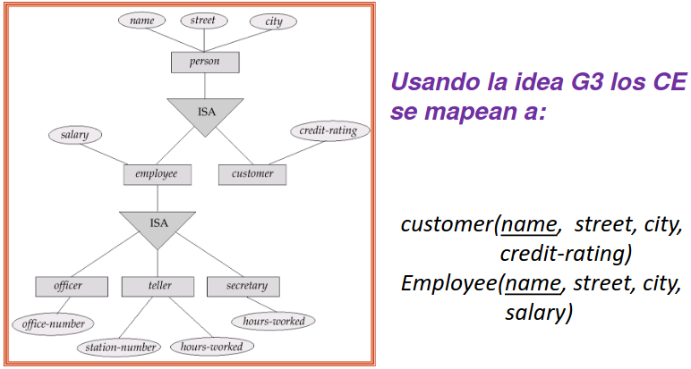

# Base de Datos

__Base de datos (BD)__: contiene datos generalmente interrelacionados.
__Esquema__: La estructura de entidades y relaciones de la BD.
__Instancia__: contenido actual de la BD en un momento del tiempo.
__Restricción de integridad__: es una propiedad que las instancias de la BD deben satisfacer. Al modificar una instancia se debe chequear que las restricciones de
integridad de la BD siguen siendo válidas.

__Procesos de diseño que veremos__:
  1. Proceso que hace un diseño de entidad-relación primero y luego traduce ese diseño de entidad-relación a un conjunto de esquemas de relación.
  2. Proceso que comienza con esquema relacional con todos los atributos atómicos del problema y un conjunto de restricciones de integridad y calcula un esquema de la base de datos. A esto se le llama normalización.

## Diseño de Entidad-Relación (ER)

Modelado de entidades y relaciones con toma de buenas decisiones de diseño. Representado diagramáticamente usado un _diagrama de entidad-relación_.
Objetivo: subsecuente __traducción__ del modelo de entidad-relación a esquemas relacionales.

- __Entidad__: objeto distinguible de otros objetos. Descrito por medio de atributos.
  - __Conjunto de entidades (CE)__: conjunto de entidades del mismo tipo (i.e. Con los mismos atributos) que comparte las mismas propiedades.

- __Relación__: asociación entre varias entidades.
  - __Conjunto de relaciones (CR)__: es una relación matemática entre n ≥ 2 CE, __{(e₁, e₂, … eₙ) | e₁ ∈ E₁, e₂ ∈ E₂, …, eₙ ∈ Eₙ}__ donde (e₁, e₂, …, eₙ) es una relación. Un atributo puede ser también una propiedad de un CR.
  - __Roles__: Los CE en un CR, no necesariamente son distintos.
  

    
  

- __Atributo__: propiedad de una entidad; esa propiedad tiene un valor en un __dominio__: _conjunto de valores permitidos para cada atributo_.
  - Atributos __Simples__: atributos hoja, no se siguen descomponiendo.
  - Atributos __compuestos__: atributos rama, se siguen descomponiendo.
  - Atributos __uni-valorados__: toman un valor.
  - Atributos __multi-valorados__: pueden tomar varios valores.
  - Atributos __derivados__: pueden computarse de otros atributos.

- __Clave__: Es un subconjunto del conjunto de atributos comunes en una colección de entidades, que permite identificar inequívocamente cada una de las entidades pertenecientes a dicha colección. Asimismo, permiten distinguir entre sí las relaciones de un conjunto de relaciones.
Dentro de los conjuntos de entidades existen los siguientes tipos de claves:
  - __Superclave de un CE__: conjunto de uno o más atributos cuyos valores unívocamente determinan cada entidad.
  - __Clave candidata (CC) de un CE__: superclave minimal (i.e. si se quita atributo dejamos de tener superclave). Una clave candidata no necesariamente tiene cardinalidad mínima.
  - __Clave primaria__: Aunque varias claves candidatas pueden existir, una de las claves candidatas es seleccionada para ser la clave primaria. No necesariamente es la de menor cantidad de atributos.
  > __Notación__: Se indican los atributos de una clave primaria para un esquema de relación R __subrayando__ los atributos de R que forman la clave primaria.

    

## Restricciones en CR's

### Correspondencias de Cardinalidades

Propósito: Diagramar conjuntos de relaciones binarios.
Sea R un CR de CE's E1 a CE's E2:

- __CR uno-uno__: Todas las entidades de E1 están asociadas con a lo sumo una entidad de E2 via R. Y viceversa.
- __CR uno-varios__: Existe alguna entidad de E1 asociada con al menos dos entidades de E2 via R. Todas las entidades de E2 están asociadas con a lo sumo una entidad de E1 via R.
- __CR varios-uno__:  Todas las entidades de E1 están asociadas con a lo sumo una entidad de E2 via R. Existe alguna entidad de E2 asociada con al menos dos entidades de E1 via R.
- __CR varios-varios__: Existe alguna entidad de E1 asociada con al menos dos entidades de E2 via R. Y viceversa.

> __Obs:__ En todos los casos pueden existir elementos pertenecientes a E1 que no están mapeados con elementos de E2 y viceversa.
>
> __Notación__: 
> 

>   
> 

>
> __Notación de intervalos o de cardinalidades__: [a..b] o [a..*] 
> 

>   
> 

> Notar que el lugar donde se pone la información es al revés (o sea, del otro lado) que en correspondencia de cardinalidades.

### Restricciones de participación

Dado un conjunto de relaciones R en el cual participa un conjunto de entidades A, dicha participación puede ser de dos tipos:

- __Participación total__: (indicada por línea doble) toda entidad en el conjunto de entidades participa en al menos una relación en el conjunto de relaciones.
  

    
  

- __Participación parcial__: (indicada por línea simple) algunas entidades no participan en alguna relación en el conjunto de relaciones.
  

    
  

## Entidades fuertes y débiles
Cuando una entidad participa en una relación puede adquirir un papel fuerte o débil. Una entidad débil es aquella que no puede existir sin participar en la relación; es decir, aquella que no puede ser unívocamente identificada solamente por sus atributos.

Una entidad fuerte (también conocida como entidad regular) es aquella que sí puede ser identificada unívocamente. En los casos en que se requiera, se puede dar que una entidad fuerte "preste" algunos de sus atributos a una entidad débil para que esta última se pueda identificar.

__Conjunto de Entidades Débiles__: Es un CE que no tiene una clave primaria en el conjunto de sus atributos.
  Se representa con rectángulo de borde doble.
  Su existencia depende de la existencia de al menos un CE fuerte llamado __CE identificador__.
  Hay un CR varios-uno entre CE débil y CE identificador, donde el CE débil tiene participación total.
  - A este CR se le llama CR de identificación.
  - El mismo se representa con un diamante doble.
  El __discriminador__ de un CE débiles es un conjunto de atributos que
    - Permite distinguir entre todas las entidades de un CE débiles asociadas a la misma entidad fuerte.
    - Los atributos del discriminador se subrayan con línea de guiones
  La __clave primaria__ de un CE débiles se forma con la clave primaria del CE identificador más el discriminador del CE débiles.

## Especialización-Generalización

__Especialización__: hace referencia a un proceso de diseño descendiente (top-down) donde designamos __subgrupos__ dentro de un CE que son distintivos de otras entidades en el CE.

Estos subgrupos son CE de más bajo nivel que
  - tienen atributos específicos (adicionales a los atributos del CE del que se saca el subgrupo), o
  - participan de CR que no aplican al CE de más alto nivel.

Una especialización se denota con un triángulo etiquetado ISA o ES, se llama también relación de superclase – subclase.

__Herencia de atributos__: un CE de más bajo nivel hereda:
  - todos los atributos,
  - la clave primaria, y
  - participaciones en CR del CE de más alto nivel con el cual está relacionado.

__Generalización__: hace referencia a un proceso de diseño ascendiente (bottom up) que generaliza unos cuantos CE que comparten las mismas propiedades en un CE de más alto nivel.

__Restricciones de integridad__:
  - Para indicar si una entidad pertenece o no a más de un CE de nivel más bajo dentro de la generalización.
    - Disjunto: una entidad puede pertenecer a solo un CE de nivel más bajo. Usar palabra reservada disj.
    - Solapado: una entidad puede pertenecer a más de un CE de nivel más bajo.
  - __Restricción de completitud__: para indicar si una entidad en el CE de nivel más alto debe pertenecer a al menos uno de los CE de nivel más bajo en la generalización.
    - Total: una entidad debe pertenecer a un CE de nivel más bajo (usar línea doble para indicarlo).
    - Parcial: una entidad puede no pertenecer a un CE de nivel más bajo

## Reglas de Reducción a Esquemas Relacionales

- __Un CE fuerte que no involucra atributos compuestos ni atributos multi-valorados__ se mapea a un esquema relacional con los mismos atributos.
  - La clave primaria del CE se convierte en la clave primaria del esquema relacional.
  

    
  

- __Un CE fuerte que no involucra atributos/subatributos multivalorados__ se mapea a un esquema relacional con los mismos atributos simples y los subatributos hoja de los atributos compuestos. Cada valor del atributo multivalorado mapea a una tupla separada en la tabla del esquema EM.
  - Solo nos quedamos con los atributos simples/hojas y eliminamos los compuestos/ramas.
  

    
  

- __Un atributo multivalorado M simple de un CE__ E es representado por un esquema separado EM.
  - EM tiene atributos correspondientes a la clave primaria de E y un atributo correspondiente al atributo multivalorado M.
  - Todos los atributos de EM forman su clave primaria.
  - Se pone una restricción de clave foránea desde EM que referencia a la clave primaria de E.
  

    
  

- __Los atributos derivados__ no son explícitamente representados en el modelo de datos relacional. Si se los necesita, una forma de computarlos es por medio de consultas.

- __Un CR varios-varios__ es representado con un esquema con atributos para las claves primarias de los dos CE participantes y todos los atributos descriptivos del CR (que no son multivalorados).
  - La clave primaria del esquema del CR es la unión de las claves primarias de los CEs que participan en el CR.
  - Para cada CE que participa en el CR se crea restricción de clave foránea que referencia clave primaria de CE.
  

    
  

- __Un CR varios a uno o uno a varios que es total en el lado varios__ puede ser representado agregando atributos extra en el CE del lado varios, conteniendo la clave primaria del lado uno.
  - La clave primaria del CR es la clave primaria del CE del lado varios.
  - Se crea restricción de clave foránea de CR que referencia a clave primaria de CE de lado varios.
  - Si la participación es parcial en el lado varios, aplicar la regla anterior puede resultar en valores nulos. Esto sucede cuando a una entidad del CE del lado varios no le corresponde ninguna entidad del CE del lado uno.
  

    
  

- __Un CR uno a uno con participación total en ambos lados__ puede ser mapeado agregando al esquema resultante de traducir uno de los CE participantes los atributos de la clave primaria del otro CE.
  - La clave primaria de cualquier CE puede ser elegida como la clave primaria del CR.
  - Se crea restricción de clave foránea de esquema relacional asociado al CR que referencia clave primaria de otro CE (el que no se tomo de base para hallar el esquema asociado al CR).
  

    
  

- __Un CE débiles__ se mapea a una tabla que incluye columnas para la clave primaria del CE identificador más los atributos (no multivalorados) del CE débiles (achatando jerarquías de atributos compuestos si es necesario).
  - La clave primaria del CE identificador más el discriminador del CE débil forman la clave primaria del esquema relacional de la traducción.
  - Para atributos de esquema de CE débil que provienen de CE identificadora se agrega restricción de clave foránea desde esquema de CE débil a CE identificador.
  - El CR identificador no se mapea.
  

    
  

- __Cuando el CE generalización no está relacionado con otros CE__ hay tres posibles guias:

1. __Si es una generalización total y disjunta__: Formar una tabla para cada CE especialización con los atributos locales y heredados; no formar tabla para la generalización.
  

    
  

2. __Si es una generalización no total y disjunta__: Formar una tabla para cada CE especialización con los atributos locales y heredados del CE generalización.
    - No va a haber redundancia entre los CE especializaciones.
    - No hay que consultar dos tablas para obtener toda la información de una especialización.
  

    
  

3. __Si es una generalización no disjunta__: Formar una tabla para el CE de nivel más alto (la generalización); Formar una tabla para cada CE especialización que incluye la clave primaria del CE generalización y los atributos locales.
  

    
  

## Diseño relacional

Tipo de esquema de base de datos que la modela como un conjunto de esquemas relacionales que sirven para describir su estructura.
__Esquema relacional__: lista de nombres de atributos (Nombre esquema = lista de atributos).
__Instancia__: Datos que se almacenan en tablas para los esquemas de la misma.
Las columnas representan atributos (o propiedades) para los elementos de la tabla (tuplas).

    

> __Notación__: __r(R)__ significa r es una relación con esquema de relación R. O sea, las columnas de r tienen como nombres los atributos de R.

__Dominio del atributo__: conjunto de valores permitidos para cada atributo.
Los valores de los atributos deben ser __atómicos__ (indivisibles).
O sea que en las consultas o restricciones de integridad no vamos a dividir el valor de un atributo en partes. Simplificando la descripción de consultas o restricciones de integridad.

__Superclaves__: Sea K ⊆ R , R esquema de relación; K es una superclave de R si los valores para K son suficientes para identificar una tupla única en cada posible relación r(R).

__Clave candidata__: Una superclave K __minimal__. Para todo atributo de K si se lo quito a K dejo de tener una superclave.

__Clave primaria__: La clave candidata elegida.
> __Notación__: Se indican los atributos de una clave primaria para un esquema de relación R __subrayando__ los atributos de R que forman la clave primaria.

__Restricción de clave foránea (o de integridad referencial)__: Los valores de uno o más atributos en una tupla de la __relación referenciante__ aparecen en uno o más atributos de una tupla en la __relación referenciada__. Los atributos referenciados de la relación referenciada suelen formar una __clave candidata__ del esquema de la relación referenciada.

    

__Redundancia de datos__: Repetición/duplicación de datos que son el mismo y por lo tanto mantenerse iguales. Debemos diseñar un esquema de la BD que no contenga redundancia de
datos. __Una solución__: Obtener un buen diseño descomponiendo el esquema que contiene todos los atributos en esquemas más chicos. La __teoría de normalización__ trabaja con esta idea y trata con cómo diseñar buenos esquemas de BD relacionales.

## Criterios al evaluar una Base de Datos

- Redundancia de datos
- Comprensibilidad
- Completitud (p.ej. en consideración de restricciones de integridad)
- Facilidad de consultar información

## Lenguajes de Consultas

__Consulta__: en una base de datos es una expresión que describe una colección de datos deseada. Para expresar consultas se usan __lenguajes de consulta__.

Para consultar los datos en modelo relacional es muy usado en la industria
el lenguaje de consultas SQL.

Para el modelo relacional existen lenguajes de consulta puros como
álgebra relacional, cálculo de tuplas, etc.
__álgebra de tablas__: variación más expresiva del álgebra relacional

__sistema gestor de BD (SGBD) relacionales__: se compone de Gestor de almacenamiento, Procesamiento de consultas y Gestor de transacciones.

## Gestión del almacenamiento

Los datos deben ser organizados en archivos con estructuras apropiadas
de modo que su acceso, modificación y retorno sea eficiente.
• A nivel físico se explica cómo los registros de datos son almacenados en
archivos.
• Para acceso, modificación y almacenamiento eficiente a los datos se
pueden usar índices (unas estructuras de acceso especiales).
• A nivel lógico se describen los datos almacenados en la BD y las relaciones
entre ellos.
• El gestor de almacenamiento provee una interfaz para los datos a nivel
físico para ser usada por los programas de aplicación y consultas enviadas
al sistema. Se ocupa de: acceso al almacenamiento, organización en
archivos de los datos, indexado.

## Procesamiento de consultas

El sistema gestor de BD procesa consultas para el modelo relacional.

1. Parseo de la consulta y su traducción (p.ej. a álgebra relacional o álgebra de tablas)
2. Optimización: Encontrar la manera “más eficiente” (o plan) para obtener la información descrita por la consulta.
3. Evaluación (siguiendo el plan optimizado)

    

## Transacciones

> __Preguntas importantes__:
> o ¿Qué pasa si falla el SGBD?
> o ¿Qué pasa si más de un usuario actualiza concurrentemente los mismos datos?

__Transacción__: una colección de operaciones que realiza una función lógica simple en una aplicación de BD. Una transacción es una unidad de ejecución que accede y posiblemente actualiza varios ítems de datos. Son __atómicas__ (i.e: o todas las operaciones de la transacción son reflejadas en la BD o ninguna lo es).

__Componente de manejo de transacciones__: asegura que BD permanezca en un estado consistente (correcto) a pesar de fallas del sistema (e.g. fallas de energía, caídas de sistema operativo) y fallas de transacciones.

__Planificaciones__: secuencias que indican el orden cronológico en el cual las instrucciones de transacciones concurrentes son ejecutadas.

__Gestor de concurrencia de transacciones__: controla la interacción entre transacciones concurrentes para asegurar la consistencia de la BD.

## Retorno de la información

__Retorno de la información__: proceso de retornar documentos a partir de una colección de documentos en respuesta a una consulta. Los documentos suelen estar en lenguaje natural no estructurado. Los resultados de una búsqueda pueden ser una lista de identificadores de documentos y también algunas piezas de texto. Los documentos suelen retornarse en orden decreciente de puntaje de relevancia.

__Sistemas de retorno de información (SRI)__: típicamente permiten expresiones de consulta formadas usando palabras clave y conectivos proposicionales.

Sistemas de retorno de la información que trabajan con colecciones de archivos almacenados en una PC.
Sistemas de retorno de la información que trabajan con la búsqueda en la web

## Bot de chat conversacional inteligente

__Bot de chat conversacional inteligente__: aplicación de software que usa la Inteligencia Artificial (IA) y el Procesamiento de Lenguaje Natural (PLN) para comprender los requerimientos de un ser humano y ayudarlo a cumplirlos.  Los bots de chat de texto solo se comunican a través de palabras
escritas. Los bots de chat multimedia, pueden incluir además de
texto otras medias como imágenes, videos, voz.

Los bots de chat conversacionales de texto funcionan a partir de
consultas claras y concisas llamadas prompts.
• Para obtener las mejores respuestas se deben diseñar buenos
prompts y para eso se recomienda seguir una cierta estructura para
su construcción que estudiaremos en clase.
• También estudiaremos la base de los bots de chats de texto que son:
procesamiento de lenguaje natural, modelos grandes de lenguaje,
arquitectura de motores de chat.