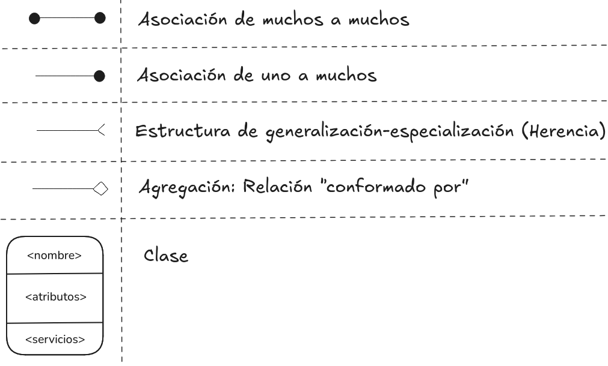

# Ingeniería del Software I - Capitulo 3

FaMAF, Universidad Nacional de Córdoba
Libro: An Integrated Approach to Software Engineering de Jalote

## Análisis y especificación de los requisitos del software

__Entrada:__ Las necesidades y deseos que se encuentran en la cabeza de alguien (ideas abstractas).

__Salida:__ Un detalle preciso de lo que será el sistema futuro.

- Involucra interacción con la gente.
- No puede automatizarse.

La fase de requisitos finaliza produciendo el documento con la especificación de los requerimientos del software (SRS).

## Requerimientos del software (SRS)

> __Requerimientos (IEEE):__ Una condición o capacidad necesaria que debe poseer o cumplir un sistema.

La SRS establece las bases para el __acuerdo__, entre el cliente/usuario y el desarrollador, sobre __que__ necesidades tiene el cliente/usuario.

Nuestro objetivo es vender por lo que si el cliente/usuario no sabe bien lo que quiere o necesita, debemos aclararlo. Vender.

>__Obs:__ Existe una __brecha comunicacional__ entre las partes
>Cliente: no comprende el proceso de desarrollo de software.
>Desarrollador: no conoce el problema del cliente ni su área de aplicación.

__Los errores de SRS salen caro__: son más caros de corregir a medida que progresa el proyecto y muchas veces se manifestarán en el software final.
Una buena SRS contribuye a minimizar cambios y errores.

La SRS se obtiene a través del __proceso de requerimientos:__ Secuencia de pasos que se necesita realizar para convertir las necesidades del usuario en la SRS.

    
    
El proceso no es lineal; es iterativo, paralelo y consta de:   1) Análisis y modelado del problema o requerimientos.   2) Especificación de los requerimientos.   3) Validación.

### Proceso de requerimientos: 1) Análisis y modelado del problema

Se enfoca en la comprensión de la estructura del problema (necesidades, requerimientos, y
restricciones del sistema deseado) y su dominio (componentes, entrada, salida).
En el se __recolecta información__, mas (o distinta) de la necesaria para la especificación, luego se __identifica y descompone el problema__ (divide y conquista) y __comprende informalmente sus partes y relaciones__ a través de técnicas como diagramas de flujo de datos, diagramas de objetos, etc. Con el fin de __plasmar las conclusiones en la SRS__, la cual sera el objeto de revisión con el cliente.

> __Obs:__ Los métodos de análisis son similares a los de diseño, pero con objetivos y alcances distintos. El análisis trata con el dominio del problema mientras que el diseño trata con el dominio de la solución.

No se construye un modelo formal del sistema; la información se obtiene a través de análisis, observación, interacción, discusión, etc.

Recolectar y organizar la información (rol pasivo) incluye interactuar con el cliente y usuarios, leer los manuales, estudiar del sistema actual, comprender el funcionamiento de la organización, el cliente, y los usuarios.

Al identificar el problema, se puede ser consultor del cliente/usuario (rol activo) y ayudarlo a comprender nuevas posibilidades.

Al descomponer el problema y comprender informalmente sus partes y relaciones se obtienen distintos puntos de vistas a través de:

- Funciones: análisis estructural o Modelado de flujo de datos (DFD)
- Objetos: análisis OO o Modelado orientado a objetos (modelos OO)
- Eventos del sistema: particionado de eventos
- Prototipo: construcción de sistema parcial (Prototipado)

> __Obs:__ Los elementos de esta fase como los DFD, modelos OO, o prototipado __no son SRS__.
> El modelado se enfoca en la estructura del problema para su análisis. La SRS se enfoca en el comportamiento externo del sistema.

#### Modelado de flujo de datos (DFD)

Se enfoca en las __funciones__ realizadas en el sistema, no en los requisitos no-funcionales.
Ve al sistema como una red de __transformadores de datos__ sobre la cual fluye la información.
Para el modelado __utiliza diagramas de flujo de datos (DFD)__ y __descomposición funcional__.

    
    
 Un DFD es una representación gráfica para representar un proceso, donde se representa el flujo de datos a través del sistema.   • Captura la manera en que ocurre la transformación de la entrada en la salida a medida que los datos se mueven a través de los transformadores/procesos.   • No se limita al software, se divide entre los procesos humanos y de software.   • En general, NO hay loops ni razonamiento condicional.   • NO es un diagrama de control, no debería existir diseño ni pensamiento algorítmico. 

Los datos se nombran sin mucho detalle en el DFD, por lo que deben definirse con mayor precisión (expresiones regulares, ...) en el __diccionario de datos__.

#### Modelado orientado a objetos

El análisis orientado a objetos es más fácil de construir y de mantener. Porque es más resistente/adaptable a cambios gracias a que los objetos son más estables que las funciones.
El sistema es visto como un conjunto de objetos interactuando entre sí, o con el usuario, a través de servicios que cada objeto provee.

El modelado consiste en __identificar los objetos__ en el dominio del problema, __agruparlos en clases__ identificando cuál es la información del estado que ésta encapsula (i.e. los atributos) e __identificar las relaciones entre las clases__, ya sea en la jerarquía o a través de llamadas a métodos.

Cada clase tiene __nombre__, __atributos__, y __servicios__. Los servicios se acceden a través de mensajes que se envían a los objetos y sirven para ver sus atributos o modificarlos cambiando sus valores y por lo tanto su __estado__.

    
    
 Guía para realizar el análisis OO:   • Identificar objetos y clases: Identificar sustantivos - Aislar potenciales objetos del sistema   • Identificar estructuras: Considerar si alguno especifica significativamente a otro (herencia) o si alguno es parte de otro (agregación)   • Identificar atributos: Características, dentro del dominio del problema (No agregar atributos innecesarios), que definen los objetos   • Identificar asociaciones: Capturan la relación entre instancias de varias clases - Pueden tener sus propios atributos (no forzar estos atributos en los objetos)   • Definir servicios: Definir los estados del sistema y por cada estado listar los eventos externos y respuestas requeridas - Asociar estas actividades con las clases 

#### Prototipado

Se construye un sistema parcial prototípico para comprender y visualizar mejor el problema y las necesidades. Puede ser:

- Descartable: el prototipo se construye con la idea de desecharlo luego de culminada
la fase de requerimientos.
- Evolucionario: se construye con la idea de que evolucionará al sistema final.

El descartable es más adecuado para esta fase del problema.

### Proceso de requerimientos: 2) Especificación de los requerimientos

Una vez comprendido el sistema, a través de la fase de modelado y análisis del problema, la transición a la SRS no es directa.
La especificación se enfoca en el comportamiento externo.

### Proceso de requerimientos: 3) Validación
