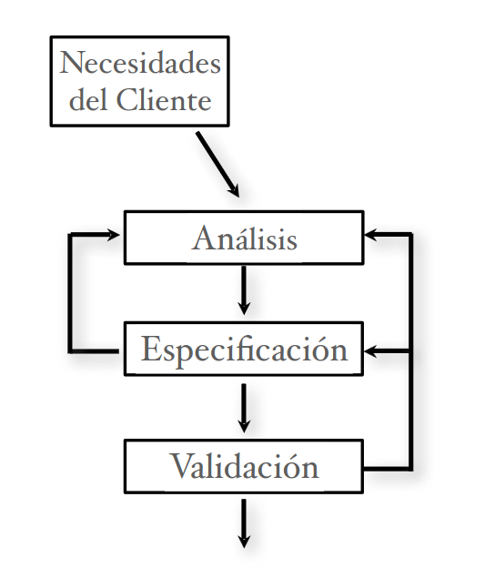
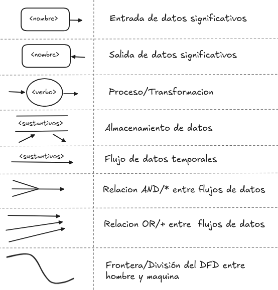
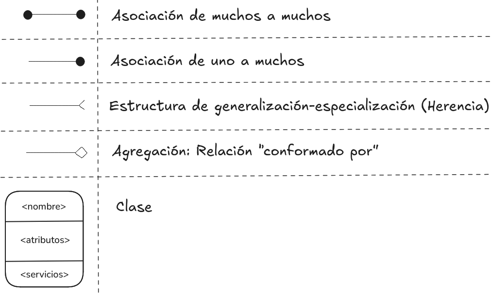
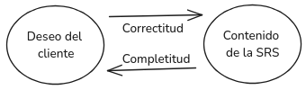
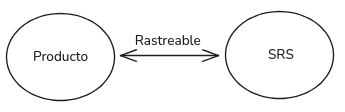

# Ingeniería del Software I - Capitulo 3

FaMAF, Universidad Nacional de Córdoba
Libro: An Integrated Approach to Software Engineering de Jalote

## Análisis y especificación de los requisitos del software

Tiene como objetivo producir el documento con la especificación de los __requerimientos del software (SRS)__ a través del __proceso de requerimientos__: Proceso de análisis y especificación a partir de la __Entrada:__ _Las necesidades y deseos que se encuentran en la cabeza de alguien (ideas abstractas)_ terminando con la __Salida:__ _Un detalle preciso de lo que será el sistema futuro_: la SRS.
Este proceso involucra interacción con la gente y no puede automatizarse.

La SRS establece las bases para el __acuerdo__, entre el cliente/usuario y el desarrollador, sobre __que__ (y __No como__ se resolverán) necesidades tiene el cliente/usuario.

__Los errores de SRS salen caro__: son más caros de corregir a medida que progresa el proyecto y muchas veces se manifestarán en el software final. Una buena SRS contribuye a minimizar cambios y errores.

> __Requerimientos (IEEE):__ Una condición o capacidad necesaria que debe poseer o cumplir un sistema.
>__Obs:__ Existe una __brecha comunicacional__ entre las partes: El cliente/usuario no comprende el proceso de desarrollo de software mientras que el desarrollador no conoce el problema del cliente ni su área de aplicación.

    
    
 <b>Proceso de requerimientos:</b>   Es la secuencia de pasos que se necesita realizar para convertir las necesidades del usuario en la SRS.   Es un proceso no lineal; es iterativo, paralelo y consta de:   1) Análisis y modelado del problema o requerimientos.   2) Especificación de los requerimientos (SRS preliminar).   3) Validación (SRS finalizada).

### Proceso de requerimientos: 1) Análisis y modelado del problema

Se enfoca en la comprensión de la estructura del problema (necesidades, requerimientos, y
restricciones del sistema deseado) y su dominio (componentes, entrada, salida).
Principalmente __recolecta información__, mas (o distinta) de la necesaria para la especificación; __identifica y descompone el problema__ (divide y conquista) y __comprende informalmente sus partes y relaciones__ a través de técnicas como diagramas de flujo de datos, diagramas de objetos, etc. Con el fin de poder plasmar en la _especificación de los requerimientos_ las conclusiones en la SRS, la cual sera el objeto de revisión con el cliente en la _verificación_.

> __Obs:__ Los métodos de análisis son similares a los de diseño, pero con objetivos y alcances distintos. El análisis trata con el dominio del problema mientras que el diseño trata con el dominio de la solución.

No se construye un modelo formal del sistema.

Recolectar y organizar la información (rol pasivo) incluye interactuar con el cliente y usuarios, leer los manuales, estudiar del sistema actual, comprender el funcionamiento de la organización, el cliente, y los usuarios.

Al identificar el problema, se puede ser consultor del cliente/usuario (rol activo) y ayudarlo a comprender nuevas posibilidades.

Al descomponer el problema y comprender informalmente sus partes y relaciones se obtienen distintos puntos de vistas a través de:

- Funciones: análisis estructural o Modelado de flujo de datos (DFD)
- Objetos: análisis OO o Modelado orientado a objetos (modelos OO)
- Eventos del sistema: particionado de eventos 'o Especificación funcional con Casos de uso' <!-- <-- __corregir__, vimos esto sino? FIXME: -->
- Prototipo: construcción de sistema parcial (Prototipado)

> __Obs:__ Los elementos de esta fase como los DFD, modelos OO, o prototipado __no son SRS__.
> El modelado se enfoca en la estructura del problema para su análisis. La SRS se enfoca en el comportamiento externo del sistema.

#### Modelado de flujo de datos (DFD)

Se enfoca en las __funciones__ realizadas en el sistema, no en los requisitos no-funcionales.
Ve al sistema como una red de __transformadores de datos__ sobre la cual fluye la información.
Para el modelado __utiliza diagramas de flujo de datos (DFD)__ y __descomposición funcional__.

    
    
 Un DFD es una representación gráfica para representar un proceso, donde se representa el flujo de datos a través del sistema.   • Captura la manera en que ocurre la transformación de la entrada en la salida a medida que los datos se mueven a través de los transformadores/procesos.   • No se limita al software, se divide entre los procesos humanos y de software.   • En general, NO hay loops ni razonamiento condicional.   • NO es un diagrama de control, no debería existir diseño ni pensamiento algorítmico. 

Los datos se nombran sin mucho detalle en el DFD, por lo que deben definirse con mayor precisión (expresiones regulares, ...) en el __diccionario de datos__.

#### Modelado orientado a objetos

El análisis orientado a objetos es más fácil de construir y de mantener. Porque es más resistente/adaptable a cambios gracias a que los objetos son más estables que las funciones.
El sistema es visto como un conjunto de objetos interactuando entre sí, o con el usuario, a través de servicios que cada objeto provee.

El modelado consiste en __identificar los objetos__ en el dominio del problema, __agruparlos en clases__ identificando cuál es la información del estado que ésta encapsula (i.e. los atributos) e __identificar las relaciones entre las clases__, ya sea en la jerarquía o a través de llamadas a métodos.

Cada clase tiene __nombre__, __atributos__, y __servicios__. Los servicios se acceden a través de mensajes que se envían a los objetos y sirven para ver sus atributos o modificarlos cambiando sus valores y por lo tanto su __estado__.

    
    
 Guía para realizar el análisis OO:   • Objetos y clases: Identificar sustantivos - Aislar potenciales objetos del sistema   • Estructuras: Considerar si alguno especifica significativamente a otro (herencia) o si alguno es parte de otro (agregación)   • Atributos: Características, dentro del dominio del problema (No agregar atributos innecesarios), que definen los objetos   • Asociaciones: Capturan la relación entre instancias de varias clases - Pueden tener sus propios atributos (no forzar estos atributos en los objetos)   • Servicios: Definir los estados del sistema y por cada estado listar los eventos externos y respuestas requeridas - Asociar estas actividades con las clases 

#### Prototipado

Se construye un sistema parcial prototípico para comprender y visualizar mejor el problema y las necesidades. Puede ser:

- Descartable: el prototipo se construye con la idea de desecharlo luego de culminada
la fase de requerimientos.
- Evolucionario: se construye con la idea de que evolucionará al sistema final.

El descartable es más adecuado para esta fase del problema.

### Proceso de requerimientos: 2) Especificación de los requerimientos

La especificación se enfoca en el comportamiento externo.
Una vez comprendido el sistema, a través de la fase de modelado y análisis del problema, la transición a la SRS no es directa, consta en organizar el conocimiento adquirido en una especificación maximizando las siguientes características:

#### Características de una SRS

- __Correcta__
  Cada requerimiento perteneciente a la SRS representa precisamente alguna característica deseada por el cliente en el sistema final.
- __Completa__
  Todas las características deseadas por el cliente están descritas en la SRS.
  La característica más difícil de lograr, para conseguirla uno debe detectar las ausencias en la especificación.

- __No ambigua__
  Para cada requerimiento existe una sola interpretación (i.e: Existe un solo significado en el contexto al que pertenece).
  Es <u>_esencial para verificabilidad_</u>, como la verificación es usualmente hecha a través de revisiones, la SRS debe ser comprensible, al menos por el desarrollador, el usuario y el cliente. Particular atención si se usa lenguaje natural.
  Los lenguajes formales ayudan a “desambiguar”
- __Verificable__ (Testeable)
  Si existe para cada requerimiento algún proceso efectivo que puede asegurar que el software final satisface el requerimiento.
- __Consistente__ (No contradicción)
  Ningún requerimiento contradice a otro.
  Ej.: conflictos lógicos, temporales, de dependencias.
- __Modificable__ (Extensibilidad)
  Si la estructura y estilo de la SRS es tal que <u>_permite incorporar cambios fácilmente preservando completitud y consistencia_</u>.
  La redundancia es un gran estorbo para modificabilidad, puede resultar en inconsistencia.
- __Rastreable__ (Traceable)
  Se debe poder determinar el origen de cada requerimiento y cómo éste se relaciona a los elementos del software.
  - _Hacia adelante:_ dado un requerimiento se debe poder detectar en qué elementos de diseño o código tiene impacto.
  - _Hacia atrás:_ dado un elemento de diseño o código se debe poder rastrear que requerimientos está atendiendo.

  

- __Ordenada en aspectos de importancia y estabilidad__
  Los requerimientos pueden ser: críticos, importantes pero no críticos, deseables pero no importantes. Algunos requerimientos son esenciales y difícilmente cambien con el tiempo pero otros son propensos a cambiar.
  Por lo tanto, Se necesita definir un orden de prioridades en la construcción para reducir riesgos debido a cambios de requerimientos.

#### Componentes de una SRS

Tener lineamientos sobre qué se debe especificar en una SRS ayudará a conseguir completitud.
Una SRS debe especificar requerimientos sobre:

1. Funcionalidad.
2. Desempeño (performance).
3. Restricciones de diseño.
4. Interfaces externas.

- __Requerimientos de funcionalidad__:
  - Conforma la mayor parte de la especificación.
  - Especifica toda la funcionalidad que el sistema debe proveer.
  - Especifica qué salidas se deben producir para cada entrada dada y las relaciones entre   ellas.
  - Describe todas las operaciones que el sistema debe realizar.
  - Describe las entradas válidas y las verificaciones de validez de la entrada y salida.
  - Describe el comportamiento del sistema en caso de entradas inválidas, errores de cálculo u   otras situaciones anormales, o en el caso de situaciones normales pero con imposibilidad de   operar.

- __Requerimientos de desempeño__:
  - Todas las restricciones en el desempeño del sistema de software.
  - Requerimientos Dinámicos (especifican restricciones sobre la ejecución):
    - Tiempo de respuesta.
    - Tiempo esperado de terminación de una operación dada.
    - Tasa de transferencia o rendimiento.
    - Cantidad de operaciones realizadas por unidad de tiempo.
    - En general se especifican los rangos aceptables de los distintos parámetros, en casos   normales y extremos.
  - Requerimientos Estáticos o de capacidad (no imponen restricción en la ejecución):
    - Cantidad de terminales admitidas.
    - Cantidad de usuarios admitidos simultáneamente.
    - Cantidad de archivos a procesar y sus tamaños.
  - Todos los requisitos se especifican en términos medibles => verificable.

- __Restricciones de diseño__:
  Ejemplos:
  - Ajustarse a estándares y compatibilidad con otros sistemas, limitaciones de hardware y   otros recursos.
  - Requerimientos de confiabilidad, tolerancia a falla, o respaldo, seguridad.

- __Requerimientos de interfaces externas__:
  - Todas las interacciones del software con gente, hardware, y otros software deben   especificarse claramente.
  - La interfaz con el usuario debe recibir atención adecuada. Crear un manual preliminar   indicando los comandos del usuario, los formatos de las pantallas, etcétera.
  - Estos requerimientos también deben ser precisos para asegurar verificabilidad. Evitar   cosas como “la interfaz debe ser amigable”.

#### Lenguajes de especificación

------------------------------ A partir de aca hay que resumir mejor.

Los lenguajes de especificación deben facilitar escribir SRS con las características deseadas: modificabilidad, no ambigüedad, etcétera.

- A la vez deben ser fáciles de aprender.
- Los lenguajes formales son precisos y carecen de ambigüedad pero no son muy fáciles de aprender.
- Usualmente se utiliza el lenguaje natural apoyado por documentos estructurados (estandarizados) para reducir imprecisiones y ambigüedades.
- La mayor ventaja del lenguaje natural es que tanto el cliente como los desarrolladores lo comprenden, pero es ambiguo...
- Las notaciones formales se utilizan en propiedades específicas del sistema o en sistemas críticos.

#### Alcance

- Qué cosas entran en / abarca el proyecto?
- Qué cosas no entran en / no abarca el proyecto?
- Objetivos, entregables y requerimientos. Tiempos de entrega.
- Cúales son las prioridades para saber qué hacer primero.
- Criterio de aceptación (¿qué tipo de usuario lo aceptará?).
- Limitantes presupuestarios.

#### Especificación funcional con Casos de uso

Busca capturar el _comportamiento del sistema_ como ___interacción__ de los usuarios con el sistema_, haciendo foco en _la especificación de cada función que provee el sistema_.

> __Obs:__
>
> - Puede usarse para especificar comportamiento de empresas u organizaciones.
> - Muy adecuado para sistemas interactivos.
> - Es util en la recolección de requerimientos dado que a los usuarios les agrada, comprenden el formato, y reaccionan a éste fácilmente.

__Componentes:__

- __Actor:__ Una persona o un sistema que interactúa con el sistema propuesto para alcanzar un objetivo.
  > __Obs:__
  > - Un actor es una entidad lógica => actores receptores y actores transmisores son distintos (aún si es el mismo individuo).
  > - Los actores pueden ser personas o sistemas.
  - _Actor primario:_ El actor principal que inicia el caso de uso (i.e: Si no existiera, no existiría el caso de uso). El caso de uso debe satisfacer su objetivo (AP es el interesado).

- __Escenario:__ es un conjunto de acciones realizadas con el fin de alcanzar un objetivo bajo determinadas condiciones.
  Las acciones se especifican como un conjunto de pasos.
  Un paso es una acción lógicamente completa realizada tanto por el actor como por el sistema.
  Es una interactuación entre el usuario y el sistema.
  - _Escenario exitoso principal:_ cuando todo funciona normalmente y se alcanza el objetivo.
  - _Escenarios alternativos:_ (de extensión/de excepción): cuando algo sale mal y el objetivo no puede ser alcanzado.

Un Caso de uso es una colección de muchos escenarios.
Un escenario puede emplear otros casos de usos en un paso (i.e: los casos de uso pueden organizarse jerárquicamente).

Los casos de uso especifican funcionalidades describiendo la interacción entre actores y sistema.
Se enfocan en el comportamiento externo.
Los casos de uso son primariamente textuales
Los diagramas de casos de uso son suplementos de los casos de usos textuales.
Muestran casos de usos, actores y sus dependencias.
Sólo proveen una visión general.
Los casos de usos no forman la SRS completa, sólo la parte funcional

Los casos de uso proveen un medio adecuado para la discusión y el
brainstorming.
=> también son apropiados para la recolección de requerimientos y el análisis del
problema.
• Los casos de uso pueden elaborarse haciendo refinamientos paso a paso.
En este contexto se presentan varios niveles de abstracción. Cuatro de ellos
emergen naturalmente.

##### Niveles de abstracción

1. Actores y objetivos:
• Preparar una lista de actores y objetivos.
• Proveer un breve resumen del caso de uso.
• Esto define el ámbito del caso de uso.
• También se puede evaluar completitud.
2. Escenarios exitosos principales:
• Por cada caso de uso, expandir el escenario principal.
• Esto provee el comportamiento principal del sistema.
• Puede revisarse para asegurar que se satisface el interés de los participantes y
actores.
3. Condiciones de falla:
• Listar las posibles condiciones de falla para cada caso de uso.
• Por cada paso, identificar cómo y por qué puede fallar.
• Este paso descubre situaciones especiales.
4. Manipulación de fallas: Quizás sea la parte más difícil.
• Especificar el comportamiento del sistema para cada condición de falla.
• Al realizar esta etapa pueden emerger nuevas situaciones y actores.

Los cuatro niveles pueden dirigir el proceso de análisis comenzando desde lo más
abstracto y agregando más detalles a medida que se avanza.
• Los casos de uso se deben especificar al nivel de detalle que sea suficiente, no hay
un criterio general para determinar cuál es el adecuado.
• Para escribir, utilizar reglas de buena escritura técnica:
Usar gramática simple / oraciones simples.
Especificar claramente todas las partes del caso de uso.
Cuando sea necesario, combinar o dividir pasos.

### Proceso de requerimientos: 3) Validación

Debido a la naturaleza de esta etapa, hay muchas posibilidades de malentendidos.
=> muchos errores son posibles.
• Es caro corregir los defectos de requerimientos más tarde.
• Se deben intentar corregir en esta etapa.
• Errores más comunes: Omisión, Inconsistencia, Hechos incorrectos y Ambigüedad

• La SRS se revisa por un grupo de personas.
• Grupo conformado por: autor, cliente, representantes de usuarios y de
desarrolladores.
• Debe incluir al cliente y a los usuarios.
• Proceso: un proceso de inspección estándar (se verá luego).
• Efectividad: se pueden detectar entre el 40% y el 80% de los errores de
requerimientos.
• Las listas de controles son muy útiles para ello.

Además, existen herramientas para el modelado y análisis de especificaciones.
• Se escriben en lenguajes de especificación formal.
Ej.: Z, B, Alloy, Autómatas, Redes de Petri, Álgebras de Procesos, etcétera.
• Hay herramientas automáticas o semiautomáticas que soportan estos lenguajes.
• Permiten verificar consistencia, dependencias circulares, o propiedades
específicas.
• También permiten simular para poder comprender completitud y corrección.

#### Métricas

Para poder estimar costos y tiempos y planear el proyecto se necesita “medir” el esfuerzo que
demandará.
• El esfuerzo del proyecto depende de muchos factores.
• El tamaño es el principal factor, validado por muchos experimentos y datos de análisis.
• Al principio el tamaño sólo puede ser estimado.
• Conseguir buenos estimadores es muy difícil.
• Una métrica es importante sólo si es útil para el seguimiento o control de costos, calendario
o calidad.
• Se necesita una unidad de tamaño que se pueda computar a partir de los requerimientos:
¿Tamaño de la SRS? => dependen mucho del autor

__Punto función__
• Es una estimación similar a la métrica LOC.
• Se determina sólo con la SRS.
• Define el tamaño en términos de la “funcionalidad”.

Tipo de funciones:
Entradas externas: Tipo de entrada (dato/control) externa a la aplicación
Salidas externas: Tipo de salida que deja el sistema
Archivos lógicos internos: Grupo lógico de dato/ control de información generado/usado/ manipulado
Archivos de interfaz externa: Grupo lógico de dato/
control de información generado/usado/ manipulado
Transacciones externa:input/output inmediatos (queries)

• Es una estimación similar a la métrica LOC.
• Se determina sólo con la SRS.
• Define el tamaño en términos de la “funcionalidad”.

• Contar cada tipo de función diferenciando según sea compleja, promedio o simple.
• Cij denota la cantidad de funciones tipo “i” con complejidad “j”.
• Punto función no ajustado (UFP):

formula

__Métricas de calidad__
La calidad de la SRS tiene impacto directo en los costos del proyecto.
=> se necesitan buenas métricas de calidad para evaluar la calidad de la SRS.
• Métricas de calidad directa: evalúan la calidad del documento estimando el
valor de los atributos de calidad de la SRS.
• Métricas de calidad indirecta: evalúan la efectividad de las métricas del
control de calidad usadas en el proceso en la fase de requerimientos.
Ej.: Número de errores encontrados.
Frecuencia de cambios de requerimientos.
