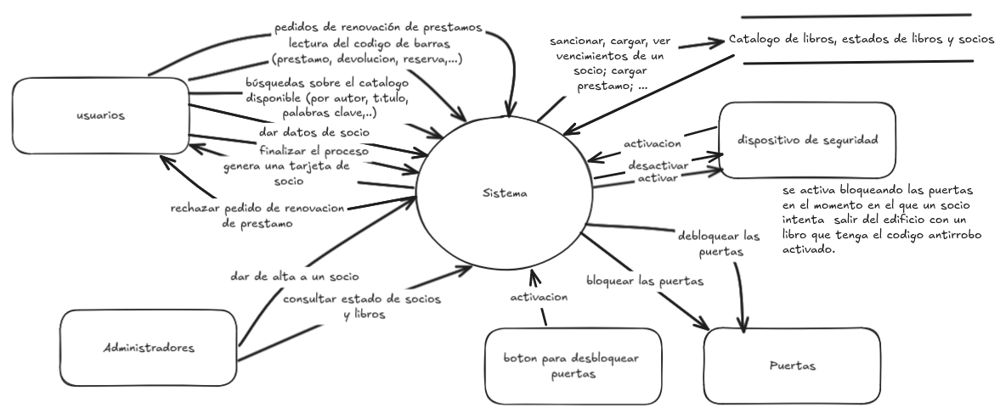

# Ingeniería del Software I - Práctico N◦ 2

FaMAF, Universidad Nacional de Córdoba
Libro: An Integrated Approach to Software Engineering de Jalote

## 1. ¿Que especifican los requisitos de funcionalidad? ¿Que otras componentes conforman la especificación de los requisitos del software? De al menos dos ejemplos de características que especifiquen cada una de ellas

- Los requerimientos de funcionalidad especifican:
  - Toda la funcionalidad que el sistema debe proveer
  - Qué salidas se deben producir para cada entrada dada y las relaciones entre ellas.
  - Todas las operaciones que el sistema debe realizar.
  - Las entradas válidas y las verificaciones de validez de la entrada y salida.
  - El comportamiento del sistema en caso de entradas inválidas, errores de cálculo u otras   situaciones anormales, o en el caso de situaciones normales pero con imposibilidad de operar.
  
- componentes conforman la especificación de los requisitos del software:
  1. Funcionalidad.
  2. Desempeño (performance).
  3. Restricciones de diseño.
  4. Interfaces externas.
  
- Dos ejemplos de características que especifiquen cada una de ellas:
  1. Funcionalidad.
     - Recibir dinero e id de producto y devolver el cambio justo, el producto y un recibo.
     - Recibir información de registro de una persona y crear el usuario.
  2. Desempeño (performance).
     - Tardar menos de un minuto (Dinámico)
     - Hasta 10 usuarios admitidos simultáneamente (Estático)
  3. Restricciones de diseño.
     - Ajustarse al estándar de tamaño de productos para maquinas expendedoras
     - Seguridad y respaldo para los usuarios registrados, no robo de identidad,...
  4. Interfaces externas.
     - La gente podrá a través de botones numerados del 1 al 16 indicarle a la maquina los productos.
     - El software deberá sincronizar su base de datos con la central cada 10 usuarios registrados.

## 2. ¿Cual es el objetivo de realizar el análisis de requisitos?

Tiene como objetivo recolectar información, analizarla y poder comprender el dominio del problema para poder plasmar en la _especificación de los requerimientos_ las conclusiones en la SRS, la cual sera el objeto de revisión con el cliente en la _verificación_.

## 3. ¿Cual es el objetivo de realizar la especificación de los requisitos?

El objetivo es conseguir una SRS que cumpla con todos las características necesarias (Correcta, Completa, No ambigua, Verificable, Consistente, Modificable, Rastreable, Ordenada en aspectos de importancia y estabilidad) para obtener las bases del acuerdo, entre el cliente/usuario y el desarrollador, sobre que (y No como se resolverán) necesidades tiene el cliente/usuario.

## 4. ¿Cuales son las partes involucradas en la construcción de una SRS?

El proceso de requerimientos es la secuencia de pasos que se necesita realizar para convertir las necesidades del usuario en la SRS. Es un proceso no lineal; es iterativo, paralelo y consta de las siguientes partes:

1) Análisis y modelado del problema o requerimientos.
2) Especificación de los requerimientos (SRS preliminar).
3) Validación (SRS finalizada).

## 5. ¿Para que sirve una SRS?

Sirve para establecer que necesidades del cliente/usuario deberá satisfacer el producto final.

## 6. ¿Cual es la diferencia entre el análisis y la especificación de requerimientos?

El análisis es el proceso de entendimiento informal de las necesidades del cliente/usuario, en cambio la especificación es la producción de un documento mas formal que contenga los requerimientos que deberá tener el producto para satisfacer esas necesidades.

## 7. ¿Para que sirven los diagramas de flujos de datos?

Sirve para descomponer el problema y comprender informalmente sus partes y relaciones.
Captura la manera en que ocurre la transformación de la entrada en la salida a medida que los datos se mueven a través de los transformadores/procesos.

## 8. Considere los siguientes problemas, para cada uno de ellos realice: un DFD, análisis orientado a objetos y describa los requisitos funcionales asociados a estos problemas mediante 3 casos de uso relevantes

### Análisis del problema 1

Objetivo: controlar los prestamos.
Actores primarios: Estudiantes y otros usuarios (docentes o personal de la institución) de la biblioteca.
Actores secundarios: personal de la biblioteca
Existen diferentes tipos de usuarios con diferentes plazos de devolución de libros. Los docentes o personal de la institución pueden retirar libros por un mes, mientras que los estudiantes solo pueden hacerlo por una semana.
Interacciones con el sistema: sacar y devolver préstamos (se puede sacar mas de uno en una operación), búsquedas sobre el catalogo disponible (por autor, titulo, palabras clave, etc.), dar datos de socio, finalizar el proceso, dar de alta a un socio (solo personal de la biblioteca), , consultas relativas al estado de los socios y los libros, reservar libros (si están prestados), pedidos de renovación de prestamos,
Datos: código de barras de los libros, dispositivo electrónico antirrobo de los libros, Salidas del sistema: activar y desactivar (si el socio no tiene prestamos vencidos) dispositivo electrónico antirrobo, sancionar a socios (que no devuelvan en el plazo estipulado un libro), bloquear las puertas (si se activa dispositivo de seguridad en el momento en el que un socio intenta salir del edificio con un libro que tenga el código antirrobo activado), desbloquear puertas (pulsando un botón), si un libro se puede prestar o no, si esta prestado o no, genera una tarjeta de socio (con los datos del usuario)...

#### DFD

Entradas:
Salidas:

El diagrama de contexto:

DFD del sistema existente:
DFD del sistema propuesto:
 Diccionario de datos del DFD del sistema propuesto:

<!-- TODO: completar!! -->

## 9. Explique el Método de análisis estructurado

## 10. Explique el Método de análisis prototipado

Se basa en la construcción de un sistema parcial prototípico para comprender y visualizar mejor el problema y las necesidades. Puede ser Descartable: _el prototipo se construye con la idea de desecharlo luego de culminada la fase de requerimientos_ o Evolucionario: se construye con la idea de que evolucionará al sistema final. El descartable es más adecuado para esta fase de análisis.

## 11. Describa las características que debe tener una especificación de requisitos

- __Correcta__
  Cada requerimiento perteneciente a la SRS representa precisamente alguna característica deseada por el cliente en el sistema final.
- __Completa__
  Todas las características deseadas por el cliente están descritas en la SRS.
  La característica más difícil de lograr, para conseguirla uno debe detectar las ausencias en la especificación.

- __No ambigua__
  Para cada requerimiento existe una sola interpretación (i.e: Existe un solo significado en el contexto al que pertenece).
  Es <u>_esencial para verificabilidad_</u>, como la verificación es usualmente hecha a través de revisiones, la SRS debe ser comprensible, al menos por el desarrollador, el usuario y el cliente. Particular atención si se usa lenguaje natural.
  Los lenguajes formales ayudan a “desambiguar”
- __Verificable__ (Testeable)
  Si existe para cada requerimiento algún proceso efectivo que puede asegurar que el software final satisface el requerimiento.
- __Consistente__ (No contradicción)
  Ningún requerimiento contradice a otro.
  Ej.: conflictos lógicos, temporales, de dependencias.
- __Modificable__ (Extensibilidad)
  Si la estructura y estilo de la SRS es tal que <u>_permite incorporar cambios fácilmente preservando completitud y consistencia_</u>.
  <u>_La redundancia es un gran estorbo para modificabilidad, puede resultar en inconsistencia_</u>.
- __Rastreable__ (Traceable)
  Se debe poder determinar el origen de cada requerimiento y cómo éste se relaciona a los elementos del software.
  - _Hacia adelante:_ dado un requerimiento se debe poder detectar en qué elementos de diseño o código tiene impacto.
  - _Hacia atrás:_ dado un elemento de diseño o código se debe poder rastrear que requerimientos está atendiendo.

  

## 12. Enumerelas las características debe tener una especificación de requisitos y describa las dos que considera mas importantes. Justifique su elección. Elija tres de las características restantes y explique que problemas ocurrirían si una especificación no las poseyera

1. No ambigua: Si es ambigua, dependiendo el grado de ambigüedad podría no darse ninguna de las demás características.
2. Rastreable: Una SRS rastreable y sin ambigüedades asegura que se dio lo que se pidió.
3. Verificable: Con las tres primeras características ya se puede considerar un buen trabajo que debe ser remunerado. Se cumplió el contrato.
4. Ordenada en aspectos de importancia y estabilidad:  Hace el futuro mas fácil. Ganancia de oportunidad. Aumenta la productividad.
Hasta aca, estas 4 primeras hacen que una SRS aceptada se transforme lo mejor posible en el producto final. Eso si, no se estaría priorizando la satisfacción del cliente/usuario, solo se estaría aceptando un trabajo y realizándolo lo mejor posible. Para un modelo mas a favor de la satisfacción del cliente mover "Correcta" al lugar 4 sacrificando productividad. ...hay muchas variaciones dependiendo el enfoque.
5. Correcta: Es mas fácil de lograr y da valor al producto.
6. Modificable: A futuro es una ganancia y ayuda a que el proyecto en si sea modificable.
7. Consistente: Al ser una SRS modificable, una inconsistencia puede solucionarse mas fácilmente. Y si es correcta, entonces la contradicción esta en el cliente.
8. Completa: Es mas difícil, innecesaria y hasta imposible de lograr en muchos casos.

Si la SRS no fuera completa no pasaría nada, dependiendo el grado de completitud claro. Pero es que es difícil o imposible de cumplir.

Si la SRS no fuera rastreable o verificable no se podría garantizar un buen trabajo ante el cliente y en el peor de los casos: la justicia.

Si la SRS fuera ambigua, dependiendo el area y la magnitud, aumentan las posibilidades de que no hagamos lo que el cliente pensó que haríamos, el cliente podría quejarse de todo y en el peor de los casos perder lo ganado o mas en la justicia.

## 13. ¿Cuales son los tipos de errores mas comunes en el desarrollo de una especificación de requisitos? Descrıbalos brevemente

1. 30%  Omisión (No completitud)
  <!-- TODO: completar!! -->
2. 10-30% Inconsistencia
  <!-- TODO: completar!! -->
3. 10-30% Hechos incorrectos
  <!-- TODO: completar!! -->
4. 5-20% Ambigüedad
  <!-- TODO: completar!! -->

## 14. ¿Es posible contar con un sistema que pueda verificar automáticamente la consistencia de un documento SRS?¿Y que pueda verificar automáticamente su completitud? Justifique su respuesta

## 15. ¿Es util contar con métricas en la etapa de análisis de requisitos? Describa brevemente las métricas de tamaño y calidad discutidas

## 16. ¿Que es, para que sirve y cuando se usa Punto Función? Explique cada uno de sus pasos
