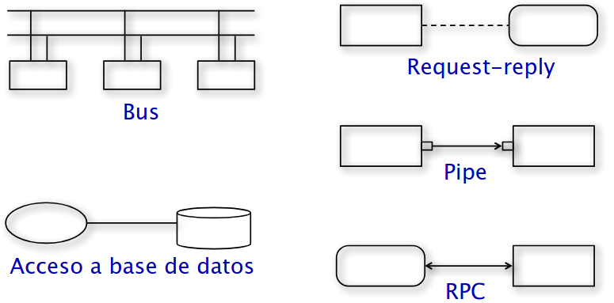
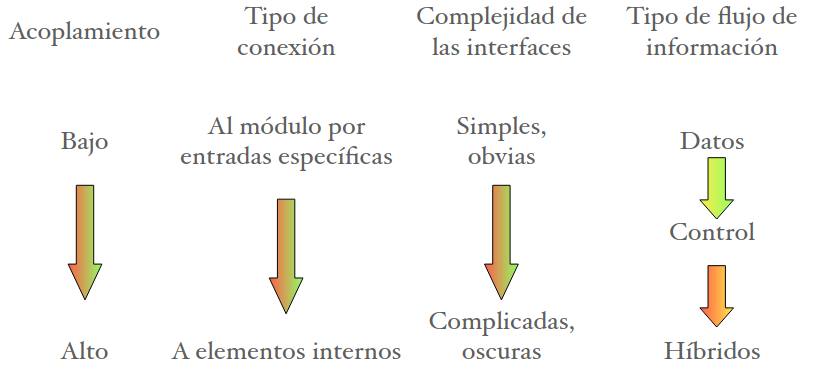

Capítulos del libro: 1, 3, 4, 6, 7, 8

## Indice
1. [Desafíos de la Ingeniería en Software](#desafios-de-la-ingenieria-en-software)
2. [El proceso de desarrollo en fases](#El-proceso-de-desarrollo-en-fases)
3. [Análisis, modelado y especificación de los requisitos del software](#Análisis,-modelado-y-especificación-de-los-requisitos-del-software)
4. [Arquitectura del software (o diseño de mas alto nivel)](#Arquitectura-del-software-(o-diseño-de-mas-alto-nivel))
5. [Diseño detallado (o diseño de bajo nivel)](#Diseño-detallado-(o-diseño-de-bajo-nivel))
6. [Métricas](#Métricas)
7. [Diseño](#Diseño)
8. 
9. 
10. [Glosario](#Glosario)

11. criterios para evaluar diseño: correcciion, eficiencia, simplicidad
12. principios fundamentales
15. metodo de analisis estructurado pasos, metricas, formulas, nombres
19. conceptos de diseño: abierto cerrado, cohesion, acoplamiento,... tres tipos de acoplamiento, de OO y de func
20. que son diagramas de estructura
21. que son mai mao (pasos)
22. que es y para que sirve heuristica de diseño
23. metricas, que son para que sirven
24. lisckov
25. solid, mas que todo ol
26. metodologia de diseño
27. metricas OF OO
28. PDL existencia, utilidad, como surgio

## Desafíos de la Ingeniería en Software
1. **==Escala==**
	- Capacidad de adaptación y respuesta de un sistema para mantener su rendimiento y eficiencia en el consumo de recursos a medida que **aumenta o disminuye** de forma significativa la demanda al sistema. (ej: cuando varia significativamente la cantidad la usuarios)
	- Dos claras dimensiones a considerar:
		- Métodos de ingeniería.
		- Administración del proyecto.
2. **==Productividad==**
	-  Minimizar según las capacidades y lo buscado el costo y/o tiempo.
3. **==Calidad==** (Estándar ISO)
	-  **Funcionalidad**: Capacidad de proveer funciones que cumplen las necesidades establecidas o implicadas.
	- **Confiabilidad**: Capacidad de realizar las funciones requeridas bajo las condiciones establecidas durante un tiempo específico.
	- **Usabilidad**: Capacidad de ser comprendido, aprendido y usado.
	- **Eficiencia**: Capacidad de proveer desempeño apropiado relativo a la cantidad de recursos usados.
	- **Mantenibilidad**: Capacidad de ser modificado con el propósito de corregir, mejorar, o adaptar.
	- **Portabilidad**: Capacidad de ser adaptado a distintos entornos sin aplicar otras acciones que las provistas a este propósito en el producto.
4. **==Consistencia y repetitividad==**
	- Capacidad para asegurar que el éxito pueda repetirse, con el fin de mantener alguna consistencia en la calidad y la productividad.
	- Objetivo: la sucesiva producción de sistemas de alta calidad y con alta productividad.
	- La consistencia permite predecir el resultado del proyecto con certeza razonable. Sin consistencia sería difícil estimar costos.
5. **==Cambio==**
	- Tolerancia y modificabilidad a la hora de adaptar el sistema a los cambios de la institución, requerimientos, dependencias, ...
	- Los métodos que no permiten cambios, aún si producen alta calidad y productividad, son poco útiles.
### Desafío clave de la IS
- La IS se enfoca mayormente en el proceso para conseguir los objetivos de calidad y productividad.
- El enfoque sistemático es realmente el proceso que se utiliza.
- La IS separa el proceso para desarrollar software del producto desarrollado (i.e. el software). Es aquí donde se distingue de las otras disciplinas informáticas.
- Premisa: El proceso es quien determina, en buena medida, la C&P
	=> un proceso adecuado permitirá obtener gran C&P.
- ==Diseñar el proceso apropiado y su control== es el desafío clave de la IS.
## El proceso de desarrollo en fases
Partiendo de un conjunto de ideas abstractas
1) Se transforman las ideas abstractas en una concreta a través de
	1. [Análisis, modelado y especificación de los requisitos del software](#Análisis,-modelado-y-especificación-de-los-requisitos-del-software)
	2. [Arquitectura del software (o diseño de alto nivel)](#Arquitectura-del-software-(o-diseño-de-alto-nivel))
	3. [Diseño detallado (o diseño de bajo nivel)](#Diseño-detallado-(o-diseño-de-bajo-nivel))
2) Se materializa la idea concreta en el producto final a través de
	4. [Codificación](#Codificación)
	5. [Testing](#Testing)
	6. [Entrega e instalación](#Entrega-e-instalación)
Terminando en un producto concreto y material.
**Obs**:
- Cada fase termina con una ==salida definida==.
- El motivo de separar en fases es la **==separación de incumbencias==**: cada fase manipula distintos aspectos del desarrollo de software.
- El proceso en fases permite **==verificar la calidad y progreso==** en momentos definidos del desarrollo (al final de la fase).
- Se debe tratar de no volver atrás, mas que todo a mas de una fase de distancia y de fases de 2) a 1).
- Se han propuesto varios modelos de procesos para el desarrollo de software, y cada organización usa su propia variante.
## Análisis, modelado y especificación de los requisitos del software

**Entrada**: Las necesidades se encuentran en la cabeza de alguien (ideas abstractas).
**Salida**: Un detalle preciso de lo que será el sistema futuro; finaliza produciendo el documento con la especificación de los ==requerimientos del software (SRS)==
**Requerimientos del software (SRS)**: La SRS establece las bases para el ==acuerdo== entre el cliente/usuario y quien suministrará el software.

| Proceso de requerimientos:                                                                                                                                                                                                                                                                                                                                                                                                              |                                                     |
| --------------------------------------------------------------------------------------------------------------------------------------------------------------------------------------------------------------------------------------------------------------------------------------------------------------------------------------------------------------------------------------------------------------------------------------- | --------------------------------------------------- |
| El proceso no es lineal; es iterativo y en paralelo. Existe superposición entre las fases: algunas partes pueden estar siendo especificadas mientras otras están aún bajo análisis.  Actividades básicas: 1) [Análisis del problema o requerimientos](#Análisis-del-problema-o-requerimientos) 2) [Especificación de los requerimientos](#Especificación-de-los-requerimientos) 3) [Validación](#Validación) |  |
### Análisis del problema o requerimientos
El objetivo del analista es comprender el sistema deseado:
- Sus necesidades, requerimientos, y las restricciones del software.
- La estructura del problema y su dominio: componentes, entrada, salida.
- El funcionamiento de la organización, el cliente, y los usuarios.
Mediante:
- **Rol pasivo**: La ==recolección== de una gran cantidad de información útil (perteneciente al ==dominio del problema==, y distinta de la necesaria para la especificación ayudando a comprender en lugar de asistir a la especificación) y su ==organización==.
	- **Estrategia básica**: ==Dividir y conquistar==. i.e, Descomponer el problema en pequeñas partes; comprender cada una de estas partes y las relaciones entre ellas.
	- **Técnicas**: diagramas de flujo de datos, diagramas de objetos, etcétera. Pero no hay una metodología definida; la información se obtiene a través de análisis, observación, interacción, discusión, feedback del cliente en las revisiones...
	- **Obs**: Los métodos de análisis son similares a los de diseño, pero con objetivos y alcances distintos. El análisis trata con el dominio del problema mientras que el diseño trata con el dominio de la solución.
- **Rol activo**: La asesoría al cliente y ayudarlo a comunicar y comprender lo que desea, i.e, actuar como su ==consultor==.
Con la finalidad:
* La información recogida se plasma y organiza directamente en la SRS, la cual es el objeto de revisión con el cliente.
### Especificación de los requerimientos
La transición del análisis a la especificación es complicada.
• La especificación se enfoca en el comportamiento externo
#### Características de una SRS
- __Correcta__
  Cada requerimiento perteneciente a la SRS representa precisamente alguna característica deseada por el cliente en el sistema final.
- __Completa__
  Todas las características deseadas por el cliente están descritas en la SRS.
  La característica más difícil de lograr, para conseguirla uno debe detectar las ausencias en la especificación.

- __No ambigua__
  Para cada requerimiento existe una sola interpretación (i.e: Existe un solo significado en el contexto al que pertenece).
  Es ==esencial para verificabilidad==, como la verificación es usualmente hecha a través de revisiones, la SRS debe ser comprensible, al menos por el desarrollador, el usuario y el cliente. Particular atención si se usa lenguaje natural.
  Los lenguajes formales ayudan a “desambiguar”
- __Verificable__ (Testeable)
  Si existe para cada requerimiento algún proceso efectivo que puede asegurar que el software final satisface el requerimiento.
- __Consistente__ (No contradicción)
  Ningún requerimiento contradice a otro.
  Ej: conflictos lógicos, temporales, de dependencias.
- __Modificable__ (Extensibilidad)
  Si la estructura y estilo de la SRS es tal que ==permite incorporar cambios fácilmente preservando completitud y consistencia==.
  La redundancia es un gran estorbo para modificabilidad, puede resultar en inconsistencia.
- **Rastreable** (Traceable)
  Se debe poder determinar el origen de cada requerimiento y cómo éste se relaciona a los elementos del software.
  - **Hacia adelante**: dado un requerimiento se debe poder detectar en qué elementos de diseño o código tiene impacto.
  - **Hacia atrás**: dado un elemento de diseño o código se debe poder rastrear que requerimientos está atendiendo.

- __Ordenada en aspectos de importancia y estabilidad__
  Los requerimientos pueden ser: críticos, importantes pero no críticos, deseables pero no importantes. Algunos requerimientos son esenciales y difícilmente cambien con el tiempo pero otros son propensos a cambiar.
  Por lo tanto, Se necesita definir un orden de prioridades en la construcción para reducir riesgos debido a cambios de requerimientos.
### Validación
En esta etapa, con el fin de evitar errores de requerimientos, se revisa la SRS por un grupo de personas conformado por: autor, cliente, representantes de usuarios y de desarrolladores.

**Importancia**: hay muchas posibilidades de malentendidos en la etapa de análisis y la de especificación y es caro corregir los defectos de requerimientos más tarde.
- **Errores más comunes**: Omisión, Inconsistencia, Hechos incorrectos y Ambigüedad

**Proceso**: un proceso de inspección estándar, se verá luego.
- Se utilizan listas de controles (lista de preguntas genéricas que siempre se podrían hacer para ver que no falte nada importante) para detectar errores de requerimientos.

**Herramientas**: existen herramientas automáticas o semiautomáticas para el modelado y análisis de especificaciones.
- Se escriben en lenguajes de especificación formal.
- Permiten verificar consistencia, dependencias circulares, o propiedades específicas.
- También permiten simular para poder comprender completitud y corrección.
## Arquitectura del software (o diseño de mas alto nivel)
> Todo sistema complejo se compone de subsistemas que interactúan.

**Objetivo**: diseñar al mas alto nivel diferentes vistas de el mismo sistema deseado. Donde, ocultando la complejidad, divide cada vista del sistema en partes lógicas (tal que cada una pueda ser comprendida independientemente) y describe las interacciones (o relaciones) que tienen entre si.

**Definición**: La arquitectura de SW de un sistema es la estructura del sistema que
comprende los elementos del SW, las propiedades externamente visibles de tales
elementos, y la relación entre ellos.

En esta etapa:
- Es donde, entrando en el dominio de la solución, los distintos interesados: usuarios, cliente, arquitecto, diseñador, .... ponen en común entre si el sistema pensado en la SRS. 
* Se hacen las elecciones de tecnología, productos a utilizar, servidores, ... según la ==confiabilidad== y ==desempeño== deseado.
* Se tiene en cuenta el ==**reuso** para aumentar la productividad==: Define que partes existentes se podrán usar o reusar para componer la arquitectura y se elige una arquitectura tal que las componentes existentes encajen adecuadamente con otras componentes a desarrollar.
* La división provista por la arquitectura servirá para guiar el ==orden, prioridad y división de tareas== (independientes entre si) durante el desarrollo del sistema:

La mayoría de las vistas de una arquitectura pertenece a alguno de estos tres tipos:
- [Asignación de recursos](#Asignación-de-recursos)
- [Módulo](#Módulo)
- [Componentes y conectores](#Componentes-y-conectores)
Las distintas vistas están correlacionadas (¡todas representan al mismo sistema!)
### Asignación de recursos
Especifica la relación (asignación a recursos) entre las unidades de software y las unidades de ejecución en el entorno como hardware, sistemas de archivos, gente, etcétera.
Exponen propiedades estructurales como qué proceso ejecuta en qué procesador, qué archivo reside dónde, ....
### Módulo
Principalmente útil en el ==planeamiento==.
Define un sistema como una colección de ==**módulos** (unidades de código), que **no** representan entidades en ejecución== (existen de manera pasiva en el código hasta que son necesarios), donde ==la relación entre ellos está basada en el código==. 

Ej. de módulos: Clases, paquetes, funciones, procedimientos, métodos, ....
Ej. de relaciones: “parte de”, “usa a” o “depende de”, llamadas, generalización o especialización, etcétera.
### Componentes y conectores
Principalmente útil en el ==análisis de desempeño==.
Define un sistema como una colección de ==**componentes**, que representan entidades de ejecución== (existen mientras el sistema está funcionando), con ==**conectores**, que proveen el medio de interacción entre las **componentes**==.

**Componentes**: son unidades de cómputo o de almacenamiento de datos.
- Ej.: objetos, procesos, .exe, .dll, etcétera.
- Cada uno tiene un tipo, y un nombre que representa su rol y le provee una identidad.
- Utilizan interfaces o puertos para comunicarse con otras componentes.
**Conectores**: Describen el medio en el cual la interacción entre componentes toma lugar.
- Ej.: pipes, sockets, memoria compartida, protocolos, .... como una llamada a procedimiento/función, puertos TCP/IP, RPC, protocolos como HTTP o TCP, bus de broadcasting....
- Cada uno tiene un nombre, que identifica la naturaleza de la interacción, y un tipo, que identifica el tipo de interacción: binaria o n-aria, unidireccional o bidireccional, ....
- ==Es importante identificarlos explícitamente== ya que pueden requerir una infraestructura de ejecución significativa e imponer restricciones sobre cómo se diseñará y construirá finalmente cada componente.

La vista C&C describe una estructura en ejecución del sistema: qué componentes existen y cómo interactúan entre ellos en tiempo de ejecución.

Algunas estructuras, denominadas **estilos arquitectónicos** para la vista de C&C, son generales y son útiles para una clase de problemas:
- [Tubos y Filtros (Pipe and Filter)](#Tubos-y-Filtros-(Pipe-and-Filter))
	Tiene solo un tipo de componente (==filtro==) y de conector (==tubo==).
	Un filtro realiza transformaciones y le pasa los datos a otro filtro a través de un tubo.
- [Estilo de datos compartidos](#Estilo-de-datos-compartidos)
	Solo un tipo de conector: ==lectura/escritura==.
	Solo dos tipos de componentes:
	- **Repositorio de datos**: provee almacenamiento permanente confiable.
	- **Usuarios de datos**: acceden a los datos en el repositorio, realizan cálculos, y ponen los resultados otra vez en el repositorio.
	La comunicación entre los usuarios de los datos sólo se hace a través del repositorio.
- [Estilo cliente servidor](#Estilo-cliente-servidor)
	Solo un tipo de conector: ==solicitud/respuesta== (request/reply) - es asimétrico.
	Solo dos tipos de componentes: ==clientes y servidores==.
	Los clientes solo pueden comunicarse con el servidor y ellos deben iniciar la comunicación enviando una solicitud.
	Dos variantes principales:
	- **Estilo pizarra**: El repositorio es una **entidad activa**.
	- **Estilo repositorio**: El repositorio es una **entidad pasiva**.
- **Estilo publicar-suscribir (publish-subscribe)**
	Dos tipos de componentes: las que ==publican eventos== y las que se ==suscriben a eventos==. Cada vez que un evento es publicado se invoca a las componentes suscriptas a dicho evento.
- **Estilo peer-to-peer**:
	Un único tipo de componente.
	Cada componente le puede pedir servicios a otra. $\equiv$ modelo de computación orientado a objetos.
- **Estilo de procesos que se comunican**:
	Procesos que se comunican entre sí a través de pasaje de mensajes.
#### Tubos y Filtros (Pipe and Filter)
Adecuado para sistemas que fundamentalmente realizan transformaciones de datos, i.e, utiliza una red de transformadores para realizar el resultado deseado.
==Un **filtro** realiza transformaciones y le pasa los datos a otro filtro a través de un **tubo**== según las siguientes ==**restricciones:**==
- Filtro:
	- Es una ==entidad independiente y asíncrona== (se limita a consumir y producir datos).
	- Debe ==trabajar sin conocer la identidad== de los filtros a los que envían o reciben datos.
	- Deben hacer ==“buffering” y sincronización== para asegurar el correcto funcionamiento como productor y consumidor.
	- Un sistema puro de tubos y filtros usualmente requiere que cada filtro tenga su propio ==hilo de control.==
- Tubo:
	- Es un ==canal unidireccional== que transporta un flujo de datos de un filtro a otro.
	- Debe conectar **solo un** puerto de salida de un filtro a **solo un** puerto de entrada de otro filtro.
#### Estilo de datos compartidos
Solo un tipo de conector: **lectura/escritura**.
Solo dos tipos de componentes:
- **Repositorio de datos**: provee almacenamiento permanente confiable.
- **Usuarios de datos**: acceden a los datos en el repositorio, realizan cálculos, y ponen los resultados otra vez en el repositorio.
	==La comunicación entre los usuarios de los datos sólo se hace a través del repositorio.==
Dos **variantes principales**:
- **Estilo pizarra**: Cuando se agregan/modifican datos en el repositorio, se informa a todos los usuarios. i.e.: ==la fuente de datos compartidos (El repositorio) es una **entidad activa**.==
- **Estilo repositorio**: ==la fuente de datos compartidos (El repositorio) es una **entidad pasiva**.==
	Ej.: sistemas orientados a base de datos; sistemas de web; entornos de programación; etcétera.
#### Estilo cliente servidor
Solo un tipo de conector: **solicitud/respuesta** (request/reply) - es asimétrico.
Solo dos tipos de componentes: **clientes y servidores**.
- Los clientes sólo se comunican con el servidor (no con otros clientes).
- La comunicación (usualmente asincrónica) siempre es iniciada por el cliente con una solicitud al servidor.
- El servidor también puede actuar como cliente.

Este estilo tiene en general la forma de una estructura multi-nivel.
Ej. clásico de 3 niveles:
- Nivel de cliente: contiene a los clientes.
- Nivel intermedio: contiene las reglas del servicio.
- Nivel de base de datos: reside la información.

### Evaluación de las arquitecturas ATAM
Es un método de análisis que ==estudia las propiedades y las concesiones entre las
Arquitecturas==. Se utiliza en las primeras etapas del desarrollo de software. Ayuda a elegir
una arquitectura adecuada para un sistema de software mediante el descubrimiento de
compensaciones y puntos sensibles.
Pasos principales:
1. **Recolectar escenarios**:
	- Los escenarios describen las interacciones del sistema.
	- Elegir los escenarios de mas interés para el análisis.
2. **Recolectar requerimientos y/o restricciones**:
	- Definir lo que se espera del sistema en tales escenarios.
3. **Describir las vistas arquitectónicas**:
	- Distintas vistas pueden ser necesarias para distintos análisis.
4. **Análisis específicos a cada atributo**:
	- Se analizan las vistas bajo distintos escenarios separadamente para cada atributo de interés.
	- Esto forma la base para la elección entre una arquitectura u otra o la modificación de la arquitectura propuesta.
5. **Identificar puntos sensitivos y de compromisos**:
	- ==Análisis de sensibilidad==: cuál es el impacto que tiene un elemento sobre un atributo de calidad. Los elementos de mayor impacto son los puntos de sensibilidad.
	- ==Análisis de compromiso==: Los puntos de compromiso son los elementos que son puntos de sensibilidad para varios atributos.
## Diseño
- Es el ==paso intermedio entre los requerimientos y el código==, el ==desplazamiento del dominio del problema al dominio de la solución==.
- Objetivo: crear un “plano del sistema” que satisfaga los requerimientos.
- Determina las mayores características de un sistema.
- Tiene un gran impacto en testing y mantenimiento.
- Es una actividad creativa.
### Niveles en el proceso de diseño
1. [Diseño arquitectónico](#Arquitectura-del-software-(o-diseño-de-mas-alto-nivel))
	- ==Identifica las componentes== necesarias del sistema, su comportamiento y relaciones.
2. Diseño de alto nivel
	- [Orientado a funciones](#Diseño-orientado-a-función), Orientado a objetos
	- ==Es la vista de los componentes== o módulos del sistema. Es decir: cuáles son los módulos del sistema, qué deben hacer, y cómo se organizan/interconectan.
3. Diseño detallado o diseño lógico
	- ==Establece cómo se implementan las componentes== o módulos de manera que satisfagan sus especificaciones.
	- Muy cercano al código: Incluye detalles del procesamiento lógico (i.e. algoritmos) y de las estructuras de datos.
### Criterios de diseño
Los criterios de evaluación son usualmente subjetivos y no cuantificables.
Objetivo: encontrar el mejor diseño posible entre diversos diseños alternativos.
Principales criterios para evaluar:
- **Corrección**
	- Que el diseño implemente los ==requerimientos==.
	- Que sea factible el diseño dada las ==restricciones==.
- **Eficiencia**
	- Uso apropiado de los ==recursos del sistema== (CPU y memoria).
- **Simplicidad**
	- Un diseño simple facilita:
		- Mantenimiento,
		- Comprensión del sistema,
		- Testing,
		- Descubrimiento y corrección de bugs,
		- Modificación del código.
### Principios de Diseño
No existe una serie de pasos que permitan derivar el diseño de los requerimientos.
Sólo hay principios que guían el proceso de diseño.
Principios fundamentales:
- **Partición y jerarquía** ("divide y conquistarás")
	- Divide el problema en pequeñas partes que sean manejables.
		- ==Cada parte debe poder solucionarse y modificarse separadamente==.
		- Debe haber la mayor ==independencia== posible entre las distintas partes (Simplifica el diseño y facilita mantenimiento) mientras que puedan ==comunicarse== para solucionar el problema mayor.
		- Se debe ==detener el particionado cuando el costo supera al beneficio==.
- **Abstracción**
	- Ve a los componentes como cajas negras: ==describe su comportamiento externo sin dar detalles internos de cómo se produce==.
	- Útil para controlar la complejidad y ==comprender los sistemas existentes==.
	- Dos mecanismos comunes de abstracción:
		- **Abstracción funcional**
			- Los módulos se tratan como ==funciones de entrada/salida==.
			- Un módulo funcional puede especificarse usando ==pre y postcondiciones==.
			- Forma la base de las metodologías orientadas a funciones.
		- **Abstracción de datos**
			- Los datos se tratan como objetos junto a sus operaciones.
			- Forma la base de las metodologías orientadas a objetos.
- **Modularidad**
	- Un sistema se dice modular si consiste de ==componentes discretas tal que puedan implementarse separadamente== y un cambio a una de ellas tenga mínimo impacto sobre las otras.
	- Necesita criterios de descomposición: ==resulta de la conjunción de la abstracción y el particionado==.
### Estrategias top-down y bottom-up
Un sistema es una jerarquía de componentes.
Dos enfoques para diseñar tal jerarquía:
- **Top-down**:
	- comienza en la componente de más alto nivel, la más abstracta; y prosigue construyendo las componentes de niveles más bajos descendiendo en la jerarquía.
- **Bottom-up**:
	- comienza por las componentes de más bajo nivel en la jerarquía, las más simples; y prosigue hacia los niveles más altos hasta construir la componente más alta.
En general se utiliza una combinación de ambos.

### Diseño orientado a función
**Módulo**: Es una ==parte lógicamente separable== de un programa. Es una ==unidad discreta e identificable== respecto a la compilación y carga.

Criterios utilizados para seleccionar módulos que soporten abstracciones bien definidas y solucionables/modificables separadamente:
- **Acoplamiento**:
	- Cuanto más conexiones hay entre dos módulos, más dependientes son uno del otro, i.e. se requiere más conocimiento de un módulo para comprender el otro módulo.
	- Los módulos deben estar tan débilmente acoplados como sea posible.
		- Los módulos se pueden modificar separadamente.
		- Se pueden implementar y testear independientemente.

Cohesion:..
## Diseño detallado (o diseño de bajo nivel)
## Métricas
Una métrica es útil para el seguimiento o control de costos, calendario o calidad.

Dos tipos:
- Métricas de **Calidad directa**: evalúan la calidad del documento estimando el valor de los atributos de calidad de la SRS.
- Métricas de **Calidad indirecta**: evalúan la efectividad de las métricas del control de calidad usadas en el proceso en la fase de requerimientos.
	Ej.: Número de errores encontrados.
	Frecuencia de cambios de requerimientos. 

Se utilizan en diferentes fases:
- [A partir de la fase de Análisis y especificación de la SRS](#A-partir-de-la-fase-de-Análisis-y-especificación-de-la-SRS): Para ==“medir”== de forma estimada el esfuerzo (depende de muchos factores; el tamaño es el principal) que demandará el proyecto a partir de la SRS y poder ==estimar== costos y tiempos y poder planear el desarrollo.
### A partir de la fase de Análisis y especificación de la SRS

#### Punto función
- Es una estimación similar a la métrica LOC.
- Se determina sólo con la SRS.
Define el tamaño en términos de la “funcionalidad”

| tipo de función / complejidad | Simple | Promedio | Compleja |
| ----------------------------- | ------ | -------- | -------- |
| Entradas externas             |        |          |          |
| Salidas externas              |        |          |          |
| Archivos lógicos internos     |        |          |          |
| Archivos de interfaz externa  |        |          |          |
| Transacciones externas        |        |          |          |
Sea $C_{}ij$ la cantidad de funciones tipo “i” con complejidad “j”.
Punto función no ajustado (UFP):
$$\sum_{i=1}^{5} \sum_{j=1}^{3} C_{ij}W_{ij}$$
Punto función ajustado ( CAF * UFP):
El Factor de ajuste de complejidad (CAF) se ajusta de acuerdo a la complejidad del entorno calculado según 14 características evaluadas numéricamente por su influencia:
$$0.65 + 0.01  \sum_{j=1}^{14} P_{i}$$
Donde $P_{i} = \text{peso de la influencia de la i-esima caracteristica}$ y
$influencia \in \text{ \{no presente, insignificante, moderada, promedio, significativa, fuerte\} }$

## Glosario

**Software** (IEEE 610.12-1990): Colección de programas, procedimientos, y la
documentación y datos asociados que determinan la operación de un sistema de computación.

**Enfoque sistemático**: metodología y prácticas existentes para solucionar un problema dentro de un dominio determinado. Esto permite repetir el proceso y da la posibilidad de predecirlo (independientemente del grupo de personas que lo lleva a cabo).

**Ingeniería de Software**: aplicación de un enfoque sistemático, disciplinado, y cuantificable al desarrollo, operación, y mantenimiento del software.

**Requerimientos** (IEEE):
1. Una condición o capacidad necesaria de un usuario para solucionar un problema o alcanzar los objetivos.
2. Una condición o capacidad necesaria que debe poseer o cumplir un sistema