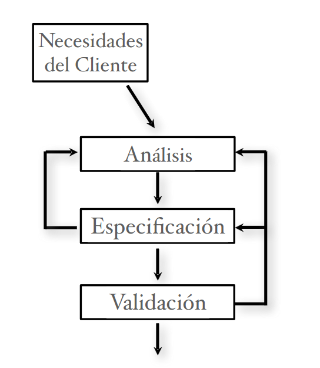
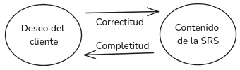
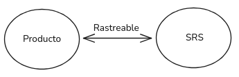

Capítulos del libro: 1, 3, 4, 6, 7, 8

**Ingeniería de Software**: aplicación de un enfoque sistemático, disciplinado, y cuantificable al desarrollo, operación, y mantenimiento del software.
## Indice (enfocado a RESUMEN SUPREMO!!!)
1. [Desafíos de la Ingeniería en Software](#Desafíos-de-la-Ingeniería-en-Software)
	1) **Escala**: Capacidad de adaptación y respuesta de un sistema a medida que aumenta o disminuye de forma significativa la demanda al sistema. 
	2) **Productividad**: minimizar el costo monetario y cumplir el cronograma.
	3) **Calidad**: Funcionalidad, Confiabilidad, Usabilidad, Eficiencia, Mantenibilidad, Portabilidad
	4) **Consistencia y Repetitividad**: Capacidad para repetir el éxito, con el fin de mantener alguna consistencia en la C&P.
	5) **Cambio**: Tolerancia y modificabilidad al adaptar el sistema a los cambios de la institución, requerimientos, dependencias, ...
2. [El proceso de desarrollo en fases](#El-proceso-de-desarrollo-en-fases)
	- Análisis y especificación, Arquitectura, Diseño detallado, Codificación, Testing, Entrega e Instalación.
3. [Análisis, modelado y especificación de los requisitos del software](#Análisis,-modelado-y-especificación-de-los-requisitos-del-software)
	Actividades básicas:
	1) [Análisis del problema o requerimientos](#Análisis-del-problema-o-requerimientos)
		- Casos de uso
		- **Metodología de análisis estructurado**
			1) Dibujar el diagrama del contexto
			2) Dibujar el DFD del sistema existente
			3) Dibujar el DFD del sistema propuesto e identificar la frontera hombre-máquina
		- **Prototipado**: Se construye un sistema parcial prototípico para con el cliente comprender mejor el problema y las necesidades. 
			Dos enfoques: **Descartable** y **Evolucionario**
	2) [Especificación de los requerimientos](#Especificación-de-los-requerimientos)
		**Características de una SRS**:
		- Correcta, Completa, No ambigua, Verificable, Consistente, Modificable, Rastreable, Ordenada en aspectos de importancia y estabilidad
	3) [Validación](#Validación)
		Acuerdo entre cliente y desarrollador en la SRS.
4. [Arquitectura del software (o diseño de mas alto nivel)](#Arquitectura-del-software-(o-diseño-de-mas-alto-nivel))
	- **Vistas** de una arquitectura:
		1. [Asignación de recursos](#Asignación-de-recursos): Especifica la asignación a recursos entre las unidades de software y las unidades de ejecución en el entorno.
		2. [Módulo](#Módulo): Describe una estructura estática del sistema como una colección de **módulos** donde la relación entre ellos está basada en el código. 
		3. [Componentes y conectores](#Componentes-y-conectores): Describe una estructura en ejecución del sistema como una colección de **componentes**, que representan entidades en ejecución, con **conectores**, que proveen el medio de interacción entre ellos.
			**Estilos** arquitectónicos para la vista de C&C:
			1) [Tubos y Filtros](#Tubos-y-Filtros-(Pipe-and-Filter)): Un **filtro** (componente independiente y asíncrono) consume y produce datos y los pasa a otro filtro por un **tubo** (conector).
			2) [Estilo de datos compartidos](#Estilo-de-datos-compartidos): La comunicación entre los **Usuarios de datos** (componente) se hace a través del **Repositorio de datos** (componente) por medio de **lectura/escritura** (conector)
			3) [Estilo cliente servidor](#Estilo-cliente-servidor): Un **cliente** (componente) solo puede comunicarse con el **servidor** (componente) y se comunica por medio de **solicitud/respuesta** (conector).
				Dos variantes principales: Estilo pizarra y Estilo repositorio
			4) Estilo **publicar-suscribir**: Cada vez que se **publica un evento** (componente) se invoca a las **suscriptas al evento** (componente).
			5) Estilo **peer-to-peer**: Cada **peer** (componente) le puede pedir servicios a otro peer. $\equiv$ modelo de computación orientado a objetos.
			6) Estilo de **procesos que se comunican**: **Procesos** (componente) que se comunican entre sí a través de pasaje de mensajes.
	- Evaluación de las arquitecturas **ATAM**
			Es un método de análisis que estudia las propiedades y las concesiones entre las Arquitecturas.
		1. **Recolectar escenarios**: Elegir los escenarios (descripción de las interacciones del sistema) de mas interés para el análisis.
		2.** Recolectar requerimientos y/o restricciones**: Definir lo que se espera del sistema en tales escenarios.
		3. **Describir las vistas arquitectónicas**
		4. **Análisis específicos a cada atributo**: Analizarlas vistas bajo distintos escenarios separadamente para cada atributo de interés.
		5. **Identificar puntos sensitivos y de compromisos**
			- Puntos sensitivos: elementos con mayor impacto sobre un atributo de calidad.
			- Puntos de compromiso: elementos que son puntos de sensibilidad para varios atributos de calidad.
5. [Diseño](#Diseño)
	- Niveles en el proceso de diseño
		1. [Diseño arquitectónico](#Arquitectura-del-software-(o-diseño-de-mas-alto-nivel))
		2. Diseño de alto nivel
		3. Diseño detallado o diseño lógico
	- **Criterios** de Diseño
		1. **Corrección**: Que el diseño implemente los **requerimientos** y sea factible dadas las **restricciones**.
		2. **Eficiencia**: Uso apropiado de los **recursos del sistema** (CPU y memoria).
		3. **Simplicidad**: Facilita Mantenimiento, Modificación, Comprensión, Testing, Descubrimiento y corrección de bugs.
	- **Principios fundamentales** de Diseño:
		1. **Partición y jerarquía**:  ("divide y conquistarás") Divide el problema en partes tal que cada una pueda solucionarse y modificarse separadamente.
		2. **Abstracción**: Describe el comportamiento externo de los componentes como cajas negras, sin dar detalles internos de cómo se produce.
			- **Abstracción funcional**: Los módulos se tratan como funciones de entrada/salida, usando pre y postcondiciones.
			- **Abstracción de datos**: Los datos se tratan como objetos junto a sus operaciones.
		3. **Modularidad**:  Un sistema se dice modular si consiste de **componentes discretas** tal que puedan implementarse separadamente y un cambio a una de ellas tenga mínimo impacto sobre las otras.
	- Diseño **orientado a función**
		- **Criterios**
			1) **Acoplamiento** por: Tipo de conexión, Complejidad de las interfaces, Tipo de flujo de dato.
				
			2) **Cohesión**: 
				De mas débil a mas fuerte.
				1. **Casual**: Cuando su relación no tiene un significado.
				2. **Lógica**: Cuando su relación debe seguir una lógica.
				3. **Temporal**: Cuando deben ejecutarse juntos.
				4. **Procedural**: Cuando son de la misma unidad procedural.
				5. **Comunicacional**: Cuando comparten una referencia al mismo dato.
				6. **Secuencial**: Cuando la salida de uno es la entrada de otro.
				7. **Funcional**: Cuando **todos** están relacionados para llevar a cabo una sola función.
		- **Metodología de diseño estructurado** (SDM)
			1) Reformular el problema como un DFD
			2) Identificar las entradas y salidas más abstractas
			3) Realizar el primer nivel de factorización
			4) Factorizar los módulos de entrada, de salida, y transformadores
			5) Mejorar la estructura
	- Diseño **orientado a a objetos**
		- **Criterios**
			1) **Acoplamiento**: 
				1. **Por interacción**: Cuando los métodos de una clase que invocan a los de otra por medio de un **tipo de conexión** (como en funcional).
				2. **De componentes**: Cuando una clase tiene variables de una complejidad con tipo de otra clase.
				3. **De herencia**: Cuando una es subclase de otra, peor si la modifica en vez de solo extenderla.
			2) **Cohesión**:
				1. **de método**: ¿Por qué los elementos están juntos en el mismo método? (Similar a orientado a funciones) (mayor si cada método implementa una única función).
				2. **de clase**: ¿Por qué distintos atributos y métodos están en la misma clase? Una clase debería representar un único concepto con todos sus elementos contribuyendo a este concepto.
				3. **de herencia**: Mas si se produce como consecuencia de la  Generalización-Especialización en vez de solo Reuso.
			3) Principio **abierto-cerrado** (OCP): “Las entidades de software deben ser abiertas para extenderlas y cerradas para modificarlas”
		- Principio de **sustitución de Liskov** (LSP): "Un programa que utiliza un objeto O con clase C debería permanecer inalterado si O se reemplaza por cualquier objeto de una subclase de C."
		- **Metodología OMT** (Object Modeling Technique)
			1) Producir el diagrama de clases
			2) Producir el modelo dinámico
			3) Producir el modelo funcional
			4) Identificar las clases internas y sus operaciones
			5) Optimizar y empaquetar
6. [Diseño detallado (o diseño de bajo nivel)](#Diseño-detallado-(o-diseño-de-bajo-nivel))
	- PDL (Process Design Language)
7. [Métricas](#Métricas)
	- [Luego de la fase de Análisis y especificación de la SRS](#A-partir-de-la-fase-de-Análisis-y-especificación-de-la-SRS)
		- **Punto función** $= UFP * CAF = (\sum_{i=1}^{5} \sum_{j=1}^{3} C_{ij}W_{ij})*(0.65 + 0.01  \sum_{j=1}^{14} P_{i})$
			Sea $C_{}ij$ la cantidad de **funciones** tipo “i” (entradas, salidas, transacciones y archivos de interfaz externas y archivos lógicos internos) con **complejidad** “j” (simple, promedio, complejo) y $P_i$ la i-esima **característica** (reusabilidad, facilidad para la instalación, facilidad para la operación, intención de facilitar cambio, ...) evaluada numéricamente por su **influencia** (nula, insignificante, moderada, promedio, significativa, fuerte).
	- Luego del diseño **orientado a función**
		1. **Tamaño y Complejidad**: Cantidad de módulos + tamaño estimado de c/u.
		2. **De red**: nodos - aristas - 1 (Impureza del grafo)
		3. **De estabilidad**: cantidad de suposiciones de un modulo por otros módulos.
		4. **Flujo de la información**: $tamaño_{LOC} * (in_{flow} * out_{flow})^2$
		5. **Flujo de la información y red**: $DC = in_{call} * out_{call} + in_{flow} * out_{flow}$
	- Luego del diseño **orientado a objetos**
		1. **Métodos pesados por clases (WMC)**: $\sum_{i=1}^{n} C(M_{i})$
		2. **Profundidad del árbol de herencia (DIT)**: numero de clases de las que hereda
		3. **Cantidad de hijos (NOC)**: numero de subclases inmediatas (reuso)
		4. **Acoplamiento entre clases (CBC)**: numero de clases cuyos métodos usan métodos o atributos de la clase o viceversa.
		5. **Respuesta para una clase (RFC)**: numero de métodos de una clase C más los métodos utilizados de otras clases al recibir un mensaje de un método de C.
8. [Glosario](#Glosario)
## Desafíos de la Ingeniería en Software
1. **==Escala==**
	- Capacidad de adaptación y respuesta de un sistema para mantener su rendimiento y eficiencia en el consumo de recursos a medida que **aumenta o disminuye** de forma significativa la demanda al sistema. (ej: cuando varia significativamente la cantidad la usuarios)
	- Dos claras dimensiones a considerar:
		- Métodos de ingeniería.
		- Administración del proyecto.
2. **==Productividad==**
	-  Minimizar el costo y cumplir el cronograma en el desarrollo de software.
3. **==Calidad==** (Estándar ISO)
	1)  **Funcionalidad**: Capacidad de proveer funciones que cumplen las necesidades establecidas o implicadas.
	2) **Confiabilidad**: Capacidad de realizar las funciones requeridas bajo las condiciones establecidas durante un tiempo específico.
	3) **Usabilidad**: Capacidad de ser comprendido, aprendido y usado.
	4) **Eficiencia**: Capacidad de proveer desempeño apropiado relativo a la cantidad de recursos usados.
	5) **Mantenibilidad**: Capacidad de ser modificado con el propósito de corregir, mejorar, o adaptar.
	6) **Portabilidad**: Capacidad de ser adaptado a distintos entornos sin aplicar otras acciones que las provistas a este propósito en el producto.
4. **==Consistencia y repetitividad==**
	- Capacidad para asegurar que el éxito pueda repetirse, con el fin de mantener alguna consistencia en la calidad y la productividad (C&P).
	- La consistencia permite predecir con certeza razonable el resultado del proyecto y estimar costos.
5. **==Cambio==**
	- Tolerancia y modificabilidad a la hora de adaptar el sistema a los cambios de la institución, requerimientos, dependencias, ...
	- Los métodos que no permiten cambios, aún si producen alta calidad y productividad, son poco útiles.
### Desafío clave de la IS
- Busca principalmente conseguir los objetivos de C&P a través del proceso.
- Separa el proceso de desarrollo del software desarrollado.
- ==Diseñar el proceso apropiado y su control== es el desafío clave de la IS.
## El proceso de desarrollo en fases
Partiendo de un conjunto de ideas abstractas
1) Se transforman las ideas abstractas en una concreta a través de
	1. [Análisis, modelado y especificación de los requisitos del software](#Análisis,-modelado-y-especificación-de-los-requisitos-del-software)
	2. [Arquitectura del software (o diseño de alto nivel)](#Arquitectura-del-software-(o-diseño-de-alto-nivel))
	3. [Diseño detallado (o diseño de bajo nivel)](#Diseño-detallado-(o-diseño-de-bajo-nivel))
2) Se materializa la idea concreta en el producto final a través de
	4. [Codificación](#Codificación)
	5. [Testing](#Testing)
	6. [Entrega e instalación](#Entrega-e-instalación)
Terminando en un producto concreto y material.
**Obs**:
- Cada fase termina con una ==salida definida y en lo posible definitiva== (tratar de no volver atrás).
- El **motivo de separar en fases** es que permite:
	-  **Separación de incumbencias**: cada fase manipula distintos aspectos del desarrollo de software.
	- **Verificar la calidad y progreso** en momentos definidos del desarrollo (al final de la fase).
- Se han propuesto varios modelos de procesos para el desarrollo de software, y cada organización usa su propia variante.
## Análisis, modelado y especificación de los requisitos del software

**Entrada**: Las necesidades se encuentran en la cabeza de alguien (ideas abstractas).
**Salida**: Un detalle preciso de lo que será el sistema futuro; finaliza produciendo el documento con la especificación de los ==requerimientos del software (SRS)==
**Requerimientos del software (SRS)**: La SRS establece las bases para el ==acuerdo== entre el cliente/usuario y quien suministrará el software.

| Proceso de requerimientos:                                                                                                                                                                                                                                                                                                                                                                                                                  |                                                     |
| ------------------------------------------------------------------------------------------------------------------------------------------------------------------------------------------------------------------------------------------------------------------------------------------------------------------------------------------------------------------------------------------------------------------------------------------- | --------------------------------------------------- |
| El proceso no es lineal; es iterativo y en paralelo. Existe superposición entre las fases: algunas partes pueden estar siendo especificadas mientras otras están aún bajo análisis.  **Actividades básicas**: 1) [Análisis del problema o requerimientos](#Análisis-del-problema-o-requerimientos) 2) [Especificación de los requerimientos](#Especificación-de-los-requerimientos) 3) [Validación](#Validación) |  |
### Análisis del problema o requerimientos
El objetivo del analista es comprender el sistema deseado:
- Sus necesidades, requerimientos, y las restricciones del software.
- La estructura del problema y su dominio: componentes, entrada, salida.
- El funcionamiento de la organización, el cliente, y los usuarios.
Mediante:
- **Rol pasivo**: La ==recolección== de una gran cantidad de información útil (perteneciente al ==dominio del problema==, y distinta de la necesaria para la especificación ayudando a comprender en lugar de asistir a la especificación) y su ==organización==.
	- **Estrategia básica**: ==Dividir y conquistar==. i.e, Descomponer el problema en pequeñas partes; comprender cada una de estas partes y las relaciones entre ellas.
	- **Técnicas**: DFD, DOO, .... Pero no hay una metodología definida; la información se obtiene a través de análisis, observación, interacción, discusión, feedback del cliente en las revisiones...
	- **Obs**: Los métodos de análisis son similares a los de diseño, pero con objetivos y alcances distintos. El análisis trata con el dominio del problema mientras que el diseño trata con el dominio de la solución.
- **Rol activo**: La asesoría al cliente y ayudarlo a comunicar y comprender lo que desea, i.e, actuar como su ==consultor==.
Con la finalidad:
* La información recogida se plasma y organiza directamente en la SRS, la cual es el objeto de revisión con el cliente.
#### Casos de uso
- Especifican cada función provista por el sistema.
- Captura el comportamiento del sistema como interacción de los usuarios con el sistema.
![[Facultad/Ing. Software/PNGs/image-9.png]]
#### Metodología de análisis estructurado
**Pasos**:
1. **Dibujar el diagrama del contexto**
	- Ve al sistema completo como un transformador e identifica el contexto.
	- Es un ==DFD con un único transformador== (el sistema), con entradas, salidas, fuentes, y sumideros del sistema identificado
2. **Dibujar el DFD del sistema existente**
	- Se refina el diagrama de contexto, ==se modela (DFD) el sistema actual tal como es== con el fin de comprender el funcionamiento.
3. **Dibujar el DFD del sistema propuesto e identificar la frontera hombre-máquina**
	- Establecer la frontera hombre máquina, qué procesos se automatizarán y cuáles permanecerán manuales, y mostrar claramente su interacción.
Siempre validar con el usuario/cliente.
#### Prototipado
Se construye un sistema parcial prototípico.
Cliente, usuarios y desarrolladores lo utilizan para comprender mejor el problema y las necesidades.
Dos enfoques:
- **Descartable**: el prototipo se construye con la idea de desecharlo luego de culminada la fase de requerimientos.
	Es mas adecuado para esta fase del problema.
- **Evolucionario**: se construye con la idea de que evolucionará al sistema final.
### Especificación de los requerimientos
La transición del análisis a la especificación es complicada.
La especificación se enfoca en el comportamiento externo.
#### Características de una SRS
1. **Correcta**
  Cada requerimiento perteneciente a la SRS representa precisamente alguna característica deseada por el cliente en el sistema final.
2. **Completa**
  Todas las características deseadas por el cliente están descritas en la SRS.
  La característica más difícil de lograr, para conseguirla uno debe detectar las ausencias en la especificación.

3. **No ambigua**
  Para cada requerimiento existe una sola interpretación (i.e: Existe un solo significado en el contexto al que pertenece).
  Es esencial para *verificabilidad*.
4. **Verificable** (Testeable)
  Si existe para cada requerimiento algún proceso efectivo que puede asegurar que el software final satisface el requerimiento.
5. **Consistente** (No contradicción)
  Ningún requerimiento contradice a otro.
6. **Modificable** (Extensibilidad)
  Si la estructura y estilo de la SRS es tal que permite incorporar cambios fácilmente preservando *completitud* y *consistencia*.
 ==La redundancia es un gran estorbo para modificabilidad==, puede resultar en inconsistencia.
7. **Rastreable** (Traceable)
	- **Hacia adelante**: dado un requerimiento se debe poder detectar en qué elementos de diseño o código tiene impacto.
	- **Hacia atrás**: dado un elemento de diseño o código se debe poder rastrear que requerimientos está atendiendo.

8. **Ordenada en aspectos de importancia y estabilidad**
 ==Los requerimientos pueden ser: **críticos**, **importantes** pero no críticos, **deseables** pero no importantes. ==Algunos requerimientos son esenciales y difícilmente cambien con el tiempo pero otros son propensos a cambiar.
  Por lo tanto, Se necesita definir un orden de prioridades en la construcción para reducir riesgos debido a cambios de requerimientos.
### Validación
En esta etapa, con el fin de evitar errores de requerimientos, se revisa la SRS por un grupo de personas conformado por: autor, cliente, representantes de usuarios y de desarrolladores.

**Objetivo principal**: ==Asegurar corrección==.

**Importancia**: hay muchas posibilidades de malentendidos en la etapa de análisis y la de especificación y es caro corregir los defectos de requerimientos más tarde.
- **Errores más comunes**: Omisión, Inconsistencia, Hechos incorrectos y Ambigüedad

**Proceso**: un proceso de inspección estándar, se verá luego.
- Se utilizan ==listas de controles== para detectar errores de requerimientos.

## Arquitectura del software (o diseño de mas alto nivel)
> **Premisa**: Todo sistema complejo se compone de subsistemas que interactúan.

**Definición**: La arquitectura de SW de un sistema es la estructura del sistema que comprende los elementos del SW, las propiedades externamente visibles de tales elementos, y la relación entre ellos.

**Objetivo**: Diseñar al mas alto nivel diferentes vistas de el mismo sistema deseado. Donde, ocultando la complejidad, divide cada vista del sistema en partes lógicas (tal que cada una pueda ser comprendida independientemente) y describe las interacciones (o relaciones) que tienen entre si.

En esta etapa:
- Es donde, entrando en el dominio de la solución, los distintos interesados: usuarios, cliente, arquitecto, diseñador, .... ponen en común entre si el sistema pensado en la SRS. 
* Se hacen las elecciones de tecnología, productos a utilizar, servidores, ... según la ==confiabilidad== y ==desempeño== deseado.
* Se tiene en cuenta el ==**reuso** para aumentar la productividad==: Define que partes existentes se podrán usar o reusar para componer la arquitectura y se elige una arquitectura tal que las componentes existentes encajen adecuadamente con otras componentes a desarrollar.
* La división provista por la arquitectura servirá para guiar el ==orden, prioridad y división de tareas== (independientes entre si) durante el desarrollo del sistema.

La mayoría de las **vistas de una arquitectura** pertenece a alguno de estos tres tipos:
1. [Asignación de recursos](#Asignación-de-recursos)
2. [Módulo](#Módulo)
3. [Componentes y conectores](#Componentes-y-conectores)
Las distintas vistas están correlacionadas (¡todas representan al mismo sistema!)
### Asignación de recursos
Especifica la relación (asignación a recursos) entre las unidades de software y las unidades de ejecución en el entorno como hardware, sistemas de archivos, gente, etcétera.
Exponen propiedades estructurales como qué proceso ejecuta en qué procesador, qué archivo reside dónde, ....
### Módulo
Principalmente útil en el ==planeamiento==.
Define un sistema como una colección de ==**módulos** (unidades de código), que **no** representan entidades en ejecución== (existen de manera pasiva en el código), donde ==la relación entre ellos está basada en el código==. 

Ej. de módulos: Clases, paquetes, funciones, procedimientos, métodos, ....
Ej. de relaciones: “parte de”, “usa a” o “depende de”, llamadas, generalización o especialización, etcétera.
### Componentes y conectores
Principalmente útil en el ==análisis de desempeño==.
Describe una estructura en ejecución del sistema como una colección de ==**componentes**, que representan entidades en ejecución== (existen mientras el sistema está funcionando), con ==**conectores**, que proveen el medio de interacción entre las **componentes**== (en tiempo de ejecución).

**Componentes**: son unidades de cómputo o de almacenamiento de datos.
- Cada uno tiene un tipo, y un nombre que representa su rol y le provee una identidad.
- Utilizan interfaces o puertos para comunicarse con otras componentes.
**Conectores**: Describen el medio en el cual la interacción entre componentes toma lugar.
- Cada uno tiene un nombre, que identifica la naturaleza de la interacción, y un tipo, que identifica el tipo de interacción: binaria o n-aria, unidireccional o bidireccional, ....
- ==Es importante identificarlos explícitamente== ya que pueden requerir o imponer restricciones sobre cómo se diseñará y construirá finalmente cada componente.

Algunas estructuras, denominadas **estilos arquitectónicos** para la vista de C&C, son generales y son útiles para una clase de problemas:
1. [Tubos y Filtros (Pipe and Filter)](#Tubos-y-Filtros-(Pipe-and-Filter))
2. [Estilo de datos compartidos](#Estilo-de-datos-compartidos)
3. [Estilo cliente servidor](#Estilo-cliente-servidor)
4. **Estilo publicar-suscribir (publish-subscribe)**
	Dos tipos de componentes: las que ==publican eventos== y las que se ==suscriben a eventos==. Cada vez que un evento es publicado se invoca a las componentes suscriptas a dicho evento.
5. **Estilo peer-to-peer**:
	Un único tipo de componente.
	Cada componente le puede pedir servicios a otra. $\equiv$ modelo de computación orientado a objetos.
6. **Estilo de procesos que se comunican**:
	Procesos que se comunican entre sí a través de pasaje de mensajes.
#### Tubos y Filtros (Pipe and Filter)
Adecuado para sistemas que fundamentalmente realizan transformaciones de datos, i.e, utiliza una red de transformadores para realizar el resultado deseado.
==Un **filtro** realiza transformaciones y le pasa los datos a otro filtro a través de un **tubo**== según las siguientes ==**restricciones:**==
- Filtro:
	- Es una ==entidad independiente y asíncrona== (se limita a consumir y producir datos).
	- Debe ==trabajar sin conocer la identidad== de los filtros a los que envían o reciben datos.
	- Deben hacer ==“buffering” y sincronización== para asegurar el correcto funcionamiento como productor y consumidor.
	- Un sistema puro de tubos y filtros usualmente requiere que cada filtro tenga su propio ==hilo de control.==
- Tubo:
	- Es un ==canal unidireccional== que transporta un flujo de datos de un filtro a otro.
	- Debe conectar **solo un** puerto de salida de un filtro a **solo un** puerto de entrada de otro filtro.
#### Estilo de datos compartidos
Solo un tipo de conector: **lectura/escritura**.
Solo dos tipos de componentes:
- **Repositorio de datos**: provee almacenamiento permanente confiable.
- **Usuarios de datos**: acceden a los datos en el repositorio, realizan cálculos, y ponen los resultados otra vez en el repositorio.
	==La comunicación entre los usuarios de los datos sólo se hace a través del repositorio.==
Dos **variantes principales**:
- **Estilo pizarra**: Cuando se agregan/modifican datos en el repositorio, se informa a todos los usuarios. i.e.: ==la fuente de datos compartidos (El repositorio) es una **entidad activa**.==
- **Estilo repositorio**: ==la fuente de datos compartidos (El repositorio) es una **entidad pasiva**.==
	Ej.: sistemas orientados a base de datos; sistemas de web; entornos de programación; etcétera.
#### Estilo cliente servidor
Solo un tipo de conector: **solicitud/respuesta** (request/reply) - es asimétrico.
Solo dos tipos de componentes: **clientes y servidores**.
- Los clientes sólo se comunican con el servidor (no con otros clientes).
- La comunicación (usualmente asincrónica) siempre es iniciada por el cliente con una solicitud al servidor.
- El servidor también puede actuar como cliente.

Este estilo tiene en general la forma de una estructura multi-nivel.
Ej. clásico de 3 niveles:
- Nivel de cliente: contiene a los clientes.
- Nivel intermedio: contiene las reglas del servicio.
- Nivel de base de datos: reside la información.
### Evaluación de las arquitecturas ATAM
Es un método de análisis que estudia las propiedades y las concesiones entre las
Arquitecturas. Ayuda a elegir una arquitectura mediante el descubrimiento de compensaciones y puntos sensibles.

**Pasos principales**:
1. **Recolectar escenarios**:
	- Los escenarios describen las interacciones del sistema.
	- Elegir los escenarios de mas interés para el análisis.
2. **Recolectar requerimientos y/o restricciones**:
	- Definir lo que se espera del sistema en tales escenarios.
3. **Describir las vistas arquitectónicas**:
	- Distintas vistas pueden ser necesarias para distintos análisis.
4. **Análisis específicos a cada atributo**:
	- Se analizan las vistas bajo distintos escenarios separadamente para cada atributo de interés.
	- Esto forma la base para la elección entre una arquitectura u otra o la modificación de la arquitectura propuesta.
5. **Identificar puntos sensitivos y de compromisos**:
	- ==Análisis de sensibilidad==: cuál es el impacto que tiene un elemento sobre un atributo de calidad. Los elementos de mayor impacto son los puntos de sensibilidad.
	- ==Análisis de compromiso==: Los puntos de compromiso son los elementos que son puntos de sensibilidad para varios atributos.
## Diseño
- Es el ==paso intermedio entre los requerimientos y el código==, el ==desplazamiento del dominio del problema al dominio de la solución==.
- Objetivo: crear un “plano del sistema” que satisfaga los requerimientos.
- Determina las mayores características de un sistema.
- Tiene un gran impacto en testing y mantenimiento.
- Es una actividad creativa.
### Niveles en el proceso de diseño
1. [Diseño arquitectónico](#Arquitectura-del-software-(o-diseño-de-mas-alto-nivel))
	- ==Identifica las componentes== necesarias del sistema, su comportamiento y relaciones.
2. Diseño de alto nivel
	- [Orientado a funciones](#Diseño-orientado-a-función), Orientado a objetos
	- ==Es la vista de los componentes== o módulos del sistema. Es decir: cuáles son los módulos del sistema, qué deben hacer, y cómo se organizan/interconectan.
3. Diseño detallado o diseño lógico
	- ==Establece cómo se implementan las componentes== o módulos de manera que satisfagan sus especificaciones.
	- Muy cercano al código: Incluye detalles del procesamiento lógico (i.e. algoritmos) y de las estructuras de datos.
### Criterios de diseño
Los criterios de evaluación son usualmente subjetivos y no cuantificables.
Objetivo: encontrar el mejor diseño posible entre diversos diseños alternativos.
Principales criterios para evaluar:
1. **Corrección**
	- Que el diseño implemente los ==requerimientos==.
	- Que sea factible el diseño dada las ==restricciones==.
2. **Eficiencia**
	- Uso apropiado de los ==recursos del sistema== (CPU y memoria).
3. **Simplicidad**
	- Un diseño simple facilita:
		- Mantenimiento,
		- Comprensión del sistema,
		- Testing,
		- Descubrimiento y corrección de bugs,
		- Modificación del código.
### Principios de Diseño
No existe una serie de pasos que permitan derivar el diseño de los requerimientos.
Sólo hay principios que guían el proceso de diseño.
Principios fundamentales:
1. **Partición y jerarquía** ("divide y conquistarás")
	- Divide el problema en pequeñas partes que sean manejables.
		- ==Cada parte debe poder solucionarse y modificarse separadamente==.
		- Debe haber la mayor ==independencia== posible entre las distintas partes (Simplifica el diseño y facilita mantenimiento) mientras que puedan ==comunicarse== para solucionar el problema mayor.
		- Se debe ==detener el particionado cuando el costo supera al beneficio==.
2. **Abstracción**
	- Ve a los componentes como cajas negras: ==describe su comportamiento externo sin dar detalles internos de cómo se produce==.
	- Útil para controlar la complejidad y ==comprender los sistemas existentes==.
	- Dos mecanismos comunes de abstracción:
		- **Abstracción funcional**
			- Los módulos se tratan como ==funciones de entrada/salida==.
			- Un módulo funcional puede especificarse usando ==pre y postcondiciones==.
			- Forma la base de las metodologías orientadas a funciones.
		- **Abstracción de datos**
			- Los datos se tratan como objetos junto a sus operaciones.
			- Forma la base de las metodologías orientadas a objetos.
3. **Modularidad**
	- Un sistema se dice modular si consiste de ==componentes discretas tal que puedan implementarse separadamente== y un cambio a una de ellas tenga mínimo impacto sobre las otras.
	- Necesita criterios de descomposición: ==resulta de la conjunción de la abstracción y el particionado==.
### Diseño orientado a función
**Módulo**: Es una ==parte lógicamente separable== de un programa. Es una ==unidad discreta e identificable== respecto a la compilación y carga.

Criterios utilizados para seleccionar módulos que soporten abstracciones bien definidas y solucionables/modificables separadamente:
#### Acoplamiento
El acoplamiento caracteriza el vínculo **inter-modular**, captura cuan dependientes están los módulos entre si. i.e.: cuanto conocimiento requiere un módulo para comprender al otro.
**Se debe reducir** para que los módulos se puedan ==implementar, modificar y testear independientemente==.
Factores que influyen en el acoplamiento:
1. **Tipo de conexión**, osea como se pasan los datos.
2. **Complejidad de las interfaces**, osea la cantidad y complejidad de los medios por los que se pasan los datos.
3. **Tipo de flujo de dato**, solo hay dos tipos: Datos y Control.

#### Cohesión
La cohesión caracteriza el vínculo **intra-modular**, captura cuan cercanamente están relacionados los elementos de un módulo entre sí.
**Niveles de cohesión** entre los elementos de un modulo:
De mas debil,
1. **Casual**: Cuando su relación ==no tiene un significado==.
2. **Lógica**: Cuando su relación debe ==seguir una lógica==.
3. **Temporal**: Cuando deben ==ejecutarse juntos==.
4. **Procedural**: Cuando  son de la ==misma unidad procedural==.
5. **Comunicacional**: Cuando ==comparten una referencia al mismo dato==.
6. **Secuencial**: Cuando la ==salida de uno es la entrada de otro==.
7. **Funcional**: Cuando **todos** están relacionados para ==llevar a cabo una sola función==.
A mas fuerte.

#### Metodología de diseño estructurado (SDM)
Ve al software como una función de transformación que convierte una entrada dada en la salida esperada.
Utiliza abstracción funcional y descomposición funcional.

**Objetivo**: Especificar módulos de funciones y sus conexiones siguiendo una estructura jerárquica con bajo acoplamiento y alta cohesión.

**Pasos**: (No reduce al diseño a una secuencia de pasos mecánicos.)
1. **Reformular el problema como un DFD**
	- Captura una visión de alto nivel del flujo de datos del sistema ignorando sus aspectos procedurales.
2. **Identificar las entradas y salidas más abstractas**
	- Separa los transformadores en subsistemas de entrada (antes de **MAI**), transformación y salida (luego de **MAO**)
3. **Realizar el primer nivel de factorización**
	- Especifica un módulo principal **coordinador** y divide el problema en **subordinados**
		- encargados de darle las entradas (uno por cada uno en MAI),
		- recibir datos y devolver una transformación o
		- recibir datos y presentarlos en la salida (uno por cada uno en MAO).
4. **Factorizar los módulos de entrada, de salida, y transformadores**
	- Descompone recursivamente cada módulo, tratándolo como el problema a resolver, de manera que el grueso de la computación se realice en los módulos subordinados.
5. **Mejorar la estructura** (heurísticas, análisis de transacciones)
	- Asegurarse de lograr bajo acoplamiento y alta cohesión utilizando heurísticas fijándose en los módulos su:
		- tamaño (código requerido),
		- complejidad (numero de entradas y salidas),
		- alcance de efecto (módulos afectados) y
		- alcance de control (subordinados).

### Diseño orientado a a objetos
Ve a los datos y a las funciones juntas (abstracción de datos como base).
Se basa en definir las clases del sistema a construir y las relaciones entre éstas.
El diseño OO (dominio de la solucion) se puede evaluar usando:
1. **Acoplamiento**
	1) **Acoplamiento por interacción**
		- Cuando los métodos de una clase que invocan a métodos de otra.
		- La intensidad depende de el tipo de conexión (como en acoplamiento funcional).
	2) **Acoplamiento de componentes**
		- Cuando una clase tiene variables con tipo de otra clase. (también acopla con todas sus subclases)
		- Menor acoplamiento si solo son atributos o parámetros en un método.
	3) **Acoplamiento de herencia**
		- Cuando una es subclase de otra.
		- Peor acoplamiento si las subclases modifican componentes de la superclase en vez de solo extenderla.
2. **Cohesión**
	1) **Cohesión de método**
		- ¿Por qué los elementos están juntos en el mismo método?(Similar a la cohesión en diseño orientado a funciones)
		- Es mayor si cada método implementa una ==única función==.
	2) **Cohesión de clase**
		 - ¿Por qué distintos atributos y métodos están en la misma clase?
		 - Una clase debería representar un ==único concepto== con todos sus elementos contribuyendo a este concepto.
	3) **Cohesión de herencia**
		- ¿Por qué distintas clases están juntas en la misma jerarquía?
		- Hay dos razones para definir subclases: Generalización-Especialización y Reuso
		- La cohesión es más alta si la jerarquía se produce como consecuencia de la generalización-especialización.
3. **Principio abierto-cerrado (OCP)**
	- “Las entidades de software deben ser abiertas para extenderlas y cerradas para modificarlas”
#### Principio de sustitución de Liskov (LSP)
"Un programa que utiliza un objeto O con clase C debería permanecer inalterado si O se reemplaza por cualquier objeto de una subclase de C."

#### Metodología OMT (Object Modeling Technique)
Pasos:
1) Iniciamos en el dominio del problema:
	1. **Producir el diagrama de clases** (El de análisis)
		- Es una estructura estática.
	2. **Producir el modelo dinámico** y usarlo para definir operaciones de las clases. (Similar a Casos de uso)
		- El modelo dinámico apunta a especificar cómo cambia el estado de los distintos objetos cuando ocurre un **evento** (solicitud de operación desde el punto de vista de un objeto).
		- Los **escenarios** (secuencia de eventos que ocurre en una ejecución particular del sistema, recordar casos de uso) permiten identificar los eventos que realizan los objetos, i.e., los servicios de los objetos.
	3. **Producir el modelo funcional** y usarlo para definir operaciones de las clases (DFD)
		- Describe las operaciones que toman lugar en el sistema, sin considerar aspectos de control, para obtener los valores de salida a partir de los valores de la entrada.
2) Terminamos en el dominio de la solución:
	4. **Identificar las clases internas y sus operaciones**
		1) Descartar clases inútiles para la implementacion.
		2) Considerar luego las implementaciones de las operaciones de cada clase.
			Si se necesitan operaciones de más bajo nivel sobre clases auxiliares más simples, estas clases se denominan **clases contenedoras**.
	5. **Optimizar y empaquetar**
		- Aplicar los principios generales: acoplamiento, cohesión, y abierto-cerrado.
		- Considerar asociaciones redundantes,  herencia, tipos genéricos, guardar atributos derivados,...
## Diseño detallado (o diseño de bajo nivel)

**PDL (Process Design Language)**:
- Tiene la sintaxis externa de un lenguaje de programación estructurado pero el vocabulario de un lenguaje natural.
- Cierto procesamiento automatizado sobre PDL es posible.
- Captura la lógica completa del procedimiento, pero revela pocos detalles de implementación.
- **Ventajas**:
	- Se puede integrar con código fuente, por lo que es fácil de mantener.
	- Permite la declaración de datos así como del procedimiento.
	- Es la forma más barata y efectiva de cambiar la arquitectura del programa.
- **Desventajas**:
	- No es capaz de expresar la funcionalidad de una manera comprensible.
	- La notación es comprensible para personas con manejo de PDL.
## Métricas
Una métrica es útil para el seguimiento o control de costos, calendario o calidad.

Dos tipos:
- Métricas de **Calidad directa**: evalúan la calidad del documento estimando el valor de los atributos de calidad de la SRS.
- Métricas de **Calidad indirecta**: evalúan la efectividad de las métricas del control de calidad usadas en el proceso en la fase de requerimientos.
	Ej.: Número de errores encontrados.
	Frecuencia de cambios de requerimientos. 

Se utilizan en diferentes fases:
- [Luego de la fase de Análisis y especificación de la SRS](#A-partir-de-la-fase-de-Análisis-y-especificación-de-la-SRS): Para ==“medir”== de forma estimada el esfuerzo (depende de muchos factores; el tamaño es el principal) que demandará el proyecto a partir de la SRS y poder ==estimar== costos y tiempos y poder planear el desarrollo.
### Luego de la fase de Análisis y especificación de la SRS
#### Punto función
- Es una estimación similar a la métrica LOC.
- Se determina sólo con la SRS.
Define el tamaño en términos de la “funcionalidad”

Sea $C_{}ij$ la cantidad de funciones tipo “i” con complejidad “j” y $P_i$ la i-esima característica evaluada numéricamente por su influencia: $$ \text{Punto función} = UFP * CAF = (\sum_{i=1}^{5} \sum_{j=1}^{3} C_{ij}W_{ij})*(0.65 + 0.01  \sum_{j=1}^{14} P_{i}) $$

| influencia     | $P_i$ |
| -------------- | ----- |
| no presente    | 0     |
| insignificante | 1     |
| moderada       | 2     |
| promedio       | 3     |
| significativa  | 4     |
| fuerte         | 5     |
### Luego del diseño orientado a funcion
Provee una evaluación cuantitativa del diseño, para que el producto final pueda mejorarse.
#### 1. Tamaño y Complejidad
El tamaño es siempre una métrica: luego del diseño se puede estimar mejor.
Ej.: Cantidad de módulos + tamaño estimado de c/u.
#### 2. De red
Se enfoca en la estructura del diagrama de estructuras; se considera un buen diagrama a aquel en el cual cada módulo tiene sólo un módulo invocador (reduce acoplamiento).
Cuanto más se desvíe de esta forma de árbol, más impuro es el diagrama:
**Impureza del grafo** = n - m - 1   (n: nodos, m: aristas)
$Impureza = 0 \implies árbol$
#### 3. De estabilidad
La estabilidad trata de capturar el impacto de los cambios en el diseño.
**Estabilidad de un modulo**: la cantidad de suposiciones por otros módulos sobre éste.
Depende de la interfaz del módulo y del uso de datos globales.
Se conocen luego del diseño.
#### 4. Flujo de la información
Miden la complejidad intra-módulo, que se estima con:
- **inflow**: flujo de información entrante al módulo.
- **outflow**: flujo de información saliente del módulo.
- **tamaño**: LOC del módulo.
- **complejidad del diseño** del módulo C: $DC = tamaño * (inflow * outflow)^2$
#### 5. Flujo de la información y red
- **fan_in**: cantidad de módulos que llaman al módulo.
- **fan_out**: cantidad de módulos llamados por el módulo.
- **inflow**: flujo de información entrante al módulo.
- **outflow**: flujo de información saliente del módulo.
- **complejidad del diseño** del módulo C: $DC = fan\_in * fan\_out + inflow * outflow$

Propenso a error si $DC > complej\_media + desv\_std$
Complejo si $complej\_media < DC < complej\_media + desv\_std$
Normal si $DC < complej\_media$.

### Luego del diseño orientado a objetos

1. **Métodos pesados por clases (WMC)**
	- Sean $M_{1} ... M_{n}$ los métodos de la clase C en consideración.
	- Sea $C(Mi)$ la complejidad del método $i$. $$WMC = \sum_{i=1}^{n} C(M_{i})$$ Si $WMC$ es alto $\implies$ la clase es más propensa a errores.
2.** Profundidad del árbol de herencia (DIT)**
	- $DIT =$ probabilidad de error en esa clase.
	- $DIT =$ numero de clases de las que hereda (si hereda de una, hereda de todas de las que esa hereda)
3. **Cantidad de hijos (NOC)**
	- $NOC =$ numero de subclases inmediatas
	- Da la idea del reuso e influencia directa de la clase sobre otros elementos de diseño.
4. **Acoplamiento entre clases (CBC)**
	- $CBC =$ numero de clases a las cuales esta clase está acoplada.
	- Dos clases están acopladas si los métodos de una usan métodos o atributos de la otra.
	- Si es alto, la clase sera mas dependiente, menos modificable y con mas probabilidad de error.
5. **Respuesta para una clase (RFC)**
	- RFC captura el grado de conexión de los métodos de una clase con otras clases.
	-  $CBC =$ numero de métodos de una clase C más los métodos utilizados de otras clases al recibir un mensaje de un método de C.
## Glosario

**Software** (IEEE 610.12-1990): Colección de programas, procedimientos, y la
documentación y datos asociados que determinan la operación de un sistema de computación.

**Enfoque sistemático**: metodología y prácticas existentes para solucionar un problema dentro de un dominio determinado. Esto permite repetir el proceso y da la posibilidad de predecirlo (independientemente del grupo de personas que lo lleva a cabo).

**Requerimientos** (IEEE):
1. Una condición o capacidad necesaria de un usuario para solucionar un problema o alcanzar los objetivos.
2. Una condición o capacidad necesaria que debe poseer o cumplir un sistema

**Factorización**: Proceso de descomponer un módulo de manera que el grueso de la computación se realice en los módulos subordinados.
