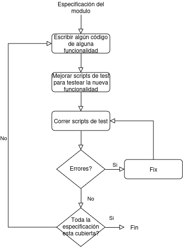
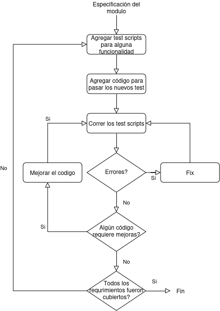
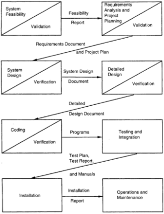
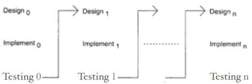

1. [Codificación](#Codificación)
	Objetivo: **implementar el diseño** de la mejor manera posible y **reducir los costos de testing y mantenimiento**.
	- [Programación-estructurada](#Programación-estructurada)
		- Objetivo: escribir programas cuya estructura **dinámica** es la misma que la **estática**. i.e: desarrollar programas cuyo flujo de control (dinámico) es **lineal** y se puede leer y entender así en el código.
			- Estructura **dinámica**: orden el cual las sentencias se **ejecutan**.
			- Estructura **estática**: orden de las sentencias en el código (orden lineal)
		- Facilita la comprensión y el razonamiento
		- Tiene **constructores** de una **única entrada y una única salida**. De esta manera, la ejecución de las sentencias se realizan en el orden en el que aparecen en el código.
	- [Procesos-de-codificación](#Procesos-de-codificación)
		- [Proceso-de-codificación-incremental](#Proceso-de-codificación-incremental) <-- grafico
		- [Desarrollo dirigido por test (TDD)](#Desarrollo-dirigido-por-test) <-- grafico
		- [Programación-de-a-pares](#Programación-de-a-pares)
			- El código se escribe de a dos programadores, donde van **alternando el rol** de escritura y el de revisor (i.e, hay **revisión continua** y mayor **detección de errores**) y pensador (**mejor diseño**).
	- [Refactorización](#Refactorización)
		 **Pausa el proceso de codificación normal** para solo **mejorar de a pequeños pasos el diseño** plasmado en el código existente **sin modificar su comportamiento externo**.
		 Hace el software mas comprensible, testeable y mantenible para aumentar la C&P en la realización de cambios.
		 Metodo: **- acoplamiento**,**+ cohesión**, **+ abierto-cerrado**.
		Refactorizaciones más comunes:
		- [Mejoras-de-métodos](#Mejoras-de-métodos)
			- **Agregar/Eliminar parámetros**: que todos los parámetros provean la información necesaria y ninguno provea información que otro ya provee.
			- **Extracción de métodos**: separar en métodos cortos cuya signatura indique lo que el método hace.
		- [Mejoras-de-clases](#Mejoras-de-clases)
			- **Desplazamiento de métodos**: Mover métodos de una clase a otra tal que se reduzca el acoplamiento y aumente la cohesión de las clases.
				(ej: cuando el método actúa demasiado con los objetos de la otra clase.)
			- **Desplazamiento de atributos**: Mover atributos de una clase a otra tal que se reduzca el acoplamiento y aumente la cohesión de las clases.
				(ej: cuando el atributo se usa más en la otra clase)
			- **Extracción de clases**: Si una clase agrupa múltiples conceptos, separar cada concepto en una clase distinta mejorando la cohesión.
			- **Remplazar valores de datos por objetos**: Si una colección de atributos forman parte de una misma entidad lógica, separarlos como una clase y definir objetos para accederlos.
		- [Mejoras-de-jerarquías](#Mejoras-de-jerarquías)
			- **Remplazar condicionales con polimorfismos**: Si el comportamiento depende de alguna condicional (if,else,switch) de tipo, aprovechar las capacidades de la POO, en particular el **polimorfismo**, para que cada tipo de objeto decida cómo comportarse.
			- **Subir métodos/atributos**: Si la funcionalidad o atributo esta duplicado en las subclases, pueden subirse a la superclase.
2. [Procesos-de-desarrollo](#Procesos-de-desarrollo)
	Modelos comunes:
	1. [Modelo-Cascada](#Modelo-Cascada)
		- Divide claramente la solución en una secuencia de fases ordenadas, conectadas por un **producto de trabajo** definido. Ideal para proyectos con requisitos claros desde el inicio pero menos adaptable a cambios.
		- Ventajas: Fácil de administrar y ejecutar. Conceptualmente **simple**, Intuitivo y lógico.
		- Desventajas: Mayores **riesgos de requerimientos**.
		 - Uso: Proyectos con **requerimientos bien comprendidos** y **tecnología definida al inicio**.
		 - **Variante**: con feedback a la fase anterior a lo sumo.
	2. [Prototipado](#Prototipado)
		- Remplaza la etapa de análisis de requerimientos del [Modelo-Cascada](#Modelo-Cascada) con una **‘’mini-cascada’’** para construir rápidamente un prototipo económico (de calidad sin cuidado) que permita al cliente tener una idea de lo que sería el SW y así conseguir **mejor feedback** de él. **El prototipo se descarta**.
		- Ventajas: Ayuda a **comprender y reducir riesgos de los requerimientos**.
		- Desventajas: Posiblemente **mayores costos y tiempos**.
		- Uso: Cuando hay mucha **incertidumbre en los requerimientos**.
	4. [Iterativo](#Iterativo)
		- Desarrolla y entrega el SW incrementalmente en una **“secuencia de cascadas”**  completas en sí mismas (con testing, feedback, ...). En cada secuencia se actualiza y se realiza un subconjunto de la LCP hasta terminar el proyecto.
			- **LCP** (lista de control del proyecto):  Contiene ordenadamente las tareas necesarias para terminar el proyecto.
		- Ventajas: **Entregas regulares y rápidas**. **Permite feedback** del usuario para mejorar lo desarrollado. **Acepta cambios** naturalmente.
		- Desventajas: **Mayor costo** en refactorizacion (o si no, en C&P en los cambios) y en **revisión** o **descarte** del trabajo ya hecho. <!-- TODO: Pregunta 2-->
		- Uso: Donde se requiere **tiempos de respuesta rápidos**, **no puede enfrentarse el riesgo de proyectos largos**  “todo o nada”, y/o **los requerimientos sólo se comprenderán con el tiempo**.
		- (Nuevos enfoques: Proceso unificado y de Desarrollo ágil: Extreme programming y Test driven development)
	5. [Timeboxing](#Timeboxing)
		- Divide la iteración en **“time boxes”** iguales y usa **pipelining** para ejecutar iteraciones en paralelo de **diferentes etapas y proyectos** independientes.
		- Ventajas: Las del **iterativo**, y **Ciclo de entrega muy corto**.
		- Desventajas: **Muy grandes equipos de trabajo** distribuidos/parelelizados -->  **Mayor costo**, y **Administración mucho mas compleja**.
		 - Uso: Donde es necesario **tiempos de entrega muy cortos**.
3. [Proceso-de-Software](#Proceso-de-Software)
	- **[Enfoque ETVX](#Enfoque-“ETVX”)**: Cada fase produce un **producto de trabajo** (**Task**), tal que el **criterio de entrada** (**Entry**) de la siguiente fase sea consistente con el **criterio de salida** (**Exit**) de la fase actual, verificando la calidad del producto (**Verificación**) para reducir el riesgo de errores acumulativos y lograr alta C&P, identificándolos lo más cerca posible de su punto de origen.
	- **¿Por qué dividir fases?**: **Cada fase ataca distintas partes del problema** (Dividir y conquistar), lo que ayuda a **validar continuamente el proyecto**.
	- **¿Por que ser predecible?**: El proceso debe ser predecible para estimar, **bajo control estadístico**, los costos, esfuerzos, calidad y desempeño, asegurando **consistencia en la C&P** al desarrollar software.
	Procesos/**componentes**:
	1. **Proceso de la ingeniería del producto**: 
		1. (fundamental) [Proceso de desarrollo de software](#Procesos-de-desarrollo): se enfoca en las actividades para el desarrollo y para garantizar la calidad necesarias para la ingeniería del sw. Es un conjunto de fases (ej: Análisis de requerimientos y especificación, Arquitectura y Diseño, Codificación, Testing, y Entrega e instalación), que pueden **adecuarse** en ciertos proyectos para construir sistemas de sw **dentro de los costos y el cronograma** (tiempo planeado), y que posean **calidad apropiada**, **alta C&P** y **satisfagan al cliente**.
		2. (fundamental) [Proceso para la administración del proyecto](#Proceso-para-la-administración-del-proyecto): se enfoca en el planeamiento y control del proceso de desarrollo con el fin de cumplir los objetivos. Consiste en 3 fases encargadas de **asignar recursos, administrarlos, observar el progreso, y tomar acciones correctivas** para **ejecutar** eficientemente las fases y actividades del **proyecto**.
			Fases:
			1) **[Planeamiento](#Planeamiento-del-proyecto-de-software)**: **Antes de comenzar el proyecto**, esta fase produce el plan que guiara el **Seguimiento y control**.
				- **Entrada**: requerimientos y la arquitectura básicos.
				Tareas claves:
				- **Estima** esfuerzo, costos,  tiempos y recursos.
				- **Selecciona** el personal.
				- **Planea** todas las tareas que la [administración del proyecto](#Proceso-para-la-administración-del-proyecto) necesita realizar durante el **seguimiento y control**. i.e: seguimiento del proyecto, control de calidad, y la [administración de la configuración](#Proceso-para-la-administración-de-la-configuración).
				- **Administra** el riesgo.
			2) **Seguimiento y Control**: **Durante el proceso de desarrollo**, esta fase **ejecuta el plan inicial** y lo **actualiza en función de las necesidades**. i.e: toma **acciones correctivas** cuando sea necesario, observando **métricas** de parámetros clave como costo, tiempos, y riesgo así como los factores que los afectan.
			3) **Análisis de terminación**: **Al finalizar el proceso de desarrollo**, esta fase **analiza el desempeño del proceso** e identifica las lecciones aprendidas. En procesos iterativos el análisis de terminación se realiza al finalizar cada iteración y se usa para mejorar en iteraciones siguientes
		3. [Proceso de inspección](#Proceso-de-inspección): Es una **revisión estructurada con roles definidos** (Moderador, Autor, Revisor, Lector, Escriba) con el objetivo de **detectar defectos** en los productos de trabajo, **sin enfocarse en resolverlos**. La información recolectada en la revisión es registrada y utilizada para monitorear la efectividad de la solución.
			Roles y responsabilidades:
			- **Moderador**: Está a cargo de la reunión y juega un rol central
				- Asegura que el foco permanece sobre la identificación de defectos en el producto de trabajo (y no en su autor).
				- Debe garantizar que la reunión se ejecute ordenada y amigablemente, y evitar que se prolonguen o se discutan soluciones.
				- Utiliza el resumen para analizar la efectividad de la revisión.
			- **Autor**: quien realizó el producto de trabajo.
			- **Revisor**: quien identifica los defectos.
			- **Lector**: lee línea a línea el producto de trabajo para enfocar el progreso de la reunión.
			- **Escriba**: registra las observaciones indicadas
			Fases: 
			
			
		4. [Proceso para la administración de la configuración](#Proceso-para-la-administración-de-la-configuración) (SCM): es el **control sistemático de los cambios** en los **ítems de configuración** en la **evolución** de un proyecto de software (**los cambios de requerimientos se manejan aparte**), asegurando que las distintas versiones se combinen correctamente, sin pérdidas. **Controla solo el producto** del proceso de desarrollo (es **independiente del proceso de desarrollo**).
			- **Control de acceso**: Establece procedimientos check-in, check-out para controlar el acceso del personal a los items del repositorio.
				
			- **Items de la configuración**: unidades individuales sujetas a cambios, los cuales se rastrean rigurosamente. Una **baseline** es un conjunto de estos ítems que representan un estado estable, sirviendo como referencia para cambios futuros.
		6. [Proceso para la administración de cambios de requisitos](#Proceso-para-la-administración-de-cambios): Permite **de manera controlada** los **requerimientos de cambio** evaluando su impacto, en esfuerzo, cronograma y costo, en los productos de trabajo y distintos ítems de configuración, manteniendo un **registro** de todos los requerimientos de cambio.
	2. **[Proceso para la administración del proceso](#Proceso-para-la-administración-del-proceso)**: se enfoca en la **evaluación y mejora** del **proceso**.
		-  **CMM** (Capability Maturity Model): ofrece un marco que especifica por niveles **áreas en las cual enfocarse** para la **mejora del proceso**.
4. [Testing](#Testing)
	- **Desperfecto** (failure): Un desperfecto de software ocurre si su **comportamiento es distinto del esperado/especificado**. **Implica la presencia de algún defecto** que lo provoca.
	- **Defecto** (fault): es lo que tiene el **potencial para causar un desperfecto**.
	- **[Registro de defectos y seguimiento](#Registro-de-defectos-y-seguimiento)**:
		Durante el **Ciclo de vida de un defecto** en un proyecto de software, se registra información sobre el defecto en las distintas etapas para ayudar al debugging y al análisis.
		- Se registra el **tipo de defecto**: funcional, lógica, standards, asignación, interfaz de usuario, interfaz de componente, desempeño, documentación, etcétera.
		- Se registra la **severidad del defecto** en términos de su impacto en el software. Útil para priorizar la corrección. Puede ser Crítico, Mayor, Menor, Cosmético,...
	- **Test**: Tupla entrada - salida esperada
	- **Testing**: un programa se **ejecuta** siguiendo un conjunto de casos de test para encontrar desperfectos en algun caso de test.
	- **Debugging**: Sirve para buscar e identificar el defecto real, que causa el desperfecto.
	- **Oráculo de test**: Provee el comportamiento correcto para un caso de test para poder verificar la ocurrencia de un desperfecto en la ejecución del caso de test.
	- **Criterio de selección de tests**: especifica las condiciones que el conjunto de casos de test debe satisfacer con respecto al programa y/o a la especificación. Sirve para poder construir un **conjunto de costo factible de casos de test** tal que la ejecución satisfactoria de todos ellos haga **probable la ausencia de defectos aumentando la confianza y calidad**.
	- Conjunto de casos de test bueno: que detecte la mayor cantidad de defectos y que ningún conjunto más pequeño también lo encuentre.
	- **[Testing incremental](#Testing-incremental)**: agregar partes no testeadas incrementalmente a la parte ya testeada. Ayuda a encontrar, identificar y eliminar más defectos. El testing de grandes sistemas se realiza siempre de manera incremental.
	- **[Testing de regresión](#Testing-de-regresión)**: Verifica que las funcionalidades previas continúen funcionando bien cuando se introduce algún cambio al software.
	- **[Especificación de los casos de test](#Especificación-de-los-casos-de-test)**: Especificación de casos de test: Establece los casos (entradas, condiciones que testeará y salidas esperadas) a testear de cada unidad separadamente, se revisa para garantizar su **efectividad** y **costo factible**, y una vez especificados se ejecuta y verifica.
	
	Dos enfoques complementarios para diseñar casos de test:
	1. **[Caja negra](#Testing-de-caja-negra)**: bueno para **detectar errores funcionales (de entrada-salida)**. **Útil a alto nivel**, donde se busca analizar el comportamiento funcional del sistema o partes de éste.
		- **Premisa**: el comportamiento esperado está especificado
		- Para diseñar los casos de test, se utiliza solo el comportamiento esperado de la **Implementación bajo test (IUT)** según su especificación. No se tiene (o se ignora) la estructura interna del código.
		
		- Se enfoca sólo en la funcionalidad: Lo que el programa hace, no como lo hace.
		
		Criterios de selección de test:
		1. [Particionado por clase de equivalencia](#Particionado-por-clase-de-equivalencia): Divide el conjunto de pares entrada-salida especificados (para entradas validas e invalidas) en clases de equivalencias tal que (**Premisa**:) si el software funciona para un caso de test en una clase muy probablemente funcione de la misma manera para todos los elementos de la misma clase.
			- **Base lógica**: la especificación requiere el mismo comportamiento en todos los elementos de una misma clase. => Es muy probable que el software se construya de manera tal que falle para todos o para ninguno.
			- **Métodos de selección de los casos de test:** (Una vez elegidas las clases)
				1. Seleccionar cada caso de test **cubriendo tantas clases como sea posible**.
				2. Seleccionar cada caso de test **cubriendo a lo sumo una clase por cada entrada.**
		2. [Análisis de valores límites](#Análisis-de-valores-límites): Elige, ademas del valor normal, valores **en**, **justo fuera** y **justo dentro** de los **límites de entrada y de salida** de cada clase de equivalencia.
		3. [Grafo de causa-efecto](#Grafo-de-causa-efecto): Construye un grafo que ilustra las **combinaciones de causas que hacen efectivo cada efecto**, luego pasa esa información en forma de lista en una **tabla de decisión** para finalmente armar los distintos casos de test.
		4. [Testing de a pares](#Testing-de-a-pares): Ejercita cada posible par de parámetros con sus posibles de valores. Es factible y se investigó que la gran mayoría de los defectos tienden a ser de modo simple o de modo doble.
		5. [Testing basado en estados](#Testing-basado-en-estados): Evalúa sistemas cuyo **comportamiento depende tanto de la entrada como del estado** actual del sistema, **modelando el sistema como una máquina de estados de interés**. Se construye a partir de las especificaciones, requerimientos (Caja negra) o mas frecuentemente del diseño (**Caja gris**).
			- **Componentes**: estados (nodos), transiciones (aristas), eventos (entradas), y acciones (salidas)
			- **Criterios de selección de los casos de test:** (una vez hecho el modelo)
				Sea T el conjunto de casos de test,
				- **Cobertura de transiciones**: T debe asegurar que toda transición sea ejecutada.
				- **Cobertura de par de transiciones**: T debe ejecutar todo par de transiciones adyacentes que entran y salen de un estado.
				- **Cobertura de árbol de transiciones**: T debe ejecutar todos los caminos simples, del estado inicial al final o a uno visitado.

	2. **[Caja blanca](#Testing-de-caja-blanca)**: bueno para **detectar errores estructurales (de lógica) del programa**. **Útil a bajo nivel solamente**, donde el programa es mas “manejable”.
		- Se enfoca en el código: El objetivo es ejecutar las distintas **estructuras** del programa con el fin de descubrir errores.
		- Los casos de test se derivan a partir del código.
		- **Criterios de selección de los casos de test**:
			1. [Criterio basado en el flujo de control](#Criterio-basado-en-el-flujo-de-control): Observa al programa como un grafo de flujo de control donde los **nodos** representan **bloques de código** y las **aristas** posibles **transferencias de control** entre ellos.
				Provee alguna idea cuantitativa de la “amplitud” del conjunto de casos de test. Se utiliza más para evaluar el nivel de testing que para seleccionar los casos de test.
				**Criterios**:
				- **Criterio de cobertura de sentencia**: Cada sentencia se ejecuta al menos una vez durante el testing.
				-  **Criterio de cobertura de ramificaciones**: Cada arista se ejecuta al menos una vez en el testing. Implica cobertura de sentencias.
				- **Criterio de cobertura de caminos**: Todos los posibles caminos del estado inicial al final deben ser ejercitados. Implica cobertura de bifurcación.
			2. [Criterio basado en el flujo de datos](#Criterio-basado-en-el-flujo-de-datos): Observa la cobertura de la relación definición-uso en las variables. Construye un grafo de definición-uso etiquetando apropiadamente el grafo de flujo de control.
				Un camino de i a j se dice **libre de definiciones** con respecto a una var x si no hay definiciones de x en todos los nodos intermedios.
				**Criterios de cobertura**:
				- **Todas las definiciones**: por cada nodo i y cada x en def(i) hay un camino libre de definiciones con respecto a x hasta un uso-c o uso-p de x.
				- **Todos los usos-p**: todos los usos-p de todas las definiciones deben testearse.
				- Otros criterios: todos los usos-c, algunos usos-p, algunos usos-c.
			3. [Criterio basado en mutación](#Criterio-basado-en-mutación): Observa a diversos mutantes del programa original.
5. [Planeamiento-del-proyecto-de-software](#Planeamiento-del-proyecto-de-software): **Antes de comenzar el proyecto**, esta fase produce el plan que guiara el **Seguimiento y control**.
	Fase principal del [Proceso para la administración del proyecto](#Proceso-para-la-administración-del-proyecto)
	**Entrada**: requerimientos y la arquitectura básicos.
	Tareas claves:
	- **Estima** esfuerzo, costos,  tiempos y recursos.
	- **Selecciona** el personal.
	- **Planea** todas las tareas que la [administración del proyecto](#Proceso-para-la-administración-del-proyecto) necesita realizar durante el **seguimiento y control**. i.e: seguimiento del proyecto, control de calidad, y la [administración de la configuración](#Proceso-para-la-administración-de-la-configuración).
	- **Administra** el riesgo.

	Tópicos más importantes:
	1. [Planeamiento del proceso](#Planeamiento-del-proceso): Planea como se ejecutará el proyecto, i.e:  el **modelo de proceso** a seguir; criterios de **entrada**, de **salida**, y actividades de **verificación** de  cada **etapa**; y las **metas parciales** para  analizar el progreso del proyecto.
	1. [Estimación del esfuerzo](#Estimación-del-esfuerzo): Dado un conjunto de requerimientos estima cuánto costará en tiempo y dinero el desarrollo del sw. Es **clave para el planeamiento**: factibilidad, análisis costo-beneficio, efectuar ofertas y asignar tiempos, costos, y recursos humanos.
		-  [COCOMO](#COCOMO): **estima el esfuerzo y el costo** necesarios para desarrollar software usando el **tamaño del software** (en KLOC) y un conjunto de **15 factores de multiplicación** que representan distintos atributos del software, hardware, personal, y proyecto.
			**Procedimiento**:
			1. **Obtener el estimador inicial** usando el **tamaño**;
				**$esfuerzo = a * tamaño^b$** donde las constantes a y b estan predefinidos segun el tipo de sistema: Orgánico, Semi-rígido y Rígido
			2. **Determinar un conjunto de 15 factores de multiplicación** representando distintos atributos;
				Por ejemplo: **DATA** (tamaño de la base de datos (software)), **TIME** (limitaciones en el porcentaje del uso de la CPU (hardware)), y **TOOL** (uso de herramientas de desarrollo de software (proyecto)).
			3. **Ajustar el estimador de esfuerzo** escalándolo según el factor de multiplicación final;
				$esfuerzo = E * \prod_{k=1}^{15} f_{k}$ donde $f_{k}$ es el k-esimo Factor de ajuste.
			4. **Calcular el estimador de esfuerzo de cada fase principal**.
	1. [Planificación y recursos humanos](#Planificación-y-recursos-humanos) o Estimación de tiempos y recursos:
		- Dos niveles de planificación:
			1. [Planificación global](#Planificación-global): abarca las metas parciales (milestones) y la fecha final.
			2. [Planificación detallada](#Planificación-detallada): es la asignación de las tareas de más bajo nivel a los recursos.
		- [Estructura del equipo de trabajo](#Estructura-del-equipo-de-trabajo]): Para asignar las tareas en la planificación detallada es necesario un equipo de trabajo estructurado.
			1. **Organización jerárquica**: Hay un administrador de proyecto con la responsabilidad global, realiza diseño, asigna recursos, etcétera.
				- Tiene programadores, testers y administrador de configuración para ejecutar las tareas detalladas.
			2. **Equipos democráticos**: El liderazgo es rotativo.
				- Funciona en pequeños grupos.
			3. **Alternativa**: Reconoce tres tareas principales: desarrollo, testing y administración del programa. Cada una tiene su equipo y cada equipo su líder. Todos reportan a un líder general.
				- Para el desarrollo de grandes productos.
	1. [Planeamiento de la administración de la configuración del software](#Planeamiento-de-la-administración-de-la-configuración-del-software): Dadas la especificación de los requerimientos y el entorno de operación, Identifica los **ítems** de configuración y especifica los procedimientos a usar para **controlar e implementar** los cambios de estos items.
	3. [Planeamiento del Control de Calidad](#Planeamiento-del-Control-de-Calidad): Durante el proyecto lleva un seguimiento de la calidad. Define actividades para identificar y eliminar defectos, analiza los datos recolectados de los defectos y establece juicios cuantitativos sobre la calidad: métricas, densidad de defectos.
	4. [Administración de riesgos](#Administración-de-riesgos):
	5. [Planificación del seguimiento del proyecto](#Planificación-del-seguimiento-del-proyecto):

## Codificación
Los programadores leen el código muchas veces para hacer mantenimiento, debugging, extenderlo, modificarlo, etcétera.
Entonces: el código debe ser fácil de leer y comprender

### **Programación-estructurada** 
**Programación estructurada** se inició  fundamentalmente contra el uso indiscriminado de constructores de control como los “gotos”.
Objetivo: simplificar la estructura de los programas de manera que sea fácil razonar sobre ellos.

**Estructura estática**: orden de las sentencias en el código. i.e: lineal.
**Estructura dinámica**: orden el cual las sentencias se ejecutan. Un programa es correcto si el comportamiento dinámico es el esperado.

Pero debemos razonar sobre el código del programa. Por lo tanto una correspondencia cercana facilitará la comprensión del comportamiento dinámico desde la estructura estática.

Objetivo de la programación estructurada: escribir programas cuya estructura
dinámica es la misma que la estática,
i.e. las sentencias se ejecutan en el mismo orden que las presenta el código.
Como las sentencias se organizan
linealmente (estático), el objetivo es
desarrollar programas cuyo flujo de
control (dinámico) es **lineal**

Los **constructores** de la programación estructurada son de una única entrada y
una única salida.

### Ocultamiento-de-la-información

### Procesos-de-codificación
Proceso básico:
• Escribir código del módulo.
• Realizar test de unidad.
• Si error: arreglar bugs y repetir tests.
#### Proceso-de-codificación-incremental

#### Desarrollo-dirigido-por-test

El TDD (Test Driven Development) es una parte independiente de **Extreme programming**.

Primero se escriben los scripts de los tests (Lo que ayuda a asegurar que todo el código sea testeable), y luego se escribe el código para que pase los casos de test.

La responsabilidad de asegurar cobertura de toda la funcionalidad (**completitud**) radica en el diseño de los casos de test y no en la codificación.
#### Programación-de-a-pares
También propuesto como práctica en XP (**Extreme programming**).

El código se escribe de a dos programadores, donde van alternando el rol de escritura y el de revisor (i.e, hay revisión continua y mayor detección de errores) y pensador (mejor diseño).
### Refactorización
Con el tiempo, aún si el diseño inicial era bueno, los cambios en el código deterioran el diseño y se vuelve más complicado modificar el código y se es más susceptible a errores.
i.e. la C&P en la realización de cambios comienza a disminuir.

Se hace de forma **separada a la codificación normal**. No agrega nuevas características, ni corrige bugs, sino que **mejora el diseño plasmado en el código existente**. Lo hace mas comprensible, testeable y mantenible para aumentar la C&P en la realización de cambios.

Modifica la estructura interna del software,
- reduciendo el **acoplamiento**,
- incrementando la **cohesión**,
- y mejorando la respuesta al principio de **abierto-cerrado** (que no se deba modificar y que sea fácil de extender),
con el fin de que sea mas comprensible, testeable y mantenible, sin cambiar su comportamiento externo.

**Principal riesgo**: “romper” la funcionalidad existente.
Para disminuir esta posibilidad: **Refactorizar en pequeños pasos**, y disponer de scripts para tests automatizados para testear la funcionalidad existente.

La refactorización permite que el diseño del código mejore continuamente en lugar de degradarse con el tiempo.
- El código extra de la refactorización se recupera en la reducción del costo en los cambios.
- No es necesario tener el diseño más general desde el comienzo; se pueden elegir diseños más simples.
- Hace más fácil y menos riesgosa la tarea inicial de diseño.
#### Mejoras-de-métodos
Agregar/Eliminar parámetros, de tal forma que todos provean información necesaria y ninguno provea información que otro ya provee, para simplificar la interface.
#### Mejoras-de-clases

**Desplazamiento de métodos**: Desplazar métodos de una clase a otra si de este forma se reduce el acoplamiento y aumenta la cohesión de las clases. (cuando el método actúa demasiado con los objetos de la otra clase.)
Inicialmente puede ser conveniente dejar un método en la clase inicial que
delegue al nuevo, debería tender a desaparecer.

**Desplazamiento de atributos**: Desplazar atributos de una clase a otra si de esta forma se reduce el acoplamiento y aumenta la cohesión de las clases. (Si los atributo se usa más en la otra clase)

**Extracción de clases**: Si una clase agrupa múltiples conceptos, separar cada concepto en una clase distinta mejorando la cohesión.

**Remplazar valores de datos por objetos**: Si una colección de atributos forman parte de una misma entidad lógica, separarlos como una clase y definir objetos para accederlos.

#### Mejoras-de-jerarquías

**Remplazar condicionales con polimorfismos**: Si el comportamiento depende de algún indicador de tipo, no se está explotando el poder de la OO. Reemplazar tal análisis de casos a través de una jerarquía de clases apropiada.

**Subir métodos/atributos**: Los elementos comunes deben pertenecer a la superclase. Si la funcionalidad o atributo esta duplicado en las subclases, pueden subirse a la superclase.

## Procesos-de-desarrollo
[Proceso de desarrollo de software](#Procesos-de-desarrollo)
**Modelo de proceso**: especifica una **estructura genérica** de los procesos, usualmente como un conjunto de etapas, que puede **adecuarse** en algunos proyectos con el fin de alcanzar sus objetivos.
**Especificación del proceso**: plan de lo que debe ejecutarse.
**Proceso**: lo que realmente se ejecuta.
### Modelo-Cascada

| Fortalezas                                                                                                                                                                                                                               | Debilidades                                                                                                                                                                                                           | Aplicación                                                                                                                                                                                                                                                                      |
| ---------------------------------------------------------------------------------------------------------------------------------------------------------------------------------------------------------------------------------------- | --------------------------------------------------------------------------------------------------------------------------------------------------------------------------------------------------------------------- | ------------------------------------------------------------------------------------------------------------------------------------------------------------------------------------------------------------------------------------------------------------------------------- |
| Divide claramente el problema en distintas fases que pueden realizarse de manera independiente. --> Fácil de administrar en un contexto contractual. --> Conceptualmente **simple**, Intuitivo y lógico. --> Fácil de ejecutar. | Puede escoger hw/ tecnología vieja.  Requisitos se congelan muy temprano. No hay feedback del usuario. --> **Requerimientos menos trabajados**.  No permite cambios --> **Aumenta riesgos**.  | Desarrolladores muy familiarizados con el problema a atacar y el proceso a seguir.  Proyectos con **requerimientos bien comprendidos** y **tecnología definida al inicio**.  Proyectos de corta duración.  Automatización de procesos manuales existentes. |

Secuencia inicial de las distintas faces:
1. Análisis de requerimientos
2. Diseño de alto nivel
3. Diseño detallado
4. Codificación
5. Testing
6. Instalación
Una fase comienza sólo cuando la anterior finaliza, en principio, no hay feedback.
Las fases dividen al proyecto; cada una de ellas se encarga de distintas incumbencias. divide claramente el problema en distintas fases que pueden realizarse de manera independiente.

### Prototipado

| Fortalezas                                                                                                                                                                                                                                                                                            | Debilidades                                                                                                                                    | Aplicación                                                                                                                                                       |
| ----------------------------------------------------------------------------------------------------------------------------------------------------------------------------------------------------------------------------------------------------------------------------------------------------- | ---------------------------------------------------------------------------------------------------------------------------------------------- | ---------------------------------------------------------------------------------------------------------------------------------------------------------------- |
| Da mejor feedback del cliente. --> Ayuda a **comprender los requerimientos**.  Mayor estabilidad en los requerimientos. --> **Reduce riesgos**.  La experiencia en la construcción del prototipo ayuda al desarrollo principal. --> **Sistemas finales mejores y más estables**. | Análisis de requerimientos pesado --> ‘’mini-cascada’’  Posiblemente **mayores costos y tiempos**.  No permite cambios tardíos. | Sistemas con usuarios novatos.  Cuando hay mucha **incertidumbre en los requerimientos**.  Cuando las interfaces con el usuario son muy importantes. |

**Desarrollo**:
1. Comienza con una versión preliminar de los requerimientos.
2. Se crea un prototipo con las características claves que necesitan mejor comprensión.
3. El cliente lo prueba y luego de su feedback el prototipo se modifica y se repite el proceso hasta que los costos y el tiempo superen los beneficios de este proceso.
4. Teniendo en cuenta el feedback, los requerimientos iniciales se modifican para producir la especificación final de los requerimientos.
5. Finalmente se descarta el prototipo.
### Iterativo

| Fortalezas                                                                                                                                                                                                          | Debilidades                                                                                                                                                                                                                                                                                               | Aplicación                                                                                                                                                                                                       |
| ------------------------------------------------------------------------------------------------------------------------------------------------------------------------------------------------------------------- | --------------------------------------------------------------------------------------------------------------------------------------------------------------------------------------------------------------------------------------------------------------------------------------------------------- | ---------------------------------------------------------------------------------------------------------------------------------------------------------------------------------------------------------------- |
| **Entregas regulares y rápidas**.  **Permite feedback** del usuario para mejorar lo desarrollado.  **Acepta cambios** naturalmente.  Reduce riesgo de requerimientos.  Prioriza requisitos. | Sobrecarga de planeamiento y cambios en cada iteración. --> Arquitectura y diseño pueden no ser óptimos. --> **Mayor costo** en refactorizacion o C&P en los cambios.  Mas revisión del trabajo hecho. El trabajo en una iteración puede deshacerse en otra. --> **Mayor costo total**. | Donde se requiere **tiempos de respuesta rápidos**.  Donde **no puede enfrentarse el riesgo de proyectos largos**  “todo o nada”.  Cuando **los requerimientos sólo se comprenderán con el tiempo**. |

- Desarrolla y entrega el SW incrementalmente (Cada incremento es completo en sí mismo --> “secuencia de cascadas”).
- Provee un marco para facilitar el testing, pues el testing de cada incremento es más fácil que el testing del sistema completo.
- El feedback de una iteración puede usarse en iteraciones futuras.
  
**Desarrollo**:
- Implementación simple para un subconjunto del problema completo (sólo aspectos claves y fáciles de entender).

- Crear **lista de control del proyecto (LCP)**
	- LCP: Contiene (en orden) las tareas que se deben realizar para lograr la implementación final (i.e: guía los pasos de iteración y lleva las tareas a realizar).
	- Cada entrada en LCP es una tarea a realizarse en un paso de iteración y debe ser lo suficientemente simple como para comprenderla completamente.
- Cada paso consiste en eliminar la siguiente tarea de la lista haciendo **diseño, implementación y análisis** del sistema parcial, y actualizar la LCP.
- El proceso se repite hasta vaciar la lista.

**Modelo en espiral**:
1. Identificar objetivos, distintas alternativas para conseguirlos, y restricciones.
2. Evaluar alternativas en base a objetivos y restricciones, considerando riesgos.
	Desarrollar estrategias para resolver incertidumbre y riesgos.
3. Desarrollar y verificar el sw.
4. Planear próximo paso.

**Desarrollo iterativo (Scrum)**:
1. **Planificación de la iteración** (primer día).
	1. **Selección de requisitos**: El cliente presenta la lista de requisitos priorizada del producto. Se aclaran y se selecciona los requisitos prioritarios a completar en la iteración.
	2. **Planificación**: El equipo elabora la lista de tareas para desarrollar los requisitos. La estimación de esfuerzo se hace de manera conjunta y los miembros del equipo se autoasignan las tareas.
2. **Ejecución de la iteración**: Reunión de sincronización (diarias).
	Cada miembro del equipo inspecciona el trabajo que el resto está realizando para poder hacer las adaptaciones necesarias y respondiendo a: ¿Que hice? ¿Que voy a hacer? ¿Que me traba?
	- El **Scrum Master** debe: Encargarse de que el equipo pueda cumplir con su compromiso y de no ser improductivo. Elimina los obstáculos que el equipo no puede resolver por sí mismo. Protege de interrupciones externas que puedan afectar la productividad.
	- El **cliente y el equipo** deben: Refinar la lista de requisitos preparandola para las siguientes iteraciones. Si es necesario, cambiar o replanificar los objetivos del proyecto para maximizar la utilidad de lo que se desarrolla y el retorno de inversión. 
3. **Inspección y adaptación** (último día).
	Revisión de la iteración.
	- **Demostración**: El equipo presenta al cliente los requisitos completados en la iteración, en forma de incremento de producto preparado para ser entregado con el mínimo esfuerzo. En función de los resultados mostrados y de los cambios que haya habido en el contexto del proyecto, el cliente realiza las adaptaciones necesarias de manera objetiva, replanificando el proyecto.
	- **Retrospectiva**: El equipo analiza cómo ha sido su manera de trabajar y cuáles son los problemas que podrían impedirle progresar adecuadamente. El scrum masterse encargará de ir eliminando los obstáculos identificados.
### Timeboxing

| Fortalezas                                                                                                                                                                     | Debilidades                                                                                                                                                | Aplicación                                                                                                           |
| ------------------------------------------------------------------------------------------------------------------------------------------------------------------------------ | ---------------------------------------------------------------------------------------------------------------------------------------------------------- | -------------------------------------------------------------------------------------------------------------------- |
| **Todas las del iterativo**.  Ejecución del proyecto distribuida (pipeline). --> **Ciclo de entrega muy corto**.  Planeamiento y negociación un poco más fácil. | **Muy grandes equipos de trabajo**. -->  **Mayor costo**  Se necesita mucha sincronización. --> **Administración mucho mas compleja**.   | Donde es necesario **tiempos de entrega muy cortos**.  Hay flexibilidad en agrupar características (features). |
Cada iteración es una “mini-cascada”: decidir especificación luego planear la iteración.
**Timeboxing**: primero fija la duración de las iteraciones y luego determina la especificación.
Divide la iteración en partes iguales y usa **pipelining** para ejecutar iteraciones en paralelo.

El desarrollo se realiza iterativamente en **time boxes de igual duración** divididos en **etapas fijas** de aproximadamente igual duración --> **alto compromiso con el cronograma**: éste no es negociable.
**Etapa**: **Un equipo** realiza **una tarea bien definida** e **independiente**. Cuando finaliza, se lo pasa al equipo de la siguiente etapa.
## Proceso-de-Software
El proceso es distinto del producto: el producto es el resultado de ejecutar un proceso.
Premisa: **Un proceso adecuado ayuda a lograr los objetivos del proyecto con alta C&P**.

**Proyecto exitoso**: Satisface las expectativas en costo, tiempo, y calidad. (reducir costos y tiempos e incrementar la calidad.)

**Modelo de proceso**: especifica un **proceso general**, usualmente **con fases** en las que el
proceso debe dividirse, conjuntamente con otras restricciones y condiciones para la ejecución de dichas fases. **No se traduce directamente al proceso**: en general el proceso real es una adaptación del modelo del proceso. **Es el proceso el que guía un proyecto**, e influye significativamente el resultado esperado del proyecto.

Dos procesos/**componentes** fundamentales:
- **Desarrollo**: se enfoca en las actividades para el desarrollo y para garantizar la calidad necesarias para la ingeniería del sw. <!--TODO: Pregunta 3-->
- **Administración del proyecto**: se enfoca en el **planeamiento y control del proceso de desarrollo** con el fin de **cumplir los objetivos**.

**Especificación del proceso**: Es un conjunto de **fases** **abstraídas** entre si (Cada fase puede ser llevada a cabo usando distintas **metodologías**.), donde cada una realiza una **tarea bien definida** y produce una salida (**producto de trabajo**).

**Producto de trabajo**: Entidad **formal** y **tangible**, capaz de ser **verificada**.

### Enfoque-“ETVX”

**ETVX**: (Entry - Task - Verification - eXit): El criterio de entrada de una fase debe ser consistente con el criterio de salida de la fase anterior.

Cada fase sigue el enfoque **ETVX** y produce información para la administración del proceso.
- **Entry**: **Criterio** de entrada: qué **condiciones** deben cumplirse para iniciar la fase.
- **Task**: Tarea: Lo que debe realizar esa fase.
- **Verification**: Verificación: Las inspecciones/controles/revisiones/verificaciones que deben realizarse a la salida de la fase, i.e. al producto de trabajo.
	Para lograr alta C&P, los errores deberían ser encontrados en la etapa en que se introdujeron. La “V” en “ETVX”.
- **Exit**: **Criterio** de salida: qué **condiciones** deben cumplirse para considerar que la fase fue realizada exitosamente.

### Características-deseadas
Los procesos de software deben:
1. **Proveer alta C&P**
	- Debe **producir sw testeable**: testing es la tarea más cara dentro del proceso de desarrollo; entre 30 y 50% del esfuerzo total de desarrollo.
	- Debe **producir sw mantenible**: el mantenimiento puede ser más caro que el desarrollo; hasta 80% del costo total durante la vida del sw.
	- Debe **eliminar defectos en etapas tempranas**: El costo de eliminar un defecto se incrementa a medida que perdura en el proceso de desarrollo.
	- Debe **ser predecible y repetible**.
	- Debe **soportar cambios** y **producir sw que se adapte a cambios**.
	En resumen: **Proveer alta C&P**:  El proceso debe **eliminar defectos en etapas tempranas**, ser **predecible** y **repetible**, **soportar cambios** y producir sw **testeable**, **mantenible** y **adaptable** a cambios.
2. **Prevenir defectos**, a través de
	**Control de calidad**: actividad cuyo propósito principal es identificar y eliminar errores
3. Conseguir **repetir el desempeño** cuando se utilizan en distintos proyectos.
	i.e: se debe poder **predecir el resultado** para poder estimar los costos y esfuerzos, y la calidad.
	Un proceso predecible se dice que está bajo **control estadístico**. 
4. Dejar lugar para cambios y tratarlos apropiadamente.
	Además de cambiar sw en operación, los cambios toman lugar durante el desarrollo. Los cambios de requerimientos son esperables.

### Proceso-de-desarrollo-de-software
**Objetivo**: construir sistemas de sw **dentro de los costos y el cronograma** (tiempo planeado), y que posean **calidad apropiada**, **alta C&P** y **satisfagan al cliente**.

Para cada proyecto, el proceso de desarrollo a seguir se especifica durante el planeamiento.

Es un conjunto de fases. Cada fase es a su vez una secuencia de pasos que definen la metodología de la fase.
¿Por qué utilizar fases?
- Dividir y conquistar.
- Cada fase ataca distintas partes del problema.
- Ayuda a validar continuamente el proyecto.

Usualmente está compuesto por las siguientes actividades:
(Los distintos modelos de proceso la realizan de distinta manera.)
1. **Análisis de requerimientos y especificación**
	**Objetivo**: comprender precisamente el problema.
	Forma la base del **acuerdo** entre el cliente y el desarrollador.
	Especifica el “qué” y no el “cómo”.
	Requiere **comprensión** detallada de un sistema inexistente!!
	**Salida** (Producto de trabajo): Especificación de los requerimientos del software (**SRS**).
2. **Arquitectura y Diseño**
	Es el paso fundamental para moverse **del dominio del problema al dominio de la solución**, del “qué” al “cómo”.
	Involucra **tres tareas**:
	- **Diseño arquitectónico**: establece las componentes y los conectores que conforman el sistema.
	- **Diseño de alto nivel**: establece los módulos y estructuras de datos necesarios para implementar la arquitectura.
	- **Diseño detallado**: establece la lógica de los módulos.
	**Salida**: Documentos correspondientes.
3. **Codificación**
	Convierte el diseño en código escrito en lenguaje específico.
	**Objetivo**: Implementar el diseño con código simple y fácil de comprender (legible!).
	La fase de codificación afecta tanto al testing como al mantenimiento. Código bien escrito puede reducir el esfuerzo de testing y de mantenimiento.
	**Salida**: el código.
4. **Testing**
	Cada fase puede introducir defectos.
	La fase de Testing debe encontrarlos y eliminarlos para mejorar la calidad.
	**Objetivo**: Identificar la mayoría de los defectos.
	Es una tarea muy cara: debe planearse y ejecutarse apropiadamente.
	**Salida**: Plan de test conjuntamente con los resultados, y el código final testeado, y confiable.
5. **Entrega e instalación**

### Otros-procesos-del-software

#### Proceso-para-la-administración-del-proyecto.
Consiste en fases encargadas de **asignar recursos, administrarlos, observar el progreso, y tomar acciones correctivas**  para **ejecutar** eficientemente las fases y actividades del **proyecto**.

Fases:
1) **[Planeamiento](#Planeamiento-del-proyecto-de-software)**
	Se realiza **antes de comenzar el proyecto**.
	Produce un plan el cual forma la base del seguimiento.
	Tareas claves:
	- **Estimar** costos y tiempos.
	- **Seleccionar** el personal.
	- **Planear** el seguimiento y el control de calidad.
	- . . .
2) **Seguimiento y control**
	Se realiza **durante el proceso de desarrollo**.
	Tareas:
	- Seguir y **observar parámetros claves** como: costo, tiempos, riesgo, así como los factores que los afectan.
	- Tomar **acción correctiva** si es necesario.
	- Las **métricas** proveen la información del proceso de desarrollo necesaria para el seguimiento.
3) **Análisis de terminación**
	Se realiza **al finalizar el proceso de desarrollo**.
	**Analiza el desempeño del proceso** e identificar las lecciones aprendidas.
	En procesos iterativos el análisis de terminación se realiza al finalizar cada iteración y se usa para mejorar en iteraciones siguientes
![[proc-admin-proyecto.png]]
#### Proceso-de-inspección.
Es una **revisión estructurada con roles definidos** con el objetivo de **detectar defectos** en los productos de trabajo, **sin enfocarse en resolverlos**. La información recolectada en la revisión es registrada y utilizada para monitorear la efectividad de la solución.

Los defectos pueden introducirse en el sw en cualquier etapa => deben eliminarse en cada etapa.

Roles y responsabilidades:
- **Moderador**: Está a cargo de la reunión y juega un rol central
	- Asegura que el foco permanece sobre la identificación de defectos en el producto de trabajo (y no en su autor).
	- Debe garantizar que la reunión se ejecute ordenada y amigablemente, y evitar que se prolonguen o se discutan soluciones.
	- Utiliza el resumen para analizar la efectividad de la revisión.
- **Autor**: quien realizó el producto de trabajo.
- **Revisor**: quien identifica los defectos.
- **Lector**: lee línea a línea el producto de trabajo para enfocar el progreso de la reunión.
- **Escriba**: registra las observaciones indicadas

Fases: 

1. **Planeamiento**: Definir roles y preparar el material.
2. **Preparación y repaso previo** (overview): se explica el propósito de la revisión y revisan individualmente el producto de trabajo con el objetivo de identificar y registrar defectos potenciales.
3. **Reunión de revisión grupal**: Definir la lista final de defectos.
	- Criterio de entrada: cada miembro debe haber hecho apropiadamente la revisión individual, el **moderador** revisa los registros individuales.
	- La reunión:
		1. El **lector** lee línea a línea el producto de trabajo.
		2. Cualquier observación que hubiere es efectuada.
		3. Discusión para identificar el defecto.
		4. La decisión es registrada por el **escriba**.
		A final de la reunión:
		- El **escriba** presenta la lista de defectos/observaciones.
		- **Se decide si se acepta el producto de trabajo**; si no, se puede requerir otra revisión.
		- **No proponen soluciones**, aunque podrían registrarse sugerencias.
		- Se prepara un resumen de las inspecciones - se usa para evaluar la efectividad de la revisión.
4. **Corrección y seguimiento**:
	- Los defectos en la lista de defectos son posteriormente corregidos por el autor.
	- Una vez corregidos, el autor obtiene el visto bueno del moderador o el producto de trabajo se somete a una nueva revisión.
	- Una vez que los defectos/observaciones fueron satisfactoriamente procesados, la revisión finaliza.
#### Proceso-para-la-administración-de-la-configuración.
La administración de la configuración (SCM) es el **control sistemático de los cambios** en la evolución de un proyecto de software (**los cambios de requerimientos se manejan aparte**), asegurando que las distintas versiones se combinen correctamente, sin pérdidas. Controla solo el producto del proceso de desarrollo (es independiente del proceso).

**Funcionalidades necesarias**:
- **Recolectar** todos las fuentes, documentos y otra información del sistema actual.
- Evitar cambios o eliminaciones **desautorizadas**.
- **Deshacer** cambios o revertir a una versión específica.
- Hacer disponible la última versión del programa.

Los **ítems de la configuración** en el software son unidades individuales que están sujetas a cambios, los cuales se rastrean rigurosamente. Una **baseline** es un conjunto de estos ítems que representan un estado estable, sirviendo como referencia para cambios futuros.

**Mecanismos principales**:
- **Control de acceso**: Estas limitan el acceso a personal específico: procedimientos de check-in, check-out.

- **Control de versión**: Auxilia a preservar viejas versiones y a deshacer cambios.
- Identificación de la configuración.
- Otros mecanismos incluyen: convenciones de nombres, estructuras de directorios, etcétera.

El proceso:
- Definir las actividades que requieren control de cambio.
- Fases principales:
	- **Planeamiento**: identificar ítems; definir la estructura del repositorio; definir control de acceso, puntos de referencia, reconciliación, procedimientos; definir procedimiento de publicación.
	- **Ejecución**: Realizar los procedimientos según lo establecido en planeamiento.
	- **Auditoría**: Para verificar que no se cometieron errores, ejemplo: que se mantiene la integridad, que los requerimientos de cambio se realizaron apropiadamente.
#### Proceso-para-la-administración-de-cambios.

La **administración de cambios** es un proceso para **controlar**, analizar y registrar los **cambios en los requerimientos** de un proyecto, evaluando su impacto en esfuerzo, cronograma, costo y otros ítems de configuración. Asegura que los cambios sean gestionados adecuadamente para evitar efectos negativos en el proyecto.

El proceso:
1. Registrar los cambios del **requerimiento de cambio** (Los cambios acumulativos también se registran).
2. Realizar análisis de impacto sobre los productos de trabajo y los **ítems**.
3. Estimar el impacto en esfuerzo y en cronograma.
4. Analizar el impacto con las personas involucradas para decidir si hacerlo efectivo o no.
5. Reprocesar los productos de trabajo e ítems.

#### Proceso-para-la-administración-del-proceso.

La **administración del proceso** se enfoca en la **evaluación y mejora** continua del **proceso**, asegurando que estén bien seleccionados, ejecutados, documentados y que se recolecten datos para analizar su desempeño. Los cambios se realizan de forma incremental.

**CMM - Capability Maturity Mod**
Marco que sugiere formas de proceder en la mejora del proceso.
Tiene 5 niveles para el proceso de software, el 1ro es ad-hoc. En cada nivel, el proceso tiene ciertas capacidades y establece las bases para pasar al siguiente nivel.

## Testing
**Desperfecto** (failure): Un desperfecto de software ocurre si su **comportamiento es distinto del esperado/especificado**. **Implica la presencia de algún defecto** que lo provoca.
Qué cosa es considerada un desperfecto depende del proyecto que se está llevando a cabo.
**Defecto** (fault): es lo que tiene el **potencial para causar un desperfecto**.

Durante el testing, un programa **ejecuta** un conjunto de casos de test para encontrar desperfectos en la ejecución de algun test --> detectar defectos en el software --> recurrir al **debugging** para identificar el defecto real, que causa el desperfecto.

**Oráculo de test**: Provee el comportamiento correcto para un caso de test para poder verificar la ocurrencia de un desperfecto en la ejecución del caso de test.

**Criterio de selección de tests**: especifica las **condiciones que el conjunto de casos de test debe satisfacer** con respecto al programa y/o a la especificación. Sirve para poder construir un **conjunto de costo factible de casos de test** tal que la ejecución satisfactoria de todos ellos haga **probable la ausencia de defectos aumentando la confianza y calidad**.

Propiedades fundamentales que esperamos de los criterios de test: **Confiabilidad & Validez (En este caso el conjunto sería exhaustivo)**

La efectividad y costo del testing dependen del conjunto de casos de test
seleccionado.
Conjunto de casos de test bueno: que detecte la mayor cantidad de defectos y que ningún conjunto más pequeño también lo encuentre.

Dos enfoques complementarios para diseñar casos de test:
1. Caja negra: bueno para **detectar errores funcionales (de entrada-salida)**. **Útil a alto nivel**, donde se busca analizar el comportamiento funcional del sistema o partes de éste.
2. Caja blanca: bueno para **detectar errores estructurales (de lógica) del programa**. **Útil a bajo nivel solamente**, donde el programa es mas “manejable”.

### Testing-de-caja-negra
**Premisa**: el comportamiento esperado está especificado
Para diseñar los casos de test, se utiliza solo el comportamiento esperado de la **Implementación bajo test (IUT)** según su especificación. No se tiene (o se ignora) la estructura interna del código.

Se enfoca sólo en la funcionalidad: Lo que el programa hace, no como lo hace.
Criterios de selección de test:
#### Particionado-por-clase-de-equivalencia

**Premisa**: Si el software funciona para un caso de test en una clase => muy probablemente funcione de la misma manera para todos los elementos de la misma clase.

**Base lógica**: la especificación requiere el mismo comportamiento en todos los elementos de una misma clase. => Es muy probable que el software se construya de manera tal que falle para todos o para ninguno.

**División en clases de equivalencia**: Hay una por cada conjunto de **entradas-salidas** **validas o invalidas**, representativas entre si, especificadas.

**Selección de los casos de test:** (Una vez elegidas las clases de equivalencia)
1. Seleccionar cada caso de test **cubriendo tantas clases como sea posible**.
2. Seleccionar cada caso de test **cubriendo a lo sumo una clase por cada entrada.**

#### Análisis-de-valores-límites

Usualmente **se encuentran en los límites de las clases de equivalencia** de su **entrada o salida**.

Los casos de test que tienen valores límites tienen **alto rendimiento**.

Para cada clase de equivalencia elegir valores **en**, **justo fuera** y **justo dentro** de los **límites de entrada y de salida** de la clase. Además del valor normal.

#### Grafo-de-causa-efecto
1. Identificar las causas y efectos en el sistema
	- **Causa**: distintas condiciones en la entrada que pueden ser verdaderas o falsas.
	- **Efecto**: distintas condiciones de salidas: V/F también.
	- Causas y efectos **son nodos en el grafo**.
2. Identificar cuáles causas pueden producir qué efectos; las causas se pueden combinar.
	- hay **aristas “positivas” y “negativas” **que determinan dependencia.
	- Existen **nodos “and” y “or”** para combinar la causalidad.
3. A partir del grafo de causa-efecto se puede armar una **tabla de decisión**.
	- Lista las combinaciones de condiciones que hacen efectivo cada efecto.
4. La tabla de decisión puede usarse para armar los distintos casos de test.

#### Testing-de-a-pares

Defecto de modo simple: involucran sólo una condición.
Defecto de modo múltiple: involucran mas de una condición. <-- es el que detecta el test combinatorio y no es factible.
**Defecto de modo doble**: involucran dos condiciones. <-- es el que detecta el **testing de a pares**.
**Testing de a pares**: ejercita cada posible par de valores --> es factible y se investigó que la gran mayoría de los defectos tienden a ser de modo simple o de modo doble.
#### Testing-basado-en-estados
En muchos sistemas, el comportamiento depende del estado del sistema, i.e. para la misma entrada, el comportamiento podría diferir en distintas ocasiones i.e. **el comportamiento y la salida depende tanto de la entrada como del estado actual del sistema**.

El estado del sistema representa el impacto acumulado de las entradas pasadas.
El testing basado en estado está dirigido a tales sistemas.

Un sistema puede modelarse como una máquina de estados. El espacio de estados puede particionarse en pocos estados, cada uno representando un estado lógico de interés del sistema. El modelo de estado se construye generalmente a partir de tales estados.

Un modelo de estados tiene cuatro **componentes**:
- **Un conjunto de estados**: son estados lógicos representando el impacto acumulativo del sistema.
- **Un conjunto de transiciones**: representa el cambio de estado en respuesta a algún evento de entrada.
- **Un conjunto de eventos**: son las entradas al sistema.
- **Un conjunto de acciones**: son las salidas producidas en respuesta a los eventos de acuerdo al estado actual.

Muestra la ocurrencia de las transiciones y las acciones que se realizan.
Se construye a partir de las especificaciones, requerimientos o del diseño.

Los casos de test se seleccionan con el modelo de estado según **criterios** como:
Sea T el conjunto de casos de test,
- **Cobertura de transiciones**: T debe asegurar que toda transición sea ejecutada.
- **Cobertura de par de transiciones**: T debe ejecutar todo par de transiciones adyacentes que entran y salen de un estado.
- **Cobertura de árbol de transiciones**: T debe ejecutar todos los caminos simples, del estado inicial al final o a uno visitado.

El modelo de estado se realiza usualmente luego de que la información de diseño se hace disponible.
En este sentido, se habla a veces de **testing de caja gris**, dado que no es de caja negra puro.

### Testing-de-caja-blanca

Se enfoca en el código: El objetivo es ejecutar las distintas **estructuras** del programa con el fin de descubrir errores.

Los casos de test se derivan a partir del código.
Se denomina también testing estructural.

Criterios de seleccion de test/Tipos de testing estructural:
#### Criterio-basado-en-el-flujo-de-control.

Observa la cobertura del grafo de flujo de control.

Considerar al programa como un grafo de flujo de control.
-  Los **nodos** representan **bloques de código**.
 - Una **arista (i, j)** representa una **posible transferencia de control del nodo i al j**.
- Suponemos la existencia de un nodo inicial y uno final. Un **camino** es una **secuencia del nodo inicial al nodo final**.

Ninguno es suficiente para detectar todos los tipos de defectos.
Proveen alguna idea cuantitativa de la “amplitud” del conjunto de casos de test.
Se utiliza más para evaluar el nivel de testing que para seleccionar los casos de test.
##### Criterio de cobertura de sentencia
**Cada sentencia se ejecuta al menos una vez** durante el testing. i.e. el conjunto de caminos ejecutados durante el testing debe incluir todos los nodos.
Limitación: puede no requerir que una decisión evalúe a falso en un if si no hay else:
No es posible garantizar 100% de cobertura debido a que puede haber nodos inalcanzables.

##### Criterio de cobertura de ramificaciones
**Cada arista se ejecuta al menos una vez** en el testing. i.e. cada decisión debe ejercitarse como verdadera y como falsa durante el testing.
**Implica cobertura de sentencias**.
Si hay múltiples condiciones en una decisión luego no todas las condiciones se ejercitan como verdadera y falsa.
##### Criterio de cobertura de caminos
**Todos los posibles caminos del estado inicial al final deben ser ejercitados**.
**Implica cobertura de bifurcación**.
**Problema**: puede haber **infinitos caminos**, considerar loops.
Notar además que puede haber caminos que no son realizables
#### Criterio-basado-en-el-flujo-de-datos.
Observa la cobertura de la relación definición-uso en las variables.

Se construye un grafo de definición-uso etiquetando apropiadamente el grafo
de flujo de control.
Una sentencia en el grafo de flujo de control puede ser de tres tipos:
- **def**: representa la definición de una variable, i.e. cuando la var está a la izquierda de la asignación.
- **uso-c**: cuando la variable se usa para cómputo, i.e. cuando la var está a la derecha de la asignación.
- **uso-p**: cuando la variable se utiliza en un predicado para transferencia de control.

El grafo de def-uso se construye asociando variables a nodos y aristas del grafo de flujo de control:
- Por cada nodo i, def(i) es el conjunto de variables para el cual hay una definición en i.
- Por cada nodo i, c-use(i) es el conjunto de variables para el cual hay un uso-c.
- Para una arista (i,j), p-use(i,j) es el conjunto de variables para el cual hay un uso-p.
Un camino de i a j se dice **libre de definiciones** con respecto a una var x si no hay definiciones de x en todos los nodos intermedios.

Criterios:
- **Todas las definiciones**: por cada nodo i y cada x en def(i) hay un camino libre de definiciones con respecto a x hasta un uso-c o uso-p de x.
- **Todos los usos-p**: todos los usos-p de todas las definiciones deben testearse.
- Otros criterios: todos los usos-c, algunos usos-p, algunos usos-c.
#### Criterio-basado-en-mutación.
Observa a diversos mutantes del programa original.
**leer en el libro**

### El proceso de testing
#### Testing-incremental
Objetivos del testing son: detectar tantos defectos como sea posible, y hacerlo a bajo costo.
Objetivos contrapuestos: incrementar el testing permite encontrar más defectos pero a la vez incrementa el costo.

**Testing incremental**: agregar partes no testeadas incrementalmente a la parte ya testeada.
- ayuda a encontrar más defectos y
- ayuda a la identificación y eliminación.
El testing de grandes sistemas se realiza siempre de manera incremental.

#### Testing-de-regresión
• Se realiza cuando se introduce algún cambio al software. ¡es importante de realizar!
• Verifica que las funcionalidades previas continúen funcionando bien.
• Se necesitan los registros previos para poder comparar.
=> tests deben quedar apropiadamente documentados (+ scripts para automatizarlos).
• Priorizar los casos de tests necesarios cuando el test suite completo no pueda
ejecutarse cada vez que se realiza un cambio.

#### Especificación-de-los-casos-de-test
El plan de test se enfoca en cómo proceder y qué testear, pero no trata con los
detalles del testeo de una unidad.
La especificación de casos de test se tiene que realizar separadamente para cada
unidad.
Conjuntamente, con cada caso de test se especifica:
	• las entradas a utilizar,
	• las condiciones que éste testeará, y
	• el resultado esperado.

La **efectividad** y **costo** del testing dependen del conjunto de casos de test
seleccionado.
¿Cómo determinar si un conjunto de casos de test es bueno? i.e. que detecte la
mayor cantidad de defectos y que ningún conjunto más pequeño también lo
encuentre.

Para cada testeo, se desarrolla una especificación de casos de test que se revisa y
se ejecuta.

La preparación de la especificación de los casos de test es una tarea exigente y
que demanda tiempo:
	• Se pueden utilizar criterios para casos de test.
	• Se pueden utilizar casos especiales y escenarios.
Una vez especificados, la ejecución y la verificación del resultado se puede
automatizar mediante scripts:
	• Es deseado si se necesita repetir el testing.
	• Se hace regularmente en grandes proyectos

#### Registro-de-defectos-y-seguimiento
Los defectos encontrados usualmente se registran en un **sistema seguidor de defectos** (“tracking”) que permite rastrearlos hasta que se “cierren”.

Durante el **Ciclo de vida de un defecto** en un proyecto de software se registra información sobre el defecto en las distintas etapas para ayudar al debugging y al análisis.

Se registra el **tipo de defecto**:
- Una posible calificación es la denominada “Orthogonal defect classification”.
- Algunas categorías: funcional, lógica, standards, asignación, interfaz de usuario, interfaz de componente, desempeño, documentación, etcétera.

Se registra la **severidad del defecto** en términos de su impacto en el software. Útil para priorizar la corrección.
Una posible categorización:
- **Crítico**: puede demorar el proceso; afecta a muchos usuarios.
- **Mayor**: tiene mucho impacto pero posee soluciones provisorias; requiere de mucho esfuerzo para corregirlo, pero tiene menor impacto en el cronograma.
- **Menor**: defecto aislado que se manifiesta raramente y que tiene poco impacto.
- **Cosmético**: pequeños errores sin impacto en el funcionamiento correcto del sistema.
## Planeamiento-del-proyecto-de-software
Fase principal del [Proceso para la administración del proyecto](#Proceso-para-la-administración-del-proyecto)
Se realiza **antes de comenzar el proyecto**.
Planea todas las tareas que la administración del proyecto necesita realizar durante el seguimiento y control, donde el plan es ejecutado y actualizado.
**Entrada**: requerimientos y la arquitectura básicos.
Tareas claves:
- **Estima** esfuerzo, costos,  tiempos y recursos.
- **Selecciona** el personal.
- **Planea** todas las tareas que la [administración del proyecto](#Proceso-para-la-administración-del-proyecto) necesita realizar durante el seguimiento y control, donde el plan es ejecutado y actualizado:
	- i.e: seguimiento del proyecto, control de calidad, y la [administración de la configuración](#Proceso-para-la-administración-de-la-configuración).
- **Administra** el riesgo.

Tópicos más importantes:
1. [Planeamiento del proceso](#Planeamiento-del-proceso)
2. [Estimación del esfuerzo](#Estimación-del-esfuerzo)
3. [Planificación y recursos humanos](#Planificación-y-recursos-humanos) o Estimación de tiempos y recursos
4. [Planeamiento de la administración de la configuración del software](#Planeamiento-de-la-administración-de-la-configuración-del-software)
5. [Planeamiento del Control de Calidad](#Planeamiento-del-Control-de-Calidad)
6. [Administración de riesgos](#Administración-de-riesgos)
7. [Planificación del seguimiento del proyecto](#Planificación-del-seguimiento-del-proyecto)

### Planeamiento-del-proceso
Planear como se ejecutará el proyecto, esto incluye:
- determinar y adecuar el **modelo de proceso a seguir**,
- definir cada **etapa** con sus criterios de **entrada y de salida**, y actividades de **verificación**,
- definir las **metas parciales** (“milestones”). Cada una de estas metas parciales se utilizan para analizar el progreso del proyecto.

### Estimación-del-esfuerzo
Dado un conjunto de requerimientos es deseable/necesario saber cuánto costará en tiempo y dinero el desarrollo del sw.
- Estimación del **esfuerzo $\approx$ personas/mes** --> considerando la recarga de costos por persona,
- --> Estimación del **costo  $\approx$  esfuerzo**
La estimación del esfuerzo es **clave para el planeamiento**: factibilidad, análisis costo-beneficio, efectuar ofertas y asignar tiempos, costos, y recursos humanos. Muchos problemas en la ejecución del proyecto se deben a una estimación inapropiada.
La estimación mejora a medida que se incrementa la información sobre el proyecto.
- **Construcción de modelos**: Se construye un modelo que intenta determinar la estimación del esfuerzo con solo estimar/determinar ciertos **parámetros claves** del proyecto que puedan medirse en sus **etapas mas tempranas**.
	- **Estimación top-down**: Determinar el esfuerzo total, y luego calcular el esfuerzo de cada parte del proyecto.
		**$esfuerzo = a * tamaño^b$** donde las constantes a y b se determinan a través de análisis de regresión sobre proyectos pasados.
		Ej: modelos [COCOMO](#COCOMO)
	- **Estimación bottom-up**:
			1. Identificar los módulos del sistema y clasificarlos como simples, medios, o complejos.
			2. Determinar el esfuerzo promedio de codificación para cada tipo de módulo.
			3. Obtener el esfuerzo total de codificación en base a la clasificación anterior y al conteo de cada tipo.
			4. Utilizar la distribución de esfuerzos de proyectos similares para estimar el esfuerzo de cada tarea y finalmente el esfuerzo total.
			5. Refinar los estimadores anteriores en base a factores específicos del proyecto.
#### COCOMO
COntructive COst MOdel
Enfoque **top-down**.

**Procedimiento**:
1. **Obtener el estimador inicial** usando el **tamaño**;
	**$esfuerzo = a * tamaño^b$** donde las constantes a y b estan predefinidos segun el tipo de sistema: Orgánico, Semi-rígido y Rígido
2. **Determinar un conjunto de 15 factores de multiplicación** representando distintos atributos;
	- Tabla de Muy bajo, Bajo, Normal, Alto, Muy alto, Extra alto
	Atributos del **software**:
	1. RELY: confiabilidad.
	2. DATA: tamaño de la base de datos.
	3. CPLX: complejidad de las funciones, datos, interfaces…
	Atributos del **hardware**:
	4. TIME: limitaciones en el porcentaje del uso de la CPU.
	5. STOR: limitaciones en el porcentaje del uso de la memoria.
	6. VIRT: volatilidad de la máquina virtual.
	7. TURN: frecuencia de cambio en el modelo de explotación.
	Atributos del **personal**:
	8. ACAP: calificación de los analistas.
	9. AEXP: experiencia del personal en aplicaciones similares.
	10. PCAP: calificación de los programadores.
	11. VEXP: experiencia del personal en la máquina virtual.
	12. LEXP: experiencia en el lenguaje de programación a usar.
	Atributos del **proyecto**:
	13. MODP: uso de prácticas modernas de programación.
	14. TOOL: uso de herramientas de desarrollo de software.
	15. SCED: limitaciones en el cumplimiento de la planificación.
3. **Ajustar el estimador de esfuerzo** escalándolo según el factor de multiplicación final;
	$esfuerzo = E * \prod_{k=1}^{15} f_{k}$ donde $f_{k}$ es el k-esimo Factor de ajuste.
4. **Calcular el estimador de esfuerzo de cada fase principal**.

| Fase                             | Tamaño en KLOC Pequeño | Tamaño en KLOC Intermedio | Tamaño en KLOC Medio | Tamaño en KLOC Grande |
| -------------------------------- | ---------------------- | ------------------------- | -------------------- | --------------------- |
| Diseño del producto              |                        |                           |                      |                       |
| Diseño detallado                 |                        |                           |                      |                       |
| Codificación y test de unidad |                        |                           |                      |                       |
| Integración y test               |                        |                           |                      |                       |

### Planificación-y-recursos-humanos

Dos niveles de planificación:
1. [Planificación global](#Planificación-global): abarca las metas parciales (milestones) y la fecha final.
2. [Planificación detallada](#Planificación-detallada): es la asignación de las tareas de más bajo nivel a los recursos.

#### Planificación-global
Depende fuertemente del esfuerzo estimado.
Para una estimación dada, hay “cierta” flexibilidad, dependiendo de los recursos asignados. Las cuentas no son tan lineales.

Un método es estimar el tiempo programado del proyecto M (en meses) como una función del esfuerzo en personas/mes. La función no es lineal y se determina analizando datos pasados.
**IBM**: M = 4.1 * esfuerzo0.36
**COCOMO**: M = 2.5 * esfuerzo0.38
**COCOMO II** : M = 3.67 * esfuerzoSE
**“Rule of thumb”** para chequear modificaciones: M = √esfuerzo
Seguidamente: determinar la duración de cada meta parcial principal del proyecto.

Con esta curva y la distribución de esfuerzos, se puede determinar el tiempo de las metas parciales.

La distribución de esfuerzo y la distribución de los tiempos en las fases son dos cosas distintas. Usualmente, la etapa de construcción conlleva el mayor esfuerzo, pero no necesariamente la mayor duración.
#### Planificación-detallada
es la asignación de las tareas de más bajo nivel a los recursos.

• Para alcanzar cada meta, muchas tareas deben llevarse a cabo.
• Tareas de bajo nivel: aquellas realizadas por una persona en no más de 2 o 3 días.
• Planificación: decidir las tareas y asignarlas preservando siempre la planificación
de alto nivel.
• Es un proceso iterativo: si no se pueden acomodar todas las tareas => revisar la
planificación global.
• La planificación detallada no se realiza de manera completa al comienzo: ésta
evoluciona.
• La planificación detallada es el documento más activo de la administración del
proceso.

• Se puede utilizar Dotproject, o equivalente, para seguir la planificación detallada.
• Cualquier actividad a realizarse debe quedar reflejada en la planificación
detallada.
• Cada tarea tiene asignado nombre, esfuerzo, fecha, duración, recurso, etc.
• % de realización usado para seguimiento.
• La planificación detallada debe ser consistente con las metas:
• Las tareas son subactividades de las actividades a nivel de metas, así que el
esfuerzo individual debe sumar apropiadamente preservando la duración total.

#### Estructura-del-equipo-de-trabajo
Para asignar las tareas en la planificación detallada es necesario un equipo de trabajo estructurado.
1. **Organización jerárquica**:
	- Hay un administrador de proyecto con la responsabilidad global, realiza diseño, asigna recursos, etcétera.
	- Tiene programadores, testers y administrador de configuración para ejecutar las tareas detalladas.
2. **Equipos democráticos**:
	- Funciona en pequeños grupos.
	- El liderazgo es rotativo
3. **Alternativa**:
	- Para el desarrollo de grandes productos.
	- Reconoce tres tareas principales: desarrollo, testing y administración del programa.
	- Cada una tiene su equipo y cada equipo su líder. Todos reportan a un líder general.
### Planeamiento-de-la-administración-de-la-configuración-del-software

Se deben identificar los **ítems** de configuración y especificar los procedimientos a usar para **controlar e implementar** los cambios de estos items.

Se realiza cuando el proyecto ha sido iniciado y ya se conoce la especificación de los requerimientos y el entorno de operación.
### Planeamiento-del-Control-de-Calidad

Objetivo: entregar un sw de alta calidad.
Unidad de medida de calidad estándar: densidad de defectos entregados, i.e. en el sw entregado.
Ejemplo: \#defectos/KLOC
Defecto: algo que causa que el sw se comporte de manera inconsistente, con respecto a los requerimientos o necesidades del cliente.
Objetivo del proyecto: entregar sw con baja densidad de defectos entregados.

**Propósito del plan de calidad**: especificar las actividades que se necesitan realizar para identificar y eliminar defectos (incluyendo las herramientas y métodos que se usarán a tal efecto)
### Administración-de-riesgos
### Planificación-del-seguimiento-del-proyecto
